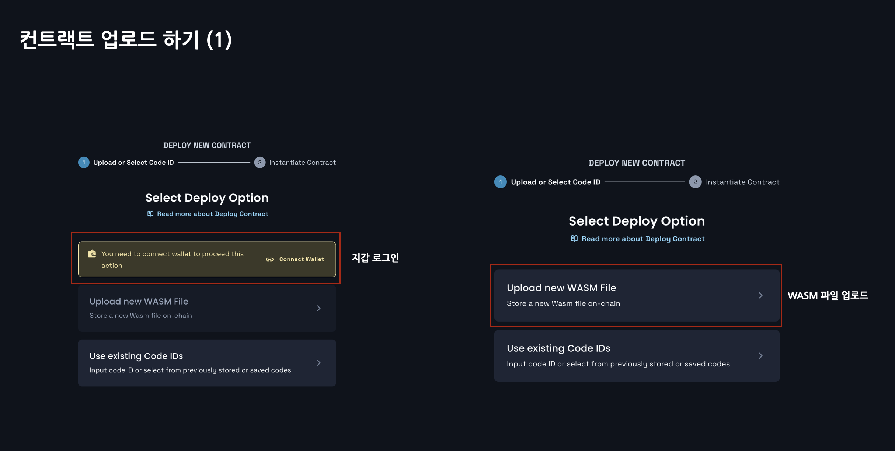
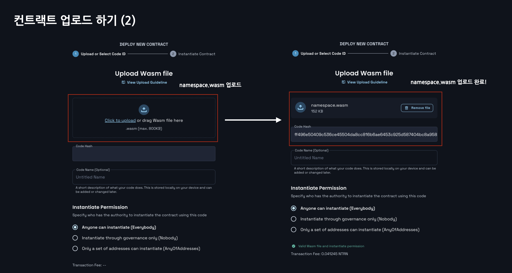
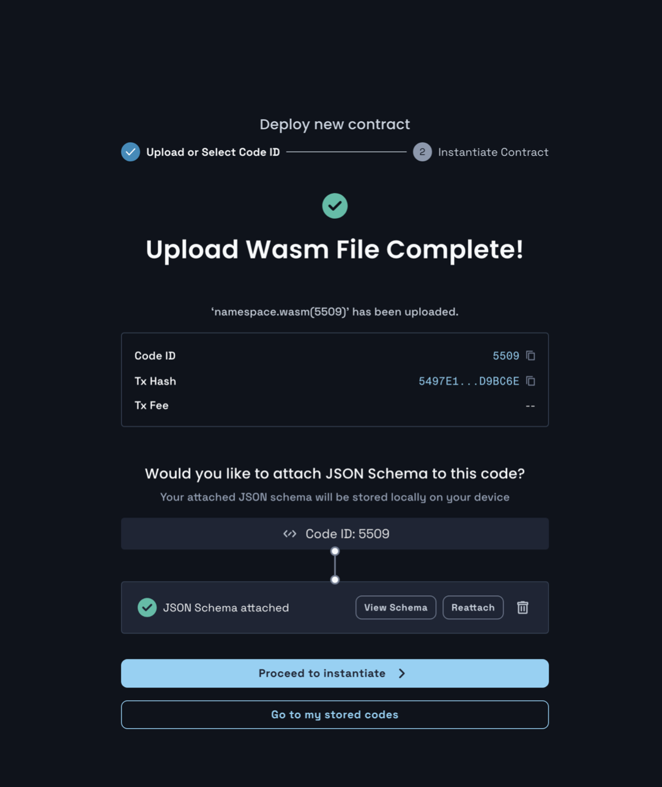

# Deploy Contracts

## 0. Neutron
[Neutron](https://docs.neutron.org/) is a blockchain network that introduces smart contracts into Cosmos-affiliated blockchains using Cosmwasm. Neutron operates on networks using the IBC protocol. Neutron security (block verification) is provided by the Cosmos Hub network through ICS (Interchain Security).

Mintscan Explorer allows you to see the status of the blocks for the mainnet and testnet:
- Mainnet(`neutron-1`): https://mintscan.io/neutron
- Testnet(`pion-1`): https://mintscan.io/neutron-testnet.

[Celatone](https://neutron.celat.one/neutron-1) is a smart contract explorer that provides a UI to upload, query, and execute contracts. In the future, through this, contracts will be distributed to the Netron test net.

## 1. Get the net faucet of the Neutron test
You can use [telegram faucet] (https://t.me/+SyhWrlnwfCw2NGM6) with the following command:
```
/request <NEUTRON-ADDRESS>
```

## 2. Builde nameservice contract
### 1. Basic build
```sh
$ cargo wasm
```

Let's check the size:
```sh
$ ls -lh ./target/wasm32-unknown-unknown/release/

# ... 1.6M  7 12 23:53 nameservice.wasm
```

### 2. Build by compressing the wasm size
I can see it's 1.6MB at the moment. The maximum size you can upload at the moment is 800KB, so you need to compress the size more.
1. Reduce Build File Capacity with RUSTFLAGS
2. Reduce file capacity with Cosmwasm's [rust optimizer](https://github.com/CosmWasm/optimizer)

First, let's reduce it using the simplest method of number one:
```sh
RUSTFLAGS='-C link-args=-s' cargo wasm
```

Let's check the size once the build is completed::
```sh
$ ls -lh ./target/wasm32-unknown-unknown/release/

# ... 195K  7 13 00:06 nameservice.wasm
```

Then, it can be confirmed that the capacity has been reduced to 195KB and the size can be distributed. You can distribute it as it is, but using method 2 provided by cosmwasm, you can compress the size smaller. The command is as follows:
```sh
docker run --rm -v "$(pwd)":/code \
  --mount type=volume,source="$(basename "$(pwd)")_cache",target=/target \
  --mount type=volume,source=registry_cache,target=/usr/local/cargo/registry \
  cosmwasm/optimizer:0.16.0
```
> This requires docker installation in advance. If docker is not installed or OS compatible, it can be fully distributed with method 1, so this part can be omitted.

After the build is complete, let's check the size:
```sh
$ ls -lh ./artifacts

# ... 165K  7 13 00:12 nameservice.wasm
```
Then you can see that it is 165KB, which is a smaller size.


## 3. Deploying to TestNet with Celatone
It provides GUI, so it can be easily deployed to testnet.
- https://neutron.celat.one/pion-1/deploy

### 1. Uploading a wasm file



### Finish uploading 
Then, code id and transaction hash will be returned:
- code id: 5509
- hash: 5497E176EBE4107F6BCD65A96071325D8E3DFD75201F17BA89FC421D76D9BC6E



## 4. Submit the results of the name service contract distribution transaction
You must submit the results of deploying the nameservice contract as follows:
- code id: 5509
- transaction hash: [5497E176EBE4107F6BCD65A96071325D8E3DFD75201F17BA89FC421D76D9BC6E](https://neutron.celat.one/pion-1/txs/5497E176EBE4107F6BCD65A96071325D8E3DFD75201F17BA89FC421D76D9BC6E)

