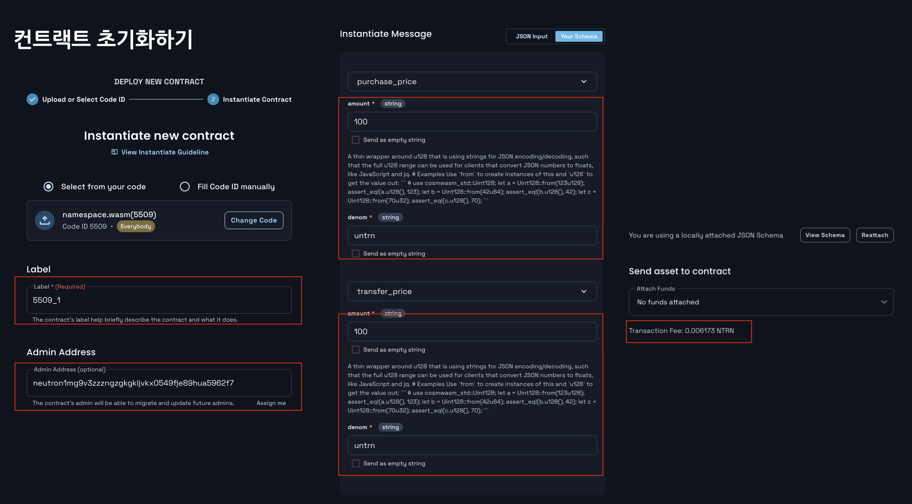
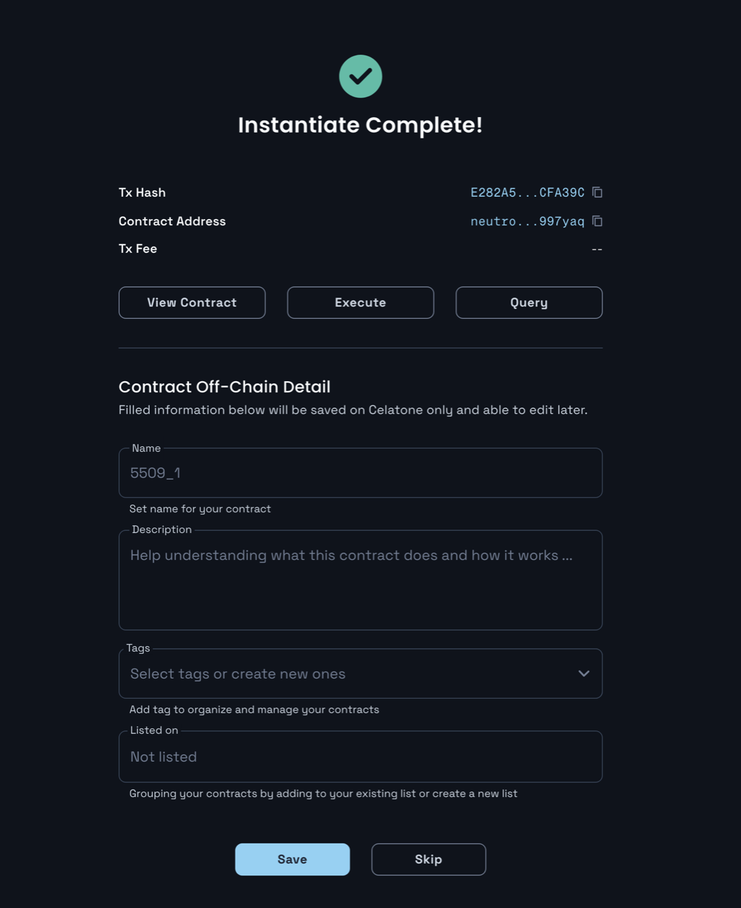
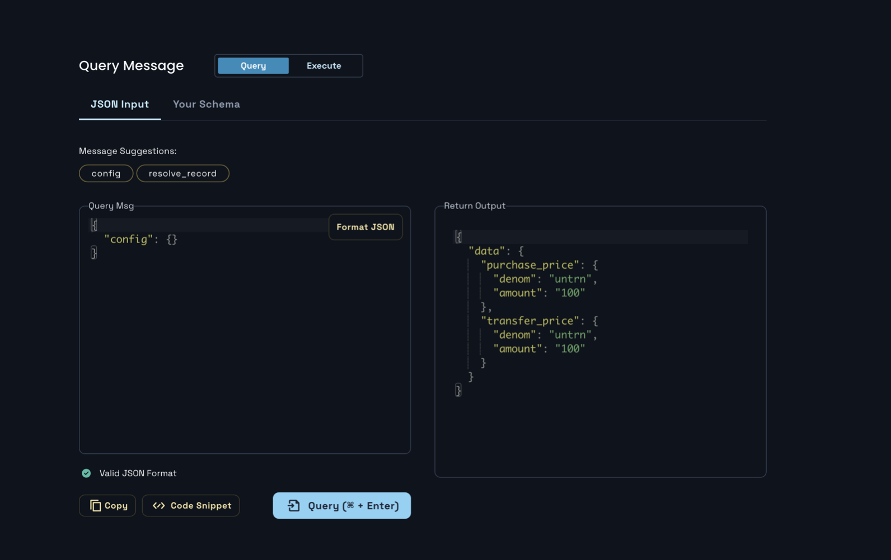

# Instantiating Cosmwasm Contract

## 0. Doing contract instantiate
Unlike the ebm contract, the cosmwasm contract is separated from the upload and instantiation (or initialization). So once you upload it, those who are authorized can initialize according to the settings at the time of distribution, so code reuse is good.

### 1. Instantiate
If you have previously distributed the contract, you will see the Instantiate screen as follows. If you have previously distributed something or want to initialize a contract distributed by others, you can enter code id.
- https://neutron.celat.one/pion-1/instantiate

Fill in the input as shown in the following photo:
1. Fill in the contract's label and admin address. The admin address is an optional element necessary for later migrate or update.
2. You must enter `purchase_price` and `transfer_price` as the content of `InstantiateMsg`. Since it is a netron test net, simply put both as 100 for mount and 'untrn' for denom.
3. When the Transaction Fee is calculated, it means that the execution is completed. Therefore, press the `Instantiate` button to transmit the transaction for contract initialization. 


### 2. Complete initializing the contract 
Once the transaction is successful it looks as the following:



## 1. Query config
If you go to the [interact contact](https://neutron.celat.one/pion-1/interact-contact) page, you can directly query the contract that was just initialized. There is no separate fee for the query itself, so you can query the config information we initialized. Let's send a query message as follows:
```json
{
  "config": {}
}
```

Then the following will return: 
```json
{
  "data": {
    "purchase_price": {
      "denom": "untrn",
      "amount": "100"
    },
    "transfer_price": {
      "denom": "untrn",
      "amount": "100"
    }
  }
}
```
It can be seen that the information of the message sent when we initialized is well stored in the contract internal state. 



## 2. Submit Contract Instantiate Transactions
The results of initializing the nameservice contract shall be submitted as follows:
- transcation hash: [E282A572BAC5274CE075FAE13E4316DC73C63FDDD68BC3E8D480B066A8CFA39C](https://neutron.celat.one/pion-1/txs/E282A572BAC5274CE075FAE13E4316DC73C63FDDD68BC3E8D480B066A8CFA39C)
