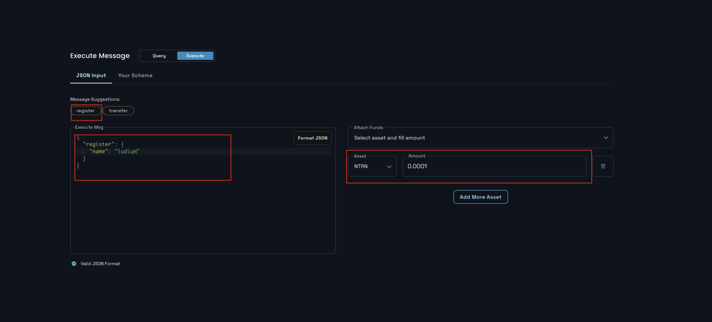
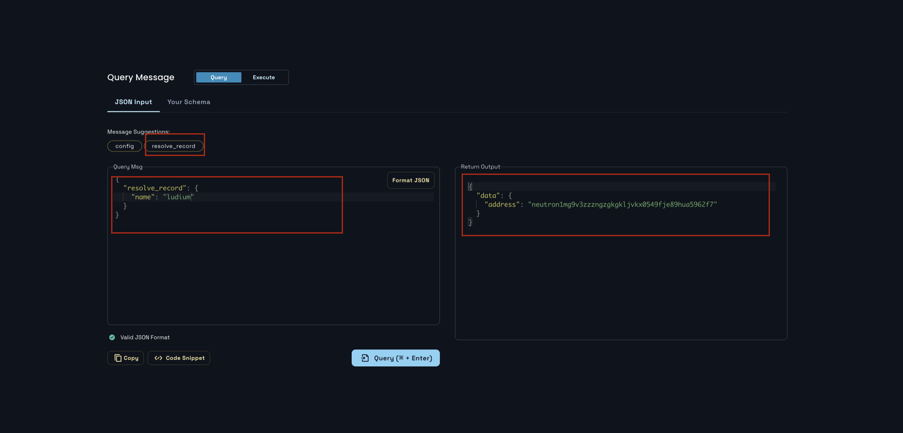

# 33a. register 트랜잭션 실행하기
## 목차
0. register 트랜잭션 실행하기 
1. `ResolveRecord` 쿼리 조회하기 
2. register 트랜잭션 실행 결과 제출하기

## 0. register 트랜잭션 실행하기
이제 nameservice를 제대로 사용해 볼 차례이다. `Execute`탭을 선택하여 `register`를 선택한 다음 name을 입력하여 메세지를 작성해보자:
```json
{
  "register": {
    "name": "hello"
  }
}
```

그리고 중요한 것은 우리가 이전에 초기화 메시지로 설정한 최소 금액을 전송해야 한다는 것이다. 100untrn은 0.0001ntrn과 같으므로 이를 attach funds에 입력해서 전송해줘야 한다. 전체적인 작성 내용은 다음과 같다:


이를 실행하고 나면 [성공한 트랜잭션](https://neutron.celat.one/pion-1/txs/B0D62692B1ACCBAD92DD040DC3F8B3746BF53A3D398A567AA67854351BEE6A65)이 발행된다. 그래도 해당 데이터가 제대로 저장되었는지 확인하기 위해서 `ResolveRecord` 쿼리 조회를 해보도록 하자.

## 1. `ResolveRecord` 쿼리 조회
다음과 같이 `ResolveRecord` 쿼리 메시지 형식에 맞게 name을 입력해준다:
```json
{
  "resolve_record": {
    "name": "hello"
  }
}
```

다음 쿼리 결과를 통해 정상적으로 등록된 것을 확인할 수 있다:
```json
{
  "data": {
    "address": "neutron..."
  }
}
```




만약 등록되지 않은 name을 조회하게 된다면 다음과 같이 null을 반환하게 된다:
```json
{
  "data": {
    "address": null
  }
}
```

## 2. register 트랜잭션 실행 결과 제출하기
다음과 같이 register 트랜잭션을 직접 실행한 결과를 제출해야 한다:
- transaction hash: [C1AED2C9966260AF037342D9321711BBDC302A154C41AECB7A14B14C032E4CA6](https://neutron.celat.one/pion-1/txs/C1AED2C9966260AF037342D9321711BBDC302A154C41AECB7A14B14C032E4CA6)