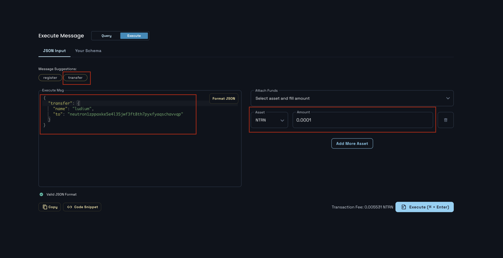
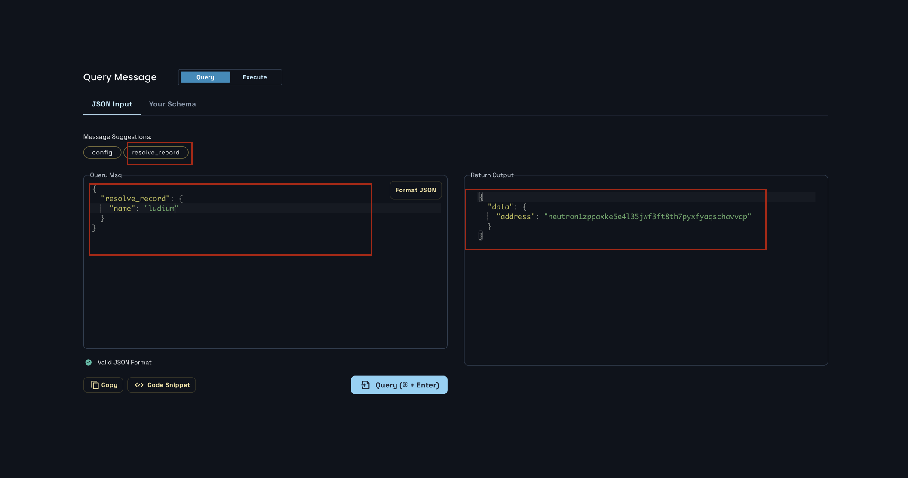

# Run transfer transaction
## Table of Contents
0. Run transfer transaction
1. Inquire `ResolveRecord` query
2. Submit transfer transaction execution results

## 0. Run transfer transaction
I can send a name I own to someone else. This time, let's write a message by selecting `transfer` on the `Execute` tab and then entering a name:
```json
{
  "transfer": {
    "name": "hello",
    "to": "neutron1zppaxke5e4l35jwf3ft8th7pyxfyaqschavvqp"
  }
}
```
Likewise, the minimum amount should be set according to the `transfer_price` set at the time of initialization. The overall contents are as follows:


After this is executed, a [successful transaction](https://neutron.celat.one/pion-1/txs/BEE3C97CCBE9895FCAA925CC182E5D2889FF84BBB19D2EB1DC52ADF431EF9152F) is issued. Still, to check whether the data is stored properly, let's look up the `ResolveRecord` query.


## 1. Inquire 'Resolve Record' query
Enter the name to match the query message format of `ResolveRecord` as follows:
```json
{
  "resolve_record": {
    "name": "hello"
  }
}
```

The qurey result shows that the change is made successfully:
```json
{
  "data": {
    "address": "neutron1zppaxke5e4l35jwf3ft8th7pyxfyaqschavvqp"
  }
}
```



## 2. Submit transfer transaction execution results
You must submit the results of running the transfer transaction directly as follows:
- transaction hash: [BEE3C97CCBE9895FCAA925CC182E5D2889FF84BB19D2EB1DC52ADF431EF9152F](https://neutron.celat.one/pion-1/txs/BEE3C97CCBE9895FCAA925CC182E5D2889FF84BB19D2EB1DC52ADF431EF9152F)