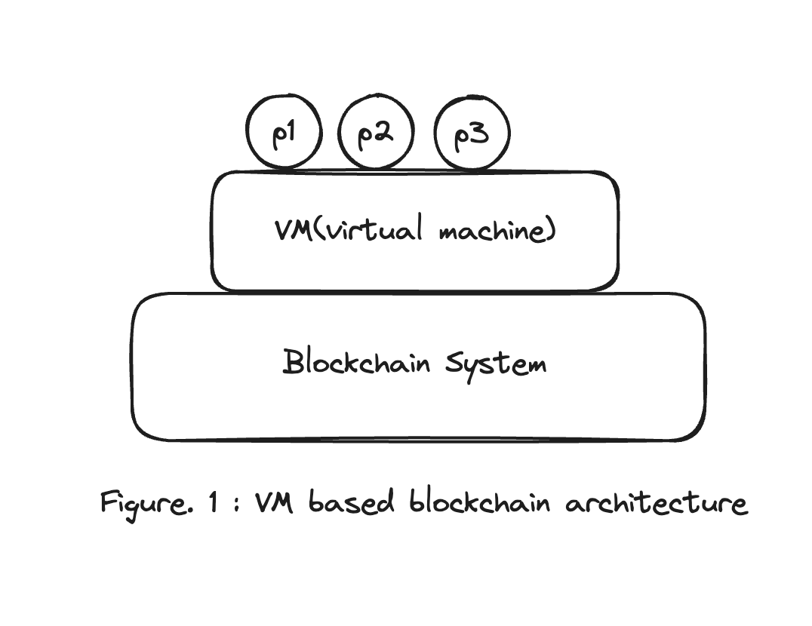
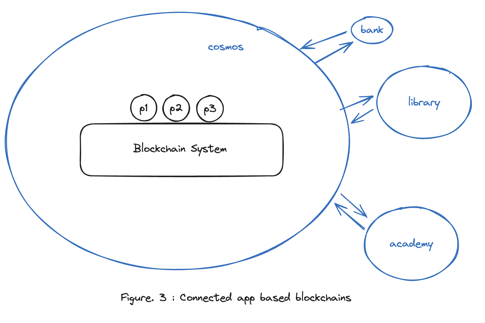

# Background on the emergence of Cosmos and Appchain

### Preview

**Hello Earth 🌏!, Welcome to Cosmos 🌌**, Welcome to the first chapter of the Cosmos Basics course.

The first topic we're going to cover is **(Understanding Why App-Specific blockcahins Emerged)**?

We chose to make this chapter one of the first topics in the Cosmos Basics course because we think it's very important to understand and appreciate the Cosmos ecosystem and why we need app chains in the first place in order to build something on it.

The **'Cosmos Basics'** course that we're going to be immersing ourselves in is one sector within the larger ecosystem of blockchain, and compared to sectors like Ethereum, which has a big community platform, you might see a lot of gaps, and you might think, “I wish there was something like this?

And the fact is that the blockchain space itself is not yet ripe, so the development community is much smaller than other communities.

For those of you who will be entering this ecosystem, my suggestion for quickly learning and mastering it and becoming a contributor to the Road to Dubai is to **empathize with why this technology is here!**.

Hopefully, this article will help you realize and understand the direction of this ecosystem and the purpose it is trying to achieve, which will be a good motivation for the long Road to Dubai educational journey ahead.

### Why Do We Need an App-Specific Chain?

Before we dive into this chapter, let me ask you a question.

- **Question: Why did we come up with the Cosmos SDK and the app-specific blockchain theme called Cosmos?**

There is no right answer. However, the fact that everyone was able to at least **'think'** about this question in their own minds makes this lesson worthwhile.

For now, just keep the main question in the back of your mind as we continue with the rest of the article.

### Review of Blockchain History

In order to empathize with the idea that we're talking about  an **app-specific chain**, let's take a quick look at how blockchain evolved before app chains.

In the larger chapter of blockchain technology, it's important to understand how blockchains have evolved in the past to put Cosmos in context.

Usually, new technologies are built on the idea that there are problems with existing technologies, so we can see and understand how the idea of app chains could have been proposed by looking at the problems with existing blockchains. So, let's first look at the characteristics of existing Bitcoin and Ethereum and talk about the need for the Cosmos SDK.

The figure below is a schematic from week 0 of the Interchain Developer Academy.

For the sake of simplicity, let's focus on blockchains like Bitcoin, Ethereum, Tendermint (now CometBFT), and Cosmos.

- In 2008 years, Bitcoin Whitepaper was released

- In 2013 years, Ethereum Whitepare was released

- In 2016 years, Cosmos Whitepaper was released

In this chronological order, we can see that new blockchain perspectives were proposed in the following order **Bitcoin → Ethereum → Cosmos**. Let's take a closer look at this sequence.

_prod : interchain developer academy 0 week course_

### Purpose of App-Specific Chains 1

The blockchains we highlighted above were Bitcoin, Ethereum, and Cosmos. Now it's time to look at the purpose of each of these chains and how they propose to improve upon the existing chains.

To start, let's redefine the very broad meaning of blockchain and consider Bitcoin as a blockchain system for payments.
(I'm not saying that TPS makes Bitcoin less useful as a payment system in practice.)

When we describe Bitcoin as a **blockchain system for paymentpayment**and then use it, we mean that it has a purpose in two ways. 

1. for Alice to send Bob a certain amount of coins (ex: 1 BTC)
2. to prove that Alice sent Bob a certain amount of coins (A single transaction) to Bob through a global ledger.

If you think about it, Bitcoin is a blockchain system for sending and receiving payments, which is very simple: 'send money' or 'receive money'.

**This is on top of a system (consensus system) that allows everyone using the system to agree on the validity of certain sending and receiving actions (transaction units)**

Now, let's apply this process of reinterpreting blockchain systems in terms of their uses to Bitcoin, Ethereum, and Cosmos.

- 1. bitcoin (consensus system + payment)

- 2. bitcoin → ethereum (consensus system + computing)

- 3. ethereum → cosmos (horizontal consensus system + horizontal computing)

If you look at it like this, you can understand it more intuitively.

### Purpose of App-Specific Chains 2

#### 1. bitcoin → ethereum (consensus system + computing)

Since we've already explained the first part (reinterpreting Bitcoin), let's explain the second part (Bitcoin -> Ethereum).

Vitalik probably had this thought. **If there is some kind of global consensus system, why not put programmable computing on top of it?** .

(**_Personal opinion based on similarity of purpose_**)

And that's how smart contracts (programs) became what they are today, and how the Solidity language came to be.

The Ethereum blockchain can be seen as proposing a new frame for the existing blockchain (payment). It is a frame that puts the computer itself on top of the global consensus system, not just a payment system. Therefore, it can be seen as an extension of the existing blockchain's purpose.

#### 2. Ethereum → Cosmos (horizontal consensus system + horizontal computing)

Now let's think about Cosmos, which we will learn about.

This is the part that can give us a clue to the question I mentioned above (**Why did the Cosmos SDK and an app-specific blockchain theme called Cosmos come about?**)

The aforementioned Ethereum is said to have proposed a new perspective of blockchain as a computing system rather than a payment system. However, if we apply this to our lives, we will think,**Is it  possible for multiple people to use a global computer in this era where each person has at least one computer such as a laptop or smartphone?**

If we extend this idea, we can also think,**Why don't we have a computable blockchain that can be horizontally scaled for specific applications?**

The Cosmos ecosystem is an implementation of this idea.

Perhaps Jae Kwon  was **trying to develop an app specific chain ecosystem called Cosmos by proposing a new frame of horizontal scaling of computational blockchains**
(**_This is just a personal opinion that serves a purpose_**)

Let's recap. The above framing of a blockchain as a horizontally scalable blockchain may not make much sense at first. So, let me explain how app specific chain is a horizontally scalable blockchain with an example.

First, Ethereum can be thought of as creating a global computer where any arbitrary program can live, and users can put whatever they want on it.

so, you can picture the following schematic in your head.

However, Cosmos can be seen as building a computing system with only the necessary programs such as remittance, lending, and saving for a bank, and a library system with only the necessary programs such as borrowing and overdue for a library, and building and connecting computing systems for different purposes.

Therefore, you can draw the following schematic.

And since the Cosmos ecosystem is an ecosystem of app chains for each purpose, you will see chain 1, chain 2, chain 3, etc. connected, with only as many programs as needed, rather than multiple programs on a single chain.

### Consider the First Question Again

Let's rephrase the question here. Now that we've gotten this far, which frame or ecosystem do you think is better or easier for developers to onboard? Your answer will be your [homework](./homework/01.md).

.
.
.
.
.
.
.
.
.

Just in case, there is no right answer. I just assigned it because it was a very meaningful time to understand the development of technology from various perspectives and to empathize with the purpose of a field.

However, I will write down an example of the results of the assignment. For future reference.

> I think chains that put up VMs, like EVM, have more freedom and less pressure to deploy new programs on-chain. Because it's public computing, users can just deploy it. On the other hand, app chains are not as free to add new programs and require consensus from multiple parties through governance. (However, not all chains are uniform, and certain restrictions can be imposed on a chain-by-chain basis).

> However, in the case of VM-based chains, it seems that multiple people may unnecessarily post the same program over and over again. If you think about it, you can just upload a well-designed banking program to the EVM and use it for everyone, because the EVM is publicly open, and multiple people can deploy the same program and use their own programs.

> From this point of view, app specific chains like Cosmos manage certain programs as modules, so instead of having unnecessary repetitive programs on top of one system, you can have a more efficient system because you only have to put up o
ne program and everyone uses it.

Feel free to repeat the example and paraphrase it in your own language, so you can compare app chains to public computing blockchains using your own vocabulary, based on the things we've talked about and the additional resources in IDA.

### Somethings from IDA

Finally, I've pulled out a few things from IDA that I think are relevant to this chapter that you might want to take a look at. Let's take a quick look at each one.

- limitations about dapps which deployed on general purpose blockchains

> Not all dApps have the same throughput requirements, but they all have to make do with the *average* resulting throughput of the platform itself if they are implemented on a general-purpose blockchain. This impacts the **scalability** of dApps.

- How does the interchain solve the scalability issue?

> Scalability is a core challenge of blockchain technology. The interchain allows applications to scale to millions of users. This degree of scalability is possible as the interchain addresses two types of scalability:

> Horizontal scalability: scaling by adding similar machines to the network. When "scaling out", the network can accept more nodes to participate in the state replication, consensus observation, and any activity that queries the state.

> Vertical scalability: scaling by improving the network's components to increase its computational power. When "scaling up", the network can accept more transactions and any activity that modifies the state.

### Somethings Special About the Cosmos Ecosystem?

This is a plus +a. I've tried to express the current state of the Cosmos ecosystem as I'm currently working in it. Agon has written some additional good stuff in [this article](./99_$ATOM과%20인터체인%20보안.md), so it would be great to link this section with that one.

The Cosmos ecosystem was actually originally intended to be an ecosystem of app chains, creating app specific blockchains and connecting them together due to scale.

However, it led to a very strong developer ecosystem of vm-based blockchains such as Ethereum, and the similar meta eventually led to the development of VMs as modules at the SDK level in Cosmos.

Representatively, WASM, EVM, MOVE-VM, etc. So, based on these things, WASM-based chains are emerging with cosmwasm, and EVM-based chains are also emerging based on ethermint & polarisEVM (more), and this is the current Cosmos ecosystem.

What we can see here is that the development of technology is not necessarily the form of efficient operation of all resources, but the experience of developers (UX or DX) who create utilities with those resources is also a very important factor in the development of technology.

### References

https://ida.interchain.io/ida-course/lps/week-0
https://ida.interchain.io/ida-course/lps/week-1
