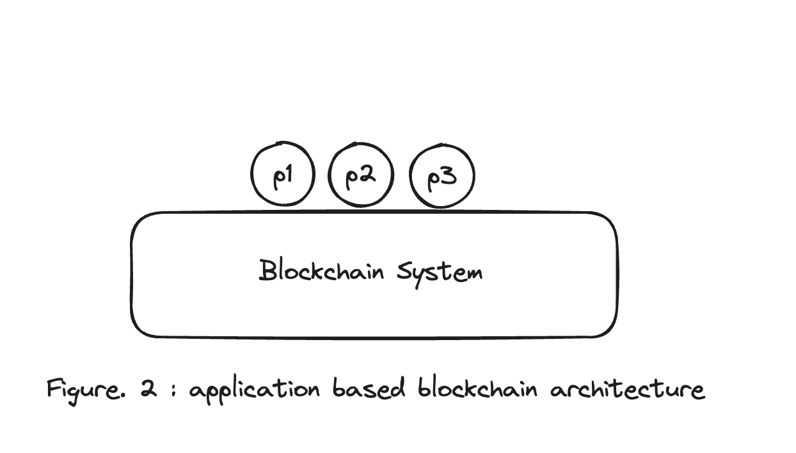

# AppChain Architecture Understanding

### Preview

**Hello Earth 🌏!, Welcome to Cosmos 🌌**, Welcome to the second chapter of the Cosmos Basics course.

The second  topic we will cover is**Understanding App Chain Architecture**.

Last time, we had a chance to empathize and understand why the concept of app-specific blockchains emerged.

In this course, we will learn how an app-specific chain is organized based on the Cosmos-SDK.

### What Are Application-Specific Blockchain

Before we dive into what the Cosmos-SDK is, let's first review what an app-specific chain looks like.

In fact, the official COSMOS SDK documentation describes it as follows.

> Application-specific blockchains are blockchains customized to operate a single application. Instead of building a decentralized application on top of an underlying blockchain like Ethereum, developers build their own blockchain from the ground up. This means building a full-node client, a light-client, and all the necessary interfaces (CLI, REST, ...) to interact with the nodes.
> _(https://docs.cosmos.network/v0.50/learn/intro/why-app-specific)_

However, I think it's a bit confusing, so I've reorganized it to make it easier for the lecture like last time, so it will be easier to understand if you take this lecture while remembering the examples and pictures you learned last time.



Last time we talked about app chains using a library as an example. **A blockchain that is dedicated to a single application,such as a library, is an application-specific blockchain (app-specific chain)**.

In the official documentation, it is expressed as a single application, so you may think that only one program is on it, but one application can have multiple functions, so you can think of it as a chain for only one service.

Continuing with the example of a library system, let's say a library needs a membership function, a loan function, and a return function.
(There may be additional functions, but we'll leave them out)

To summarize the above, **a library app chain**would include the following programs

1. Registration Program (Registration Program)
2. Borrowing Program (Borrowing Program)
3. Returning Program (Returning Program)

Now, let's make the above application based blockchain architecture more specific to the example 'Library App Chain'.


### Shortcut of Application-Specific Blockchains

Before we continue with the lesson, once again, if we were to summarize what we learned above, we could say that we now have a shortcut.

Instead of application blockchains for general purpose, such as VM-based Ethereum (EVM), which is the first thing we learn about when we come across blockchains (to put multiple applications on top of one blockchain),  **application-specific blockchains, such as the library example,  are blockchains for one application (=service)**.

### Application-Specific Blockchains Benefits

Let's take a quick look at the benefits of app chains as listed in the official docs.

There are four main benefits of AppChains (flexibility, performance, security, and sovereignty).

We won't go into all of them in detail, just a quick overview.
(This is because they're not as important to our curriculum and development process as they are to you right now).

However, if you want to know more about the features of AppChain in more detail, we recommend reading the original article through this [link](https://docs.cosmos.network/v0.50/learn/intro/why-app-specific#application-specific-blockchains-benefits).

##### 1. Flexibility

The appchains in the Cosmos ecosystem that we will learn about are basically built on top of the Cosmos-SDK.
(In fact, an appchain does not necessarily need to use the Cosmos-SDK).

We'll cover the architecture of that SDK in the next section. Don't worry!

But before we get to that, a quick refresher: Appchains are divided into two main parts

1. the application area and 
2. the consensus engine part.

These two parts are connected by an interface called ABCI (Application BlockChain Interface).

Therefore, **you don't necessarily have to use cosmos-sdk and cometbft (formerly tendermint) as long as you meet this interface standard** And this is called flexibility.

> Application-specific blockchains give maximum flexibility to developers: In Cosmos blockchains, the state-machine is typically connected to the underlying consensus engine via an interface called the ABCI. This interface can be wrapped in any programming language, meaning developers can build their state-machine in the programming language of their choice.

If you're curious about more of this stuff,

- Narwhal&Bullshark with Cosmos-sdk article on DAG based [DAG based Narwhal&Bullshark with Cosmos-sdk article](https://www.paradigm.xyz/2022/07/experiment-narwhal-bullshark-cosmos-stack) written by a really famous and good paradigm.

- You might also want to check out [namada](https://specs.namada.net/base-ledger/consensus), which has been working hard on privacy asset transfer (shiled transfer) lately.

(I hope everyone can ask a question here.. 🙏🙏🙏)

##### 2. Performance

Performance refers to TPS (transaction per seconds) in the common parlance.
(If you don't understand this, please raise your hand immediately 🙋‍♂️.  If you don't, you're an idiot.)

So, performance means how many transactions can be processed efficiently in a small amount of time.

The app chains we will learn about are naturally more performant than general purpose VM-based chains because they consume computing resources for a single application.

> In order to optimize the performance of the decentralized application, it needs to be constructed as a block chain specific to the application. An application-specific blockchain only operates a single application, so that the application does not compete with others for computation and storage.

##### 3. Security

Skip this section. If you are curious, please refer to the reference link.

##### 4. Sovereignty

Finally, the long-awaited  sovereignty, or should I say  **sovereignty, which is actually the biggest advantage and feature of an app chain+**.

In general purpose chains, it can be difficult to make on-chain-level modifications or suggestions that are specific to a particular dApp, since many dApps are on a single chain.

However, an app chain is a chain dedicated to the application, which means that it can propose and improve core-level modifications to improve the UX of the dApp part of the application. This feature is called self-sovereignty. There are chains such as Injective and dYdX that make good use of these points, but it would be nice to learn more about them later.

> One of the major benefits of application-specific blockchains is sovereignty. The fundamental issue here is that the governance of the application and the governance of the network are not aligned. This issue is solved by application-specific blockchains. Because application-specific blockchains specialize to operate a single application, stakeholders of the application have full control over the entire chain. This ensures that the community will not be stuck if a bug is discovered, and that it has the freedom to choose how it is going to evolve.

##### etc. Furthermore

I would also like to briefly mention Interchain Security (ICS), which is not mentioned in the official documentation.

Based on the above, app chains may be a good direction for blockchains with their own direction and purpose. However, each app chain with multiple sovereignties as above has its own sovereignty, which results in  **a decentralized form of security** based on the TVL of each token.

This means that a chain with a relatively low TVL among multiple app chains may be more vulnerable to security.
(I'd love to have a chance to talk about PoS and PoW at length later, since the basic implication of PoS is to secure the chain with cash, but I'll skip it for now as it would only interrupt the current course. This means that you can ask me questions 🙋‍♂️!🙋‍♂️!🙋‍♂️!)

For the above reasons, there is currently a discussion in the Cosmos ecosystem about how to operate new Sovereign app chains such as Interchain Security by inheriting the security of a [large TVL](https://www.coingecko.com/en/coins/cosmos-hub) such as Cosmos(ATOM). (ex: Stride & Neutron)

---

### Cosmos-SDK based App Chain Architecture

Now it's time to describe the architecture of the Cosmos App Chain that we will learn about.

However, we'll save that for the next article. Instead, I'd like to end this hour with a lot of thinking about how to match the diagram below with what we learned in this hour.

```sh
              +---------------------+
              |                     |
              |     Application     |       -> Cosmos-SDK
              |                     |
              +--------+---+--------+
                       ^   |
                       |   | ABCI
                       |   v
              +--------+---+--------+
              |                     |
              |                     |
              |     Tendermint      |
              |                     |
              |                     |
              +---------------------+
```

```sh
                ^  +-------------------------------+  ^
                |  |                               |  |   Built with Cosmos SDK
                |  |  State-machine = Application  |  |
                |  |                               |  v
                |  +-------------------------------+
                |  |                               |  ^
Blockchain node |  |           Consensus           |  |
                |  |                               |  |
                |  +-------------------------------+  |   CometBFT
                |  |                               |  |
                |  |           Networking          |  |
                |  |                               |  |
                v  +-------------------------------+  v
```

### References

- https://docs.cosmos.network/v0.50/learn/intro/why-app-specific
