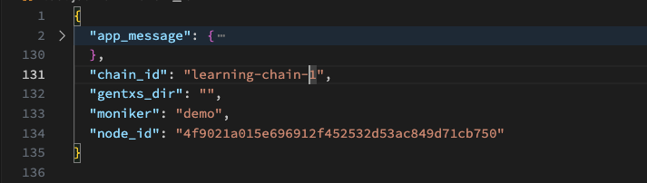
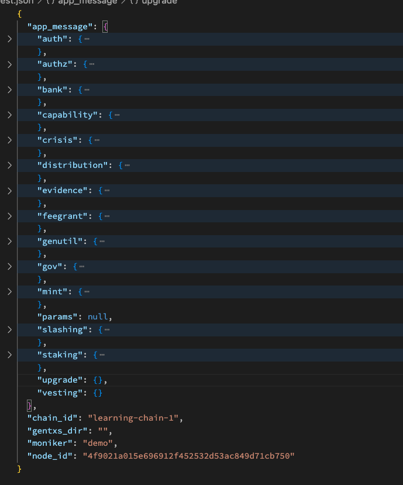
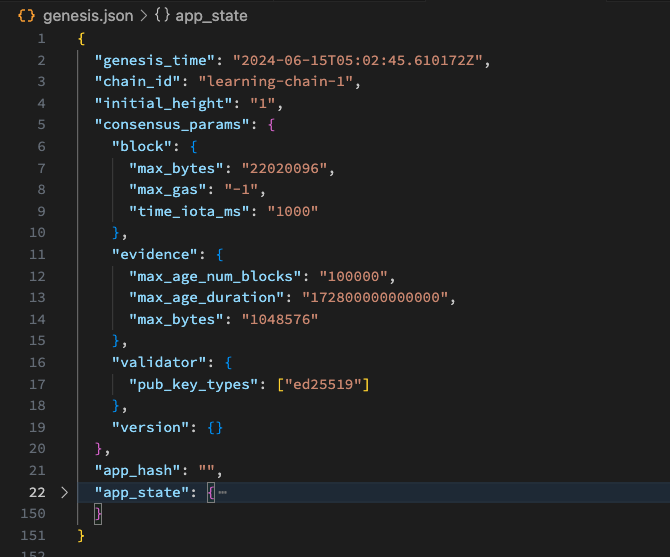
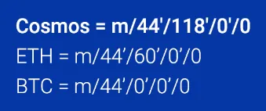
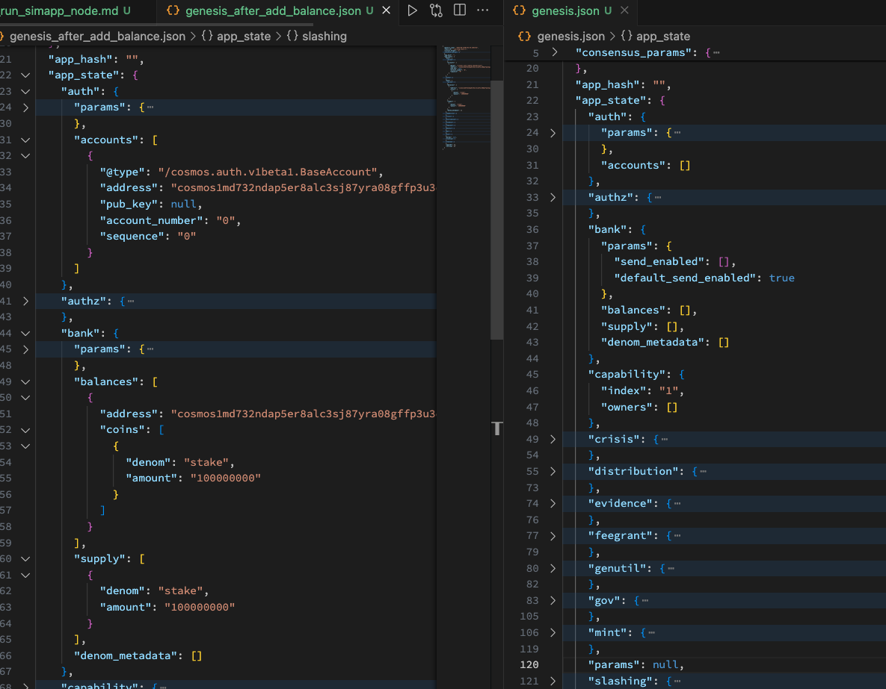
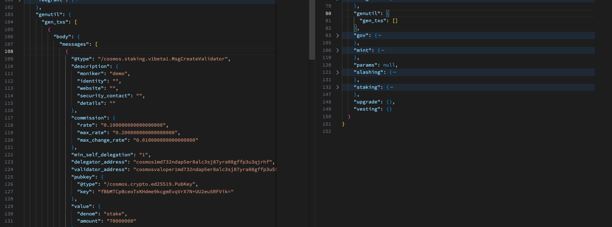
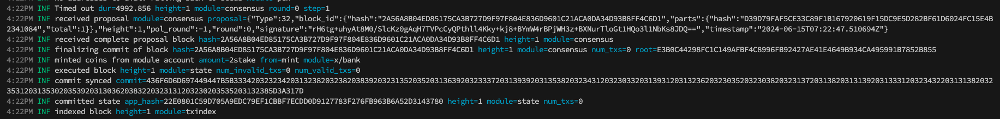

# Simapp 노드 구동하기

### Preview

**Hello Earth 🌏!, Welcome to Cosmos 🌌**, Welcome to the fourth chapter of the Cosmos Basics course.

From this point on, we'll be doing hands-on exercises instead of lectures based on articles. 🧑‍💻🧑‍💻🧑‍💻

In this fourth lesson, we will run the most basic app (appchain) made with the Cosmos SDK. Some of you may have been expecting to study the architecture of simapp and how to customize appchain with cosmos-sdk to develop appchain, but !!!

Personally, I think it would be more effective to  **experience the application first and then learn deeply while thinking and wondering “how was this made""?**, so I changed the order, so please understand.
(Personally, I think there are many ways to understand something, but I think it's more immersive when you have to use it yourself and get a sense of need and interest.)

So, what we're going to learn in this lesson is how to operate an appchain called simapp. By operating, I mean we will start with the genesis block, which is the 0th block, and then we will create blocks 3 and 4 through consensus and finish this lesson.

For reference, this article is a reorganized version of this [link](https://tutorials.cosmos.network/tutorials/3-run-node/), and there is also a [video](https://www.youtube.com/watch?v=wNUjkp2PFQI), so if necessary, those who are not satisfied with the text-only lecture can refer to it according to their preferred content.

### Build a Simapp

First, create a working directory and clone the cosmos-sdk git, which will be used throughout this tutorial.

```bash
# make your own working directory
mkdir ~/cosmos-basic && cd cosmos-basic

# clone cosmos-sdk git
git clone https://github.com/cosmos/cosmos-sdk && cd cosmos-sdk
```

Next, we'll switch to the `v0.45.4` branch, since we're planning to study the appchain structure for version v0.45.4.

Now let's build a simapp client called `simd` and check the version.

```bash
# switch to v0.45.4
git checkout v0.45.4

# build a simapp client
make build

# checking simapp version
./build/simd version

# >>> 0.45.4
```

So let's start by simply typing `help` after simapp to see what commands are available.

In this lesson, you'll only learn a few of these commands, but you'll definitely want to try the others.

(If you get confused while studying on your own, just add `help` to the end of the command and you'll get some examples.)


```bash

# command help
./build/simd help


simulation app

Usage:
  simd [command]

Available Commands:
  add-genesis-account Add a genesis account to genesis.json
  collect-gentxs      Collect genesis txs and output a genesis.json file
  config              Create or query an application CLI configuration file
  debug               Tool for helping with debugging your application
  export              Export state to JSON
  gentx               Generate a genesis tx carrying a self delegation
  help                Help about any command
  init                Initialize private validator, p2p, genesis, and application configuration files
  keys                Manage your application's keys
  migrate             Migrate genesis to a specified target version
  query               Querying subcommands
  rollback            rollback cosmos-sdk and tendermint state by one height
  rosetta             spin up a rosetta server
  start               Run the full node
  status              Query remote node for status
  tendermint          Tendermint subcommands
  testnet             Initialize files for a simapp testnet
  tx                  Transactions subcommands
  validate-genesis    validates the genesis file at the default location or at the location passed as an arg
  version             Print the application binary version information

Flags:
  -h, --help                help for simd
      --home string         directory for config and data (default "/Users/jeongseup/.simapp")
      --log_format string   The logging format (json|plain) (default "plain")
      --log_level string    The logging level (trace|debug|info|warn|error|fatal|panic) (default "info")
      --trace               print out full stack trace on errors

Use "simd [command] --help" for more information about a command.
```

---

### Initialize Simapp

Now that we've seen the different commands through the `help` command, let's initialize the basic things needed for the simapp chain locally with the `init` command

```bash
# initiate simapp node in local
./build/simd init demo \
 --home ./private/.simapp \
 --chain-id learning-chain-1 > init.json
```
After executing the command, go to the directory located in the `--home` flag and check the result json generated by the above command instead of the initial app state, genesis.

(If you don't have a json syntax prettier like jq, you can just open the file with vscode)

There are a lot of different key-value values, but let's just take a quick look.

```json
// init command result
{
  "app_message": {
    "auth": {
      "accounts": [],
      "params": {
        "max_memo_characters": "256",
        "sig_verify_cost_ed25519": "590",
        "sig_verify_cost_secp256k1": "1000",
        "tx_sig_limit": "7",
        "tx_size_cost_per_byte": "10"
      }
    },
    "authz": {
      "authorization": []
    },
    "bank": {
      "balances": [],
      "denom_metadata": [],
      "params": {
        "default_send_enabled": true,
        "send_enabled": []
      },
      "supply": []
    },
    "capability": {
      "index": "1",
      "owners": []
    },
    "crisis": {
      "constant_fee": {
        "amount": "1000",
        "denom": "stake"
      }
    },
    "distribution": {
      "delegator_starting_infos": [],
      "delegator_withdraw_infos": [],
      "fee_pool": {
        "community_pool": []
      },
      "outstanding_rewards": [],
      "params": {
        "base_proposer_reward": "0.010000000000000000",
        "bonus_proposer_reward": "0.040000000000000000",
        "community_tax": "0.020000000000000000",
        "withdraw_addr_enabled": true
      },
      "previous_proposer": "",
      "validator_accumulated_commissions": [],
      "validator_current_rewards": [],
      "validator_historical_rewards": [],
      "validator_slash_events": []
    },
    "evidence": {
      "evidence": []
    },
    "feegrant": {
      "allowances": []
    },
    "genutil": {
      "gen_txs": []
    },
    "gov": {
      "deposit_params": {
        "max_deposit_period": "172800s",
        "min_deposit": [
          {
            "amount": "10000000",
            "denom": "stake"
          }
        ]
      },
      "deposits": [],
      "proposals": [],
      "starting_proposal_id": "1",
      "tally_params": {
        "quorum": "0.334000000000000000",
        "threshold": "0.500000000000000000",
        "veto_threshold": "0.334000000000000000"
      },
      "votes": [],
      "voting_params": {
        "voting_period": "172800s"
      }
    },
    "mint": {
      "minter": {
        "annual_provisions": "0.000000000000000000",
        "inflation": "0.130000000000000000"
      },
      "params": {
        "blocks_per_year": "6311520",
        "goal_bonded": "0.670000000000000000",
        "inflation_max": "0.200000000000000000",
        "inflation_min": "0.070000000000000000",
        "inflation_rate_change": "0.130000000000000000",
        "mint_denom": "stake"
      }
    },
    "params": null,
    "slashing": {
      "missed_blocks": [],
      "params": {
        "downtime_jail_duration": "600s",
        "min_signed_per_window": "0.500000000000000000",
        "signed_blocks_window": "100",
        "slash_fraction_double_sign": "0.050000000000000000",
        "slash_fraction_downtime": "0.010000000000000000"
      },
      "signing_infos": []
    },
    "staking": {
      "delegations": [],
      "exported": false,
      "last_total_power": "0",
      "last_validator_powers": [],
      "params": {
        "bond_denom": "stake",
        "historical_entries": 10000,
        "max_entries": 7,
        "max_validators": 100,
        "unbonding_time": "1814400s"
      },
      "redelegations": [],
      "unbonding_delegations": [],
      "validators": []
    },
    "upgrade": {},
    "vesting": {}
  },
  "chain_id": "learning-chain-1",
  "gentxs_dir": "",
  "moniker": "demo",
  "node_id": "4f9021a015e696912f452532d53ac849d71cb750"
}
```

The above is a lot to take in at once, so let's make it easier on ourselves by folding it out.



We can see that the message output by the init command contains the following values: app_message, chain_id, moniker, and node_id.

Each value is separated into the following files to organize each output value.

- app_message & chain_id -> genesis.json
- moniker -> config/config.toml
- node_id -> node_key.json

And if you look further into the app_message section, you will see the following additional keys.

Each key under app_message contains the initial state of the default modules used by simapp, and the presence of each key means that modules such as auth and authz are included in simapp.



You can also see the listup and description of each default module in the [README](https://github.com/cosmos/cosmos-sdk/blob/v0.45.4/x/README.md).

### Understand Init Module State & Catch Up Genesis State

#### Understand Init Module State

Of the many basic modules, we will only look at the Staking module.

Each module has a different usability, but the basic structure is similar, so once you understand one, you can easily understand the others.

For reference, not all appchains comply with this, but each of the modules provided by the cosmos-sdk has its own specification document, so it is recommended to check the [specification document](https://github.com/cosmos/cosmos-sdk/blob/v0.45.4/x/staking/spec/README.md) for detailed module purpose, semantic usability, etc.

```json
// staking module example init state
{
  "staking": {
    "delegations": [],
    "exported": false,
    "last_total_power": "0",
    "last_validator_powers": [],
    "params": {
      "bond_denom": "stake",
      "historical_entries": 10000,
      "max_entries": 7,
      "max_validators": 100,
      "unbonding_time": "1814400s"
    },
    "redelegations": [],
    "unbonding_delegations": [],
    "validators": []
  },
  "upgrade": {},
  "vesting": {}
}
```

#### Catch Up Genesis State

Now let's look at the genesis state containing the app_message above.

The app_message and chain_id that we saw as a result of the init command are included in my genesis.json, so we can look at that file.


```bash
# print initial app state
jq ./private/.simapp/config/genesis.json
```
As usual, there is a lot of data coming in at once, so let's try folding it like above. Once you get used to seeing the structure and understand it, you'll realize that it's simpler than you think.

The application states that we saw in app_message are contained in app_state, and the only other thing we need to check is that the `chain_id` that we injected as a flag in the `init` command is well contained in genesis.



---

### Prepare to Create a New Block

#### Alice Account

Next, we'll create a test account, alice account. This is because we need a validator to create a new block after init the genesis state.
(I'm leaving out a lot of blockchain basics, but trust me, if you don't know, raise your hand and ask 🙋‍♂️! Ask questions, it's a shame to be ignorant)

For the above reasons, let's first include alice account as a validator in the genesis state to run simapp(blockchain). (Alice is the block producer of our chain)

First, let's check the initialized key in the working directory we're currently using! You probably won't get any results, because of course there is no key in the home directory we're currently using.

```bash
./build/simd keys list \
    --home ./private/.simapp \
    --keyring-backend test
```

Now let's create an account named `alice`. If you've done a good job, you should see something like this.
(Note that the key type states that we used an algorithm of the form secp256k1, which I'm not going to explain here, but I personally think it's a good idea to learn it at least once if you're going to dive into the blockchain ecosystem in the future)

```bash
# create a alice account(mnemonic)
./build/simd keys add alice \
    --home ./private/.simapp \
    --keyring-backend test

# - name: alice
#   type: local
#   address: cosmos1md732ndap5er8alc3sj87yra08gffp3u3qjrhf
#   pubkey: '{"@type":"/cosmos.crypto.secp256k1.PubKey","key":"A6uTQ2JNyME5LpFz+LoT68nlg2a+Jxedsbs3mb8Scph8"}'
#   mnemonic: ""

# **Important** write this mnemonic phrase in a safe place.
# It is the only way to recover your account if you ever forget your password.

# <random... >
```

**But there's one thing you should know about key-path, though: it's a mnemonic.**

This path needs to be determined before our address can be derived from the command-generated mnemonic (which is just a really big number, a seed value), which is slightly different for each protocol.

The appchain we're learning about, the cosmos-sdk appchain, uses mainly 118 paths.
(Ethereum is 60 for reference)

For now, let's just say that this is out of the scope of the course, so let's just say that it exists! For more information, you can read this article(https://medium.com/cosmostation/mnemonic-phrase-hd-wallets-simplified-12b54f9e5031) from Cosmos Station, where I work.

```bash
# default algorithm & key-path in simapp
  --algo string              Key signing algorithm to generate keys for (default "secp256k1")
  --coin-type uint32         coin type number for HD derivation (default 118)
```



Back to the point, we check that we can recheck the key generated in our home directory like this.

```bash
/build/simd keys show alice \
    --home ./private/.simapp \
    --keyring-backend test

# - name: alice
#   type: local
#   address: cosmos1md732ndap5er8alc3sj87yra08gffp3u3qjrhf
#   pubkey: '{"@type":"/cosmos.crypto.secp256k1.PubKey","key":"A6uTQ2JNyME5LpFz+LoT68nlg2a+Jxedsbs3mb8Scph8"}'
#   mnemonic: ""
```

Finally, we update the genesis state with a token that alice can bond with as a validator, and the account is ready to go.

```bash
# check bond denom for preparing alice validatror
grep bond_denom ./private/.simapp/config/genesis.json

# "bond_denom": "stake"

# add initial tokens into genesis
./build/simd add-genesis-account alice 100000000stake \
    --home ./private/.simapp \
    --keyring-backend test
```

It's easier to understand what you're getting yourself into if you compare genesis to the following



#### Validator

Now that we've created the key and updated Alice with the initial token, let's create a genesis transaction (gentx) so that when the blockchain runs with genesis, Alice can become a validator.
(Alice will be a Genesis Validator)

To see what this means, let's compare the photos below.

```bash
# Do not forget to use your own --chain-id.
./build/simd gentx alice 70000000stake \
    --home ./private/.simapp \
    --keyring-backend test \
    --chain-id learning-chain-1
Genesis transaction written to "private/.simapp/config/gentx/gentx-b5c926d6bcacbf7803a47b90e5dcb2b4576a8724.json"
```

The data below is the gentx that the json just generated. You can see that the gentx is a transaction that declares alice account as the validator.

```json
{
  "body": {
    "messages": [
      {
        "@type": "/cosmos.staking.v1beta1.MsgCreateValidator",
        "description": {
          "moniker": "demo",
          "identity": "",
          "website": "",
          "security_contact": "",
          "details": ""
        },
        "commission": {
          "rate": "0.100000000000000000",
          "max_rate": "0.200000000000000000",
          "max_change_rate": "0.010000000000000000"
        },
        "min_self_delegation": "1",
        "delegator_address": "cosmos1md732ndap5er8alc3sj87yra08gffp3u3qjrhf",
        "validator_address": "cosmosvaloper1md732ndap5er8alc3sj87yra08gffp3u55xkm6",
        "pubkey": {
          "@type": "/cosmos.crypto.ed25519.PubKey",
          "key": "fBbMTCpBceoTxKHdme9kcgmEvqVrX7N+UU2eu5RFVik="
        },
        "value": {
          "denom": "stake",
          "amount": "70000000"
        }
      }
    ],
    "memo": "b5c926d6bcacbf7803a47b90e5dcb2b4576a8724@192.168.0.101:26656",
    "timeout_height": "0",
    "extension_options": [],
    "non_critical_extension_options": []
  },
  "auth_info": {
    "signer_infos": [
      {
        "public_key": {
          "@type": "/cosmos.crypto.secp256k1.PubKey",
          "key": "A6uTQ2JNyME5LpFz+LoT68nlg2a+Jxedsbs3mb8Scph8"
        },
        "mode_info": {
          "single": {
            "mode": "SIGN_MODE_DIRECT"
          }
        },
        "sequence": "0"
      }
    ],
    "fee": {
      "amount": [],
      "gas_limit": "200000",
      "payer": "",
      "granter": ""
    }
  },
  "signatures": [
    "bNFYCOIqle0q5sG9+Btxx+fUtNtfPJ6hkUPvH9N2phl9gb6dJVUxVJ4pjLpZrlagjmtGJAJEHQoQTRoXfZVEyQ=="
  ]
}
```

 And since we're only setting up Alice as a validator, let's run collect-gentxs below.

> collect-gentxs: After you have created this genesis transaction in its own file, collect all the genesis transactions with collect-gentxs to include them in your genesis file. Here you have only one anyway:

```bash
$ ./build/simd collect-gentxs \
    --home ./private/.simapp
```

Now you can see that the empty module called genutil has been updated with a new state, and this is the transaction that declares Alice as a validator. Later, when the chain is up and running, those gentxs will be executed, making Alice a party that can agree to create blocks as a validator from block 0.



For more information, see [that part](https://tutorials.cosmos.network/tutorials/3-run-node/#make-yourself-a-proper-validator).

ps. tip! Keep in mind that in a real production environment, you wouldn't configure a Validator party with a single account like this, but rather you would configure specific decentralized parties and use the state collected by each party submitting gentx as genesis.

### Run a node & Create new blocks

We're all set. Now let's use the `start` command to get Alice to join the consensus as a validator and create new blocks in the learning chain we created.

Voila, you should see that you've created a block like the one below.

```bash
./build/simd start \
    --home ./private/.simapp
```



### Interaction state with our simapp

Once the blockchain is up and running, let's check if it still has Alice's balance that we initially put in it.

Alice's address was cosmos1md732ndap5er8alc3sj87yra08gffp3u3qjrhf, so configure the command as below.
(In the actual lesson, the address may change, so check it and execute the command)


```bash
# query alice accont
./build/simd query bank balances cosmos1md732ndap5er8alc3sj87yra08gffp3u3qjrhf
```

```json
// query result
{
  "balances": [
    {
      "denom": "stake",
      "amount": "30000000"
    }
  ],
  "pagination": {
    "next_key": null,
    "total": "0"
  }
}
```
That's it for this lesson, where we'll configure the local chain we created and interact with it. If you want to learn more about interacting with the chain, you can check out the official docs.

Until next time, let's learn about the architecture of simapp!

ps. I've uploaded the json files for everything we learned today to assets for your reference.
