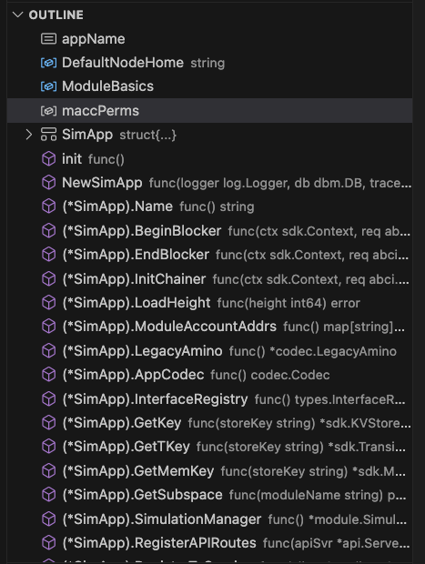

# Understanding the Simapp architecture-1

### Preview

**Hello Earth 🌏!, Welcome to Cosmos 🌌**, Welcome to the fifth chapter of the Cosmos Basics course.

In the last three lessons, we learned about the main components of the app chain, and in the last lesson, we ran the application simapp that contains those components.

Now let's take a closer look at how those main components are implemented.

The first thing we need to remind ourselves of is that the app chain implemented with the Cosmos SDK consists of several layers, and the top state-machine level is the one that developers are mostly concerned with.

This doesn't mean that you don't need to use the consensus layer parts as a developer, they are mostly interfaced, so when you develop at the application level, you just need to know that certain methods are passed to the CometBFT level through an interface called ABCI.

```sh
                ^  +-------------------------------+  ^
                |  |                               |  |
                |  |  State-machine = Application  |  |
                |  |                               |  |   Built with Cosmos SDK
                |  |            ^      +           |  |
                |  +----------- | ABCI | ----------+  v
                |  |            +      v           |  ^
                |  |                               |  |
Blockchain Node |  |           Consensus           |  |
                |  |                               |  |
                |  +-------------------------------+  |   CometBFT
                |  |                               |  |
                |  |           Networking          |  |
                |  |                               |  |
                v  +-------------------------------+  v
```

### Looking back at Simapp

In the previous lesson, we covered an application called simapp.

Its daemon was named simd, and we practiced running a simapp node with the command `simd start`.

Now, let's take a closer look at the core of the simapp node we ran.

**note**

> Cosmos SDK based blockchain full nodes are typically represented by a binary ending in -d (e.g. appd or gaiad). Additionally, these binaries are built by running the main.go file located in ./cmd/appd/. This is typically done via a Makefile.

### Simapp Architecture

First, let's take a look at the structure of simapp!

It looks a bit complicated at first glance, but since it's golang, it's simpler to organize this structure into packages (modules).

Don't worry too much about it for now.

```bash
.
├── README.md
├── app.go
├── app_test.go
├── config.go
├── encoding.go
├── export.go
├── genesis.go
├── genesis_account.go
├── genesis_account_test.go
├── helpers
│   └── test_helpers.go
├── params
│   ├── amino.go
│   ├── doc.go
│   ├── encoding.go
│   ├── params.go
│   ├── proto.go
│   └── weights.go
├── sim_bench_test.go
├── sim_test.go
├── simd
│   ├── cmd
│   │   ├── cmd_test.go
│   │   ├── genaccounts.go
│   │   ├── genaccounts_test.go
│   │   ├── root.go
│   │   ├── testnet.go
│   │   └── testnet_test.go
│   └── main.go
├── state.go
├── test_helpers.go
├── types.go
├── utils.go
└── utils_test.go
```

Now, let's group the above complex files into modules. They'll probably be more visible than before.

```bash
.
├── README.md
├── simapp (*.go)
├── helpers module
│   └── *.go
├── params module
│   ├── *.go
├── simd
│   ├── cmd module
│   │   ├── *.go
│   └── main.go (main module, entrypoint)
```

At this point, the first thing to check is  **where the main module, or entry point, is and where the main blockchain application is defined**.

We can see that one of the structures below is the main module, which is defined in `simd/main.go`. The rest of the `/*.go` files in the root directory are the actual core application level that we're going to be dealing with, wrapped in a module called simapp.

 And we can infer that modules like helpers, parasm, and cmd are for utilities or commands in the CLI, respectively.

**note**

> If you look at the code below, which is in a file called app.go, you can see that each module we used in Genesis is referenced by the main structure of the app chain called app.go. 👀 👀 👀 👀

### Core application file, app.go

Now let's learn about the most important core application file, app.go.

#### 1. import modules

If we look at the `app.go` file, we can see that each of the modules we used in Genesis are referenced in this file. This suggests that the modules defined in `app.go` could eventually become each application in the chain of applications we create or want to create.

```go
package simapp

import (
	"encoding/json"
	"io"
	"net/http"
	"os"
	"path/filepath"

	"github.com/gorilla/mux"
	"github.com/rakyll/statik/fs"
	"github.com/spf13/cast"
	abci "github.com/tendermint/tendermint/abci/types"
	"github.com/tendermint/tendermint/libs/log"
	tmos "github.com/tendermint/tendermint/libs/os"
	dbm "github.com/tendermint/tm-db"

	"github.com/cosmos/cosmos-sdk/baseapp"
	"github.com/cosmos/cosmos-sdk/client"
	"github.com/cosmos/cosmos-sdk/client/grpc/tmservice"
	"github.com/cosmos/cosmos-sdk/client/rpc"
	"github.com/cosmos/cosmos-sdk/codec"
	"github.com/cosmos/cosmos-sdk/codec/types"
	"github.com/cosmos/cosmos-sdk/server/api"
	"github.com/cosmos/cosmos-sdk/server/config"
	servertypes "github.com/cosmos/cosmos-sdk/server/types"
	simappparams "github.com/cosmos/cosmos-sdk/simapp/params"
	"github.com/cosmos/cosmos-sdk/testutil/testdata"
	sdk "github.com/cosmos/cosmos-sdk/types"
	"github.com/cosmos/cosmos-sdk/types/module"
	"github.com/cosmos/cosmos-sdk/version"
	"github.com/cosmos/cosmos-sdk/x/auth"
	"github.com/cosmos/cosmos-sdk/x/auth/ante"
	authrest "github.com/cosmos/cosmos-sdk/x/auth/client/rest"
	authkeeper "github.com/cosmos/cosmos-sdk/x/auth/keeper"
	authsims "github.com/cosmos/cosmos-sdk/x/auth/simulation"
	authtx "github.com/cosmos/cosmos-sdk/x/auth/tx"
	authtypes "github.com/cosmos/cosmos-sdk/x/auth/types"
	"github.com/cosmos/cosmos-sdk/x/auth/vesting"
	vestingtypes "github.com/cosmos/cosmos-sdk/x/auth/vesting/types"
	"github.com/cosmos/cosmos-sdk/x/authz"
	authzkeeper "github.com/cosmos/cosmos-sdk/x/authz/keeper"
	authzmodule "github.com/cosmos/cosmos-sdk/x/authz/module"
	"github.com/cosmos/cosmos-sdk/x/bank"
	bankkeeper "github.com/cosmos/cosmos-sdk/x/bank/keeper"
	banktypes "github.com/cosmos/cosmos-sdk/x/bank/types"
	"github.com/cosmos/cosmos-sdk/x/capability"
	capabilitykeeper "github.com/cosmos/cosmos-sdk/x/capability/keeper"
	capabilitytypes "github.com/cosmos/cosmos-sdk/x/capability/types"
	"github.com/cosmos/cosmos-sdk/x/crisis"
	crisiskeeper "github.com/cosmos/cosmos-sdk/x/crisis/keeper"
	crisistypes "github.com/cosmos/cosmos-sdk/x/crisis/types"
	distr "github.com/cosmos/cosmos-sdk/x/distribution"
	distrclient "github.com/cosmos/cosmos-sdk/x/distribution/client"
	distrkeeper "github.com/cosmos/cosmos-sdk/x/distribution/keeper"
	distrtypes "github.com/cosmos/cosmos-sdk/x/distribution/types"
	"github.com/cosmos/cosmos-sdk/x/evidence"
	evidencekeeper "github.com/cosmos/cosmos-sdk/x/evidence/keeper"
	evidencetypes "github.com/cosmos/cosmos-sdk/x/evidence/types"
	"github.com/cosmos/cosmos-sdk/x/feegrant"
	feegrantkeeper "github.com/cosmos/cosmos-sdk/x/feegrant/keeper"
	feegrantmodule "github.com/cosmos/cosmos-sdk/x/feegrant/module"
	"github.com/cosmos/cosmos-sdk/x/genutil"
	genutiltypes "github.com/cosmos/cosmos-sdk/x/genutil/types"
	"github.com/cosmos/cosmos-sdk/x/gov"
	govkeeper "github.com/cosmos/cosmos-sdk/x/gov/keeper"
	govtypes "github.com/cosmos/cosmos-sdk/x/gov/types"
	"github.com/cosmos/cosmos-sdk/x/mint"
	mintkeeper "github.com/cosmos/cosmos-sdk/x/mint/keeper"
	minttypes "github.com/cosmos/cosmos-sdk/x/mint/types"
	"github.com/cosmos/cosmos-sdk/x/params"
	paramsclient "github.com/cosmos/cosmos-sdk/x/params/client"
	paramskeeper "github.com/cosmos/cosmos-sdk/x/params/keeper"
	paramstypes "github.com/cosmos/cosmos-sdk/x/params/types"
	paramproposal "github.com/cosmos/cosmos-sdk/x/params/types/proposal"
	"github.com/cosmos/cosmos-sdk/x/slashing"
	slashingkeeper "github.com/cosmos/cosmos-sdk/x/slashing/keeper"
	slashingtypes "github.com/cosmos/cosmos-sdk/x/slashing/types"
	"github.com/cosmos/cosmos-sdk/x/staking"
	stakingkeeper "github.com/cosmos/cosmos-sdk/x/staking/keeper"
	stakingtypes "github.com/cosmos/cosmos-sdk/x/staking/types"
	"github.com/cosmos/cosmos-sdk/x/upgrade"
	upgradeclient "github.com/cosmos/cosmos-sdk/x/upgrade/client"
	upgradekeeper "github.com/cosmos/cosmos-sdk/x/upgrade/keeper"
	upgradetypes "github.com/cosmos/cosmos-sdk/x/upgrade/types"

	// unnamed import of statik for swagger UI support
	_ "github.com/cosmos/cosmos-sdk/client/docs/statik"
)
```

For example, if we assume that our app chain is a library chain, then the various imported modules above will have the register module, borrow module, return module, etc. that we talked about last time.

So we can express it like this.

>  So, a “library app chain” needs the following programs.
>
> 1. Registration Program (Registration Program)
> 2. Borrowing Program (Borrowing Program)
> 3. Returning Program (Returning Program)
>    Then, if we express the above application based blockchain architecture more specifically for the 'library app chain' as an example, it would look like this.


```go
import (
	// something code lines
	// ...
	// ..
	registerkeeper "github.com/cosmos/cosmos-sdk/x/register/keeper"
	registertx "github.com/cosmos/cosmos-sdk/x/register/tx"
	registertypes "github.com/cosmos/cosmos-sdk/x/register/types"

	borrowkeeper "github.com/cosmos/cosmos-sdk/x/borrow/keeper"
	borrowtx "github.com/cosmos/cosmos-sdk/x/borrow/tx"
	borrowtypes "github.com/cosmos/cosmos-sdk/x/borrow/types"

	returnkeeper "github.com/cosmos/cosmos-sdk/x/return/keeper"
	returntx "github.com/cosmos/cosmos-sdk/x/return/tx"
	returntypes "github.com/cosmos/cosmos-sdk/x/register/types"
)
```

#### 2. const & variables

And next, let's talk about const and variable.

This part is not standard for simapp, it just depends on how each chain defines them.

First, let's look at a complete code block of const & variables used inside `app.go` in simapp.

```go
const appName = "SimApp"

var (
	// DefaultNodeHome default home directories for the application daemon
	DefaultNodeHome string

	// ModuleBasics defines the module BasicManager is in charge of setting up basic,
	// non-dependant module elements, such as codec registration
	// and genesis verification.
	ModuleBasics = module.NewBasicManager(
		auth.AppModuleBasic{},
		genutil.AppModuleBasic{},
		bank.AppModuleBasic{},
		capability.AppModuleBasic{},
		staking.AppModuleBasic{},
		mint.AppModuleBasic{},
		distr.AppModuleBasic{},
		gov.NewAppModuleBasic(
			paramsclient.ProposalHandler, distrclient.ProposalHandler, upgradeclient.ProposalHandler, upgradeclient.CancelProposalHandler,
		),
		params.AppModuleBasic{},
		crisis.AppModuleBasic{},
		slashing.AppModuleBasic{},
		feegrantmodule.AppModuleBasic{},
		upgrade.AppModuleBasic{},
		evidence.AppModuleBasic{},
		authzmodule.AppModuleBasic{},
		vesting.AppModuleBasic{},
	)

	// module account permissions
	maccPerms = map[string][]string{
		authtypes.FeeCollectorName:     nil,
		distrtypes.ModuleName:          nil,
		minttypes.ModuleName:           {authtypes.Minter},
		stakingtypes.BondedPoolName:    {authtypes.Burner, authtypes.Staking},
		stakingtypes.NotBondedPoolName: {authtypes.Burner, authtypes.Staking},
		govtypes.ModuleName:            {authtypes.Burner},
	}
)

var (
	_ App                     = (*SimApp)(nil)
	_ servertypes.Application = (*SimApp)(nil)
)

// ... something code lines
// ...
// ...
```

For the most part, you should be able to get past this easily, knowing that `ModuleBasic` checks that each module meets the basic interface of a defined module at the cosmos-sdk level and creates it for you.

```go
func module.NewBasicManager(modules ...module.AppModuleBasic) module.BasicManager

// AppModuleBasic is the standard form for basic non-dependant elements of an application module.
type AppModuleBasic interface {
	Name() string
	RegisterLegacyAminoCodec(*codec.LegacyAmino)
	RegisterInterfaces(codectypes.InterfaceRegistry)

	DefaultGenesis(codec.JSONCodec) json.RawMessage
	ValidateGenesis(codec.JSONCodec, client.TxEncodingConfig, json.RawMessage) error

	// client functionality
	RegisterRESTRoutes(client.Context, *mux.Router)
	RegisterGRPCGatewayRoutes(client.Context, *runtime.ServeMux)
	GetTxCmd() *cobra.Command
	GetQueryCmd() *cobra.Command
}
```

It is also good to know that there are type and interface restrictions so that a core application struct can be a core application struct that satisfies a specific interface, as shown below.

```go
var (
	_ App                     = (*SimApp)(nil)
	_ servertypes.Application = (*SimApp)(nil)
)
```

#### 3. simapp struct

Now let's take a look at the structure and methods of our application, called simapp.

What this structure means is that when we run the `start` command from run a node, which we learned about last time, it instantiates the state-machine structure defined in the app.go file.

There's a lot of code in the app.go file, and before we go through it all, let's outline it so we have a general idea of what to expect.

Below is the structure and Methods of `SimApp` as viewed by vscode. It looks like there are a lot of different functions, so let's take a look at them one by one.



First, as we keep emphasizing, `app.go` contains the type definition and initialization functions for the application. The type definition for a cosmos-sdk based application like the simapp we are looking at is as follows. (This is the basic definition of the app chain)

1. baseapp reference: This is an application definition that extends baseapp, and baseapp realizes most of the core logic.
2. storage key list: Each module uses multiple storage to store its state.
3. module manager list: each module should define its own keeper
4. appCodec reference: encode & decode tx-msg with codec for data. Here, codec means protobuf codec
5. legacyAmino encoder reference: amino is the legacy codec before codecs like protobuf were used.
6. module manager and default module manager: manages modules, registers needed services, query services, etc.

**(Don't worry if there are a lot of words and suddenly difficult words popping out of nowhere, the concepts will gradually catch on in your head as you keep looking at it anyway, don't try to force yourself to understand it! Just accept it)**

ref; https://docs.cosmos.network/v0.47/learn/beginner/overview-app

Now, let's take a look at the app.go of the core application simapp with the components above

```go
// SimApp extends an ABCI application, but with most of its parameters exported.
// They are exported for convenience in creating helper functions, as object
// capabilities aren't needed for testing.
type SimApp structure {
	*baseapp.BaseApp
	legacyAmino *codec.LegacyAmino
	appCodec codec.Codec
	interfaceRegistry types.InterfaceRegistry

	invCheckPeriod uint

	// keys to access the substores
	keys map[string]*storetypes.KVStoreKey
	tkeys map[string]*storetypes.TransientStoreKey
	memKeys map[string]*storetypes.MemoryStoreKey

	// keeps
	AccountKeeper authkeeper.AccountKeeper
	BankKeeper bankkeeper.Keeper
	CapabilityKeeper *capabilitykeeper.Keeper
	StakingKeeper stakingkeeper.Keeper
	SlashingKeeper slashingkeeper.Keeper
	MintKeeper mintkeeper.Keeper
	DistrKeeper distrkeeper.Keeper
	GovKeeper govkeeper.Keeper
	CrisisKeeper crisiskeeper.Keeper
	UpgradeKeeper upgradekeeper.Keeper
	ParamsKeeper paramskeeper.Keeper
	AuthzKeeper authzkeeper.Keeper
	EvidenceKeeper evidencekeeper.Keeper
	FeeGrantKeeper feegrantkeeper.Keeper
	GroupKeeper groupkeeper.Keeper
	NFTKeeper nftkeeper.Keeper

	// the module manager
	mm *module.Manager

	// simulation manager
	sm *module.SimulationManager

	// module configurator
	configurator module. Configurator
}
```

There's a lot of stuff here, and it won't all fit in at once, so let's just take a quick glance at how the six components we learned about above are laid out.

### Appchain Initiate Method (NewSimApp)

The complex structure we learned about above, the `SimApp` struct, needs a create method to instantiate it.

We define this as a function called `NewSimApp`. The function that instantiates an appchain struct like this NewSimApp is called `AppCreator` in the cosmos-sdk.

With the AppCreator function, we have created the signature of a function that can now instantiate the actual struct.

#### AppCreator Signature

> This function constructs a new application with the type defined in the previous section. It must meet the AppCreator signature to be used in the start order of the application guardian program order.

```go
// AppCreator is a function that allows us to lazily initialize an
// application using various configurations.
AppCreator func(log.Logger, dbm.DB, io.Writer, AppOptions) Application
```

### NewSimApp Method

Creating a NewApp (AppCreator) that initiates the simapp defined above is a bit complicated, so we'll just skim over it this time.

However, it would be good to see how the features 1 through 6 above are implemented below.

> 1. BaseApp Reference: An application definition that extends baseapp, baseapp realizes most of the core logic.
> 2. storage key list: each module uses multiple storage to store its state
> 3. module manager list: each module should define its own keeper
> 4. appCodec reference: encode & decode tx-msg with codec for data. Codec here means > protobuf codec
> 5. legacyAmino encoder reference: amino is the legacy codec before codecs like protobuf were used.
> 6. module manager and default module manager: manages modules, registers required services, query services, etc.

```go
// NewSimApp returns a reference to an initialized SimApp.
func NewSimApp(
	logger log.Logger, db dbm.DB, traceStore io.Writer, loadLatest bool, skipUpgradeHeights map[int64]bool,
	homePath string, invCheckPeriod uint, encodingConfig simappparams.EncodingConfig,
	appOpts servertypes.AppOptions, baseAppOptions ...func(*baseapp.BaseApp),
) *SimApp {
	appCodec:= encodingConfig.Codec
	legacyAmino:= encodingConfig.Amino
	interfaceRegistry:= encodingConfig.InterfaceRegistry

	bApp:= baseapp.NewBaseApp(appName, logger, db, encodingConfig.TxConfig.TxDecoder(), baseAppOptions..)
	bApp. SetCommitMultiStoreTracer(traceStore)
	bApp.SetVersion(version.Version)
	bApp.SetInterfaceRegistry(interfaceRegistry)

	keys:= sdk.NewKVStoreKeys(
		authtypes.StoreKey, banktypes.StoreKey, stakingtypes.StoreKey,
		minttypes.StoreKey, districts.StoreKey, slashingtypes.StoreKey,
		govtypes.StoreKey, paramstypes.StoreKey, upgradetypes.StoreKey, feegrant.StoreKey,
		evidencepes.StoreKey, capabilitytypes.StoreKey,
		authzkeeper.StoreKey, nftkeeper.StoreKey, group.StoreKey,
	)
	tkeys:= sdk.NewTransientStoreKeys(paramstypes.TStoreKey)
	// NOTE: The testingkey is just mounted for testing purposes. Actual applications should
	// not include this key.
	memKeys:= sdk.NewMemoryStoreKeys(capabilitytypes.MemStoreKey, "testingkey")

	// configure state listening capabilities using AppOptions
	// we are doing nothing with the returned streaming Services and waitGroup in this case
	if _, _, err:= streaming.LoadStreamingServices(bApp, appOpts, appCodec, keys); err != nil {
		tmos.Exit(err.Error())
	}

	app:= &SimApp{
		BaseApp: bApp,
		legacyAmino: legacyAmino,
		appCodec: appCodec,
		interfaceRegistry: interfaceRegistry,
		invCheckPeriod: invCheckPeriod,
		keys: keys,
		tkeys: tkeys,
		memKeys: memKeys,
	}
	// set the BaseApp's parameter store

	// ..
	// ..
	// .. skipped some code bases
	// ..
	// Quite a bit of code has been omitted..

	return app
}
```

### Appchain Method

Let's take a look at some of the methods that the other `SimApp` structs we saw above use to satisfy the interface for becoming a cosmos-sdk based baseapp.

These methods tend to be boilerplate, but they are the ones that must be implemented in any cosmos-sdk based chain.

We've already learned these methods above in the outline below.


#### InitChainer

First, the first method we'll cover is the `InitChainer` function.

Its job is to eventually run block 0 so that the first block can init the state for block1.

When we created gentx and put it into genesis last time, it was an extension of that part, so if we didn't stake it along the way, we'd get an error from the initChainer.

And the same is true if genesis has an invalid signature txs.

```go
// InitChainer application update at chain initialization
func (app *SimApp) InitChainer(ctx sdk.Context, req abci.RequestInitChain) abci.ResponseInitChain {
	var genesisState GenesisState
	if err:= json.Unmarshal(req.AppStateBytes, &genesisState); err != nil {
		panic(err)
	}
	app.UpgradeKeeper.SetModuleVersionMap(ctx, app.mm.GetVersionMap())
	return app.mm.InitGenesis(ctx, app.appCodec, genesisState)
}
```

#### BeginBlocker and EndBlocker

The next methods we'll cover are beginblocker & endblocker. These are literally hooks that work before and after a block is created. The easiest example is a Cosmos chain with inflation, where there is a hook in beginblock for a module called mint to create tokens.

These methods are a very unique and fun aspect of the Cosmos-SDK.

In fact, I'm not sure if other ethereum-like chains have similar logic or components! There are quite a few chains that have switched to Cosmos because they found this part attractive.

(I remember chains like [injective](https://youtu.be/p3rK4rBmy9U?si=vrXHiVzsTx-de-Dt) put some interesting logic through this endblocker to further optimize their dex application, oh, and there's also dydx)

The point I'm trying to make is that eventually, dapps will switch from a general purpose vm application to a sovereign application on Layer2 (L2) or other ecosystems, depending on the needs of each application at the core level, such as block production in chains.

Each `BeginBlocker` and `EndBlocker` are simple functions as shown below, but the actual logic behind them exists at each modular level, so let's skip them for now.

However, it's worth noting that appchains implemented with the cosmos-sdk can incorporate any logic before or after block creation to suit the business logic of each chain.

```go
// BeginBlocker application updates every begin block
func (app *SimApp) BeginBlocker(ctx sdk.Context, req abci.RequestBeginBlock) abci.ResponseBeginBlock {
	return app.mm.BeginBlock(ctx, req)
}

// EndBlocker application updates every end block
func (app *SimApp) EndBlocker(ctx sdk.Context, req abci.RequestEndBlock) abci.ResponseEndBlock {
	return app.mm.EndBlock(ctx, req)
}
```

#### Registered encoder

A codec is just what it sounds like.

However, I'm sure there are some developers out there who don't really understand what it means.

In a nutshell, a blockchain is a database that needs to continuously store certain state values as key-values, and because of this, we want to construct and update the statement for each blockchain at the lowest possible cost (small size).

Therefore, most blockchains do not store the received data as it is, but encode it with a codec specific to each chain and store it as a compressed array of bytes.

In COSMOS-SDK, we use PROTOBUF EN&DECODER as a codec for this reason.
(You'll learn what protobuf is later!)

Since it is not possible to support all types of messages with a codec, and since malicious types of messages may be requested, we create a registry called `InterfaceRegistry` to ensure that only certain messages are requested.

> InterfaceRegistry. InterfaceRegistry is used by Protobuf encoder to handle the interface of using google.protobuf.Any for coding and decoding （ We also say “ unpacking ”）.

For this reason, for each chain, the `EncodingConfig` struct contains both the registry and the codec. You can see that there are two codecs, Amino is the legacy codec as mentioned above, and codec or marshaler is the protobuf-based codec that is currently used.

- Codec: The default coder used by the entire Cosmos SDK. It consists of BinaryCodec for coding and decoding status and JSONCodec for exporting data to users （ for example ） in CLI. In the default case, SDK uses Protobuf as a encoder.

- TxConfig: TxConfig defines an interface where the client can use it to generate a specific transaction type defined by the application. Currently, SDK handles two types of transactions: SIGN_MODE_DIRECT（ uses Protobuf binary as an online code ） and SIGN_MODE_LEGACY_AMINO_JSON（ relies on Amino）.

```go
// EncodingConfig specifies the concrete encoding types to use for a given app.
// This is provided for compatibility between protobuf and amino implementations.
type EncodingConfig struct {
	InterfaceRegistry types. InterfaceRegistry
	Codec codec. Codec
	TxConfig client. TxConfig
	Amino *codec.LegacyAmino
}
```

**note**
The Cosmos ecosystem has a standardized document called ADR, just like the EIP. And through this document and through governance, the previous proposal to use protobuf as a codec was [adopted](https://github.com/cosmos/cosmos-sdk/blob/main/docs/architecture/adr-019-protobuf-state-encoding.md) and that's what we're using now.

The full name is Architecture Decision Records, ADR, and it's kind of like EIP in other protocols.

### Baseapp

Finally, let's wrap up this lesson by talking briefly about baseapps.

A baseapp is the basic structure that implements a Cosmos SDK application, and a simapp is an extension of that baseapp.

This baseapp type does the following things.

```go
type App struct {
  // reference to a BaseApp
  *baseapp.BaseApp

  // list of application store keys

  // list of application keepers

  // module manager
}

```

- 1. Application block links are used for communication between the state machine and the underlying consensus engine (e.g., Tendermint)
- 2. service routers route messages and queries to the appropriate modules
- 3. different states, the state machine updates the various fluctuating states based on the ABCI messages it receives
- 4. the goal of BaseApp is to provide a base layer for Cosmos SDK applications, so that developers can easily extend it to build their own custom applications. Typically, developers create custom types for their applications.

Finally, below is the structure of the BaseApp because, as you can see from the structure, these iterative and boilerplate processes in each chain are already implemented in the BaseApp or have interfaces defined to implement them.

Our developers can easily configure a custom application using the modules of their choice without worrying about ABCI implementation, service routers, state management logic, etc.

```go
// BaseApp reflects the ABCI application implementation.
type BaseApp struct { // nolint: maligned
	// initialized on creation
	logger            log.Logger
	name              string               // application name from abci.Info
	db                dbm.DB               // common DB backend
	cms               sdk.CommitMultiStore // Main (uncached) state
	storeLoader       StoreLoader          // function to handle store loading, may be overridden with SetStoreLoader()
	router            sdk.Router           // handle any kind of message
	queryRouter       sdk.QueryRouter      // router for redirecting query calls
	grpcQueryRouter   *GRPCQueryRouter     // router for redirecting gRPC query calls
	msgServiceRouter  *MsgServiceRouter    // router for redirecting Msg service messages
	interfaceRegistry types.InterfaceRegistry
	txDecoder         sdk.TxDecoder // unmarshal []byte into sdk.Tx

	anteHandler    sdk.AnteHandler  // ante handler for fee and auth
	initChainer    sdk.InitChainer  // initialize state with validators and state blob
	beginBlocker   sdk.BeginBlocker // logic to run before any txs
	endBlocker     sdk.EndBlocker   // logic to run after all txs, and to determine valset changes
	addrPeerFilter sdk.PeerFilter   // filter peers by address and port
	idPeerFilter   sdk.PeerFilter   // filter peers by node ID
	fauxMerkleMode bool             // if true, IAVL MountStores uses MountStoresDB for simulation speed.

	// manages snapshots, i.e. dumps of app state at certain intervals
	snapshotManager    *snapshots.Manager
	snapshotInterval   uint64 // block interval between state sync snapshots
	snapshotKeepRecent uint32 // recent state sync snapshots to keep

	// volatile states:
	//
	// checkState is set on InitChain and reset on Commit
	// deliverState is set on InitChain and BeginBlock and set to nil on Commit
	checkState   *state // for CheckTx
	deliverState *state // for DeliverTx

	// an inter-block write-through cache provided to the context during deliverState
	interBlockCache sdk.MultiStorePersistentCache

	// absent validators from begin block
	voteInfos []abci.VoteInfo

	// paramStore is used to query for ABCI consensus parameters from an
	// application parameter store.
	paramStore ParamStore

	// The minimum gas prices a validator is willing to accept for processing a
	// transaction. This is mainly used for DoS and spam prevention.
	minGasPrices sdk.DecCoins

	// initialHeight is the initial height at which we start the baseapp
	initialHeight int64

	// flag for sealing options and parameters to a BaseApp
	sealed bool

	// block height at which to halt the chain and gracefully shutdown
	haltHeight uint64

	// minimum block time (in Unix seconds) at which to halt the chain and gracefully shutdown
	haltTime uint64

	// minRetainBlocks defines the minimum block height offset from the current
	// block being committed, such that all blocks past this offset are pruned
	// from Tendermint. It is used as part of the process of determining the
	// ResponseCommit.RetainHeight value during ABCI Commit. A value of 0 indicates
	// that no blocks should be pruned.
	//
	// Note: Tendermint block pruning is dependant on this parameter in conunction
	// with the unbonding (safety threshold) period, state pruning and state sync
	// snapshot parameters to determine the correct minimum value of
	// ResponseCommit.RetainHeight.
	minRetainBlocks uint64

	// application's version string
	appVersion string

	// recovery handler for app.runTx method
	runTxRecoveryMiddleware recoveryMiddleware

	// trace set will return full stack traces for errors in ABCI Log field
	trace bool

	// indexEvents defines the set of events in the form {eventType}.{attributeKey},
	// which informs Tendermint what to index. If empty, all events will be indexed.
	indexEvents map[string]struct{}
}
```

#### References

https://docs.cosmos.network/v0.50/learn/beginner/app-anatomy
https://docs.cosmos.network/v0.45/core/baseapp.html
