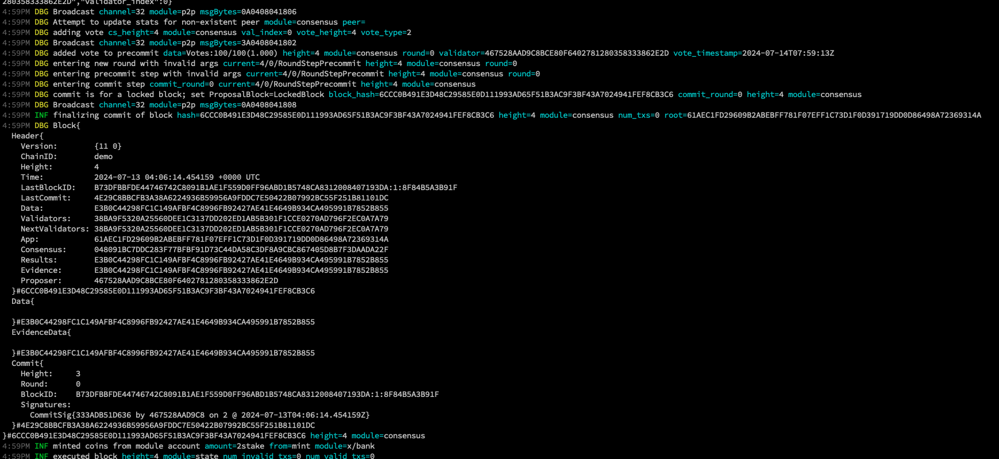
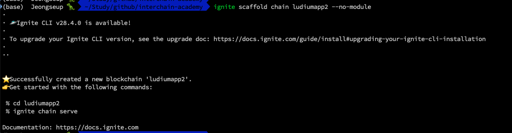

# Creating a Ludium Appchain

### Preview

<!-- TODO : preview mention -->

Now that we've learned all about simapp, we're going to create a simple application chain similar to simapp. For this mission, I think it would be more meaningful to copy & paste to the code level and learn what code is where, so I'm going to replace most of the writing with hands-on practice and Q&A. Let's get started!

---

<!-- TODO: Should I start with go mod init? -->

### 1. Clone ludiumapp chain

First, clone the ludiumapp-chain repo I prepared. If you have cloned it afterwards, I will only explain the changes to the structure.

```bash
git clone https://github.com/Ludium-Official/ludiumapp-chain
```

First, the code architecture of the existing simapp. Although I only learned app.go, the most important thing is to understand app.go and the main application chain structure because it will help you understand how it is connected when you customize modules or learn module parts later.

I think the rest of the code is something you just need to look at a lot and get used to. However, for those who are still new to development, I will only explain that `<appchain-name>/cmd/main.go` in the root path is basically the entry point for the main function and the part that is built.

#### simapp architecture

In the previous simapp we learned, app.go and other application-related code were packaged in a package called simapp in the root path.

```sh
├── README.md
├── app.go
├── config.go
├── encoding.go
├── export.go
├── genesis.go
├── genesis_account.go
├── params
│   ├── amino.go
│   ├── doc.go
│   ├── encoding.go
│   ├── params.go
│   ├── proto.go
│   └── weights.go
├── simd
│   ├── cmd
│   │   ├── genaccounts.go
│   │   ├── root.go
│   └── main.go
├── state.go
├── types.go
├── upgrades.go
├── utils.go
```

#### ludiumapp chain

I've pushed the application-related parts mentioned above into the app directory to make them more visible and understandable to developers.

```sh
├── app
│   ├── app.go
│   ├── const.go
│   ├── default_app_methods.go
│   ├── encoding.go
│   ├── export.go
│   ├── genesis.go
│   ├── params
│   │   ├── config.go
│   │   ├── encoding.go
│   │   ├── params.go
│   │   └── proto.go
│   └── types
│       ├── address.go
│       ├── cointype.go
│       └── config.go
├── go.mod
├── go.sum
├── ludiumappd
│   ├── cmd
│   │   ├── app_creater.go
│   │   ├── genaccount.go
│   │   ├── query.go
│   │   ├── root.go
│   │   └── tx.go
│   └── main.go
```

And for your reference, I've added some comments in Korean with `NOTE` in the parts that need some explanation as shown below. I hope it helps you understand.


If you're done reading this, you can finish by creating a clone and a private repo and copycoding it. For reference, this [chain-minimal repository](https://github.com/cosmosregistry/chain-minimal), which organizes the simapp structure in a similar way, may also be helpful.

### 2. Start ludiumapp chain

If you have a clone and want to run it first, you can follow the README.

```bash
# install chain
make install

# init chain
./scripts/init.sh

# start chain
./scripts/start.sh
```



<!-- https://github.com/cosmosregistry/chain-minimal -->

### 3. Rebuild with ignite cli

The last thing we'll cover is how to recreate the ludiumapp we created in this lesson using a CLI tool called ignite. ignite is a scaffolding tool that creates boilerplate parts for cosmos-sdk appchain developers. Using ignite makes it easier to develop an appchain. However, I didn't use the tool right from the start because I felt that it would only make things more complicated if I didn't understand each component, since there are so many things being created at once. However, I'll just cover the fact that it exists and how it's possible to reproduce the work above if you use it. For more information about ignite, you can check out the [official docs](https://docs.ignite.com/).

#### install ignite cli

The version we installed is v0.26.1. The reason for using this version is that the cosmos-sdk version is v0.46.x, which is similar to v0.45.4.

```bash
# install ignite v0.26.1
curl https://get.ignite.com/cli@v0.26.1\! | bash

# check ignite version
ignite version
```

#### create a new ludiumapp2 with ignite

Then simply enter the command below and it will generate a basic AppChain configuration like the boilerplate shown below. Now that we understand the architecture of a simple AppChain, let's check if it's similar with a tree.

```bash
# create a new app chain
ignite scaffold chain ludiumapp2 --no-module

# >>> result
# % cd ludiumapp2
# % ignite chain serve
```



```sh
.
├── app
│   ├── app.go
│   ├── encoding.go
│   ├── export.go
│   ├── genesis.go
│   ├── params
│   │   └── encoding.go
│   └── simulation_test.go
├── cmd
│   └── ludiumapp2d
│   ├── cmd
│   │   ├── config.go
│   │   ├── genaccounts.go
│   │   └── root.go
│   └── main.go
├── config.yml
├── docs
│   ├── docs.go
│   ├── static
│   │   └── openapi.yml
│   └── template
│   └── index.tpl
├── go.mod
├── go.sum
├── readme.md
├── testutil
│   ├── network
│   │   └── network.go
│   ├── nullify
│   │   └── nullify.go
│   └── sample
│   └── sample.go
└── tools
└── tools.go

```

#### start ludiumapp2 chain

Finally, let's spin up a chain as a quick test to make sure the generated chain is working properly.

```bash
# serve our chain
ignite chain serve
```


**homework**

Finally, the account address prefix of the ludiumapp chain currently being created is cosmos1xxx. Let's practice changing this to ludium1xxx for each of us.

```

- name: alice
  type: local
  address: cosmos1vu5kdedva5a5und43xuqxdru5msm4klmsu08hh
  pubkey: '{"@type":"/cosmos.crypto.secp256k1.PubKey","key":"A1SA9X5q6bzmrpJBEcq5Gpl4vBtas/5L7729511/nEUi"}'
  mnemonic: ""
- name: bob
  type: local
  address: cosmos1efyl2s5fut2c8r5n2yc09wxxyl87pgm2dtege4
  pubkey: '{"@type":"/cosmos.crypto.secp256k1.PubKey","key":"AmqoDI1g0cv01TjH9VDjljfcY4GFhKPIJykH3esIU3G+"}'
  mnemonic: ""

```

The references below should be enough to get you started.

- https://github.com/cosmostation/mintstation/blob/main/app/app.go#L141, https://github.com/cosmostation/mintstation/blob/main/cmd/mintstationd/cmd/config.go

- https://github.com/KYVENetwork/chain/blob/v1.0.0/app/app.go#L142

- https://github.com/neutron-org/neutron/blob/v1.0.0/app/config.go

- https://github.com/osmosis-labs/osmosis/blob/v10.2.0/app/params/config.go

- https://github.com/Jeongseup/nameservice-chain/blob/main/app/app.go#L116
