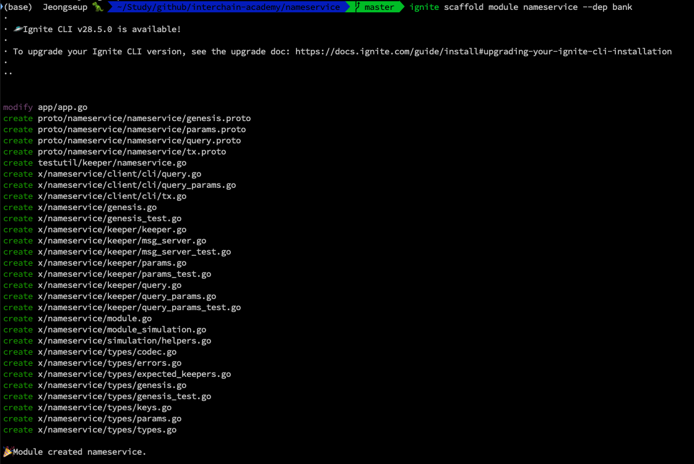
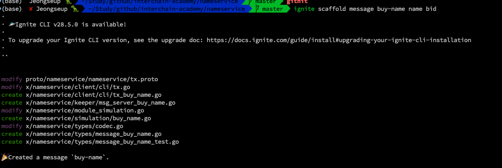
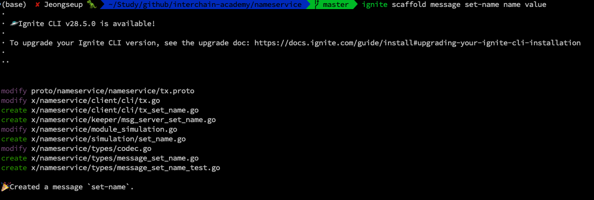
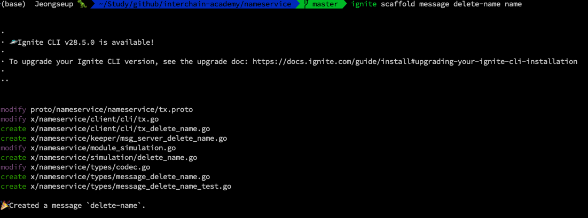

# Creating a nameservice chain with Ignite

### Preview

<!-- TODO : preview mention -->

We learned Ignite at the end of last time. Originally, you might want to move on to the next part, Transactions and Queries, and learn about things like store, keeper, etc. and cosmos-sdk modules, and build appchains with custom modules, but I've prepared this article in hopes that you'll learn more as a preview and review. Once again, **don't try to understand this article, but think of it as a quick overview of how modules are added to minimal appchains like simapp and ludiumapp, and what you need to work on and learn in order to add a single module.** For now, let's quickly build a nameservice chain with Ignite.

### 1. Create a nameservice chain without any module

As we've learned before, create an appchain in a minimalist state with no modules.

```bash
# create empty chain
# how to use? : ignite scaffold chain <chain-name> --no-module
ignite scaffold chain nameservice --no-module

# change directory into nameservice chain
cd nameservice
```

### 2. Add a new module, nameservice

Now let's add a custom module called nameservice. The nameservice application chain will be a simple module that allows users to buy and sell names with tokens.

Using the command below, we add the nameservice module under the directory x, just like the basic modules. The -flag means that we need a dependency on the bank module for token transfer. Let's see the result.

```bash
# add namespace module with bank module dependency
ignite scaffold module nameservice --dep bank
```



Something has been created, and the structure of the nameservice module created under the x directory in the appchain looks like this

```sh
└── x
└── nameservice
├── client
│   └── cli
│   ├── query.go
│   ├── query_params.go
│   └── tx.go
├── genesis.go
├── genesis_test.go
├── keeper
│   ├── keeper.go
│   ├── msg_server.go
│   ├── msg_server_test.go
│   ├── params.go
│   ├── params_test.go
│   ├── query.go
│   ├── query_params.go
│   └── query_params_test.go
├── module.go
├── module_simulation.go
├── simulation
│   └── helpers.go
└── types
├── codec.go
├── errors.go
├── expected_keepers.go
├── genesis.go
├── genesis.pb.go
├── genesis_test.go
├── keys.go
├── params.go
├── params.pb.go
├── query.pb.go
├── query.pb.gw.go
├── tx.pb.go
└── types.go
```

The important thing to note here is that it's actually a proto directory rather than a module. Basically, to create any module, you need to define what data you want to send and receive. Like this If you're not familiar with proto, you can think of it as json formatting. However, proto defines what messages to send and receive, and then generates `*.proto` and `x/module/*.go` files to CRUD or query those messages, respectively. Therefore, although golang is the language that AppChain developers mainly deal with, the first thing to define after organizing the actual business logic is the data structure, and the `message-name.proto` is created according to the data structure.

```proto
message Whois {
  string index = 1;
  string name = 2;
  string value = 3;
  string price = 4;
  string owner = 5;

}
```

Once again, we'll simply look at the directory structure.

```sh
── proto
│   └── nameservice
│   └── nameservice
│   ├── genesis.proto
│   ├── params.proto
│   ├── query.proto
│   └── tx.proto
```

### 3. Add messages for nameservice module

Without going into the detailed business logic, we will create three messages in the nameservice module: BuyName, SetName, and DeleteName. The important thing to note is that each message will conform to the `Msg` interface type, which extends proto.Message and includes the following methods as well as the legacy methods (Type, Route, GetSignBytes). The reason each message must conform to Msg is that the Cosmos SDK wraps and unwraps messages in transactions, so the application developer only needs to define the message.

- BuyName: buys a name
- SetName: sets a value to a name
- DeleteName: Deletes a name

```go
// https://docs.ignite.com/v0.25/guide/nameservice/messages
// Transactions messages must fulfill the Msg interface
type Msg interface {
    proto.Message

    // ValidateBasic does a simple validation check that
    // doesn't require access to any other information.
    ValidateBasic() error

    // Signers returns the addrs of signers that must sign.
    // CONTRACT: All signatures must be present to be valid
    GetSigners() []AccAddress

    // Legacy methods
    Type() string
    Route() string
    GetSignBytes() []byte
}

```

The messages required by the module can be scaffolded through ignite like this.

```bash
# add messages
ignite scaffold message buy-name name bid

ignite scaffold message set-name name value

ignite scaffold message delete-name name
```







### 4. Implement messages

Then, for each message, fill in the message parts according to the nameservice application business logic and you are done with the module development.

This part is not important right now, so you can replace it with this [link](https://github.com/Jeongseup/nameservice-chain/commit/5bae53103ad4db8fc93b473b43ffa93a7e68dfb1).

And finally, if you want to play around with the nameservice chain we'll be creating, you can follow [this article](https://docs.ignite.com/v0.25/guide/nameservice/play) to test it out.

### 5. End

Today's tutorial is not a hands-on tutorial, but more of a motivation for what we will learn in the future. The modules and their interactions have been previewed so that you can understand them more easily when you create a custom module like the one above and integrate it into our app chain that we created last time.

However, if you're curious about the process, you can check out my repo below to see what code was added and modified in each commit. The most important thing to understand is that a module is constructed by organizing the data structure of the messages that the module needs in the `proto` directory according to the business logic, implementing `tx.proto` and `query.proto` to CRUD & Query those messages, and finally generating the various files needed in `x/module/*.go` through a well-crafted proto directory.

**tx.proto is generated as tx.pb.go via the protobuf code generator. Here's a sample:** **tx.proto

```go
// https://github.com/Jeongseup/nameservice-chain/blob/5bae53103ad4db8fc93b473b43ffa93a7e68dfb1/x/nameservice/types/tx.pb.go
// Code generated by protoc-gen-gogo. DO NOT EDIT.
// source: nameservice/nameservice/tx.proto

// some codes..
```

#### References

- https://docs.ignite.com/v0.25/guide/nameservice
- https://github.com/Jeongseup/nameservice-chain/commits/main/
