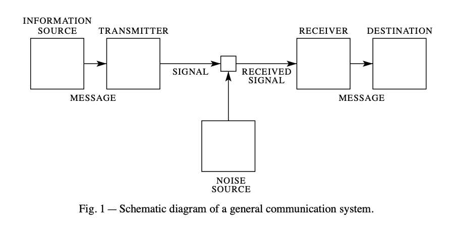

# Encoding 
> Before we dive into the gRPC, REST, and CometBFT used by the cosmos-sdk and cometbft, it is important to learn about the technology behind them. 

## 0. What is information volume?
This concept of encoding is very important because there are a lot of messages going back and forth on a blockchain network. This is especially true in the case of [Tendermint] (./99c1_tendermint_with_bft.md). Before we dive into the Cosmos SDK Encoding library, let's look at the concept of information quantity as defined by information theory to understand why we need to encode and what makes it good. 

The [IPC technique](./14_rpc_basic.md#0-ipcinter-process-communication), which we learned about in the previous article, is based on Shannon's information theory. Previous experts had tried to solve the problem of communication physically and had not grasped the essence of the problem, such as overcoming the noise problem. In 1948, Shannon revolutionized the way we think about communication by [defining what communication is]((https://people.math.harvard.edu/~ctm/home/text/others/shannon/entropy/entropy.pdf)). Shannon's 1948 paper (Information Theory) and Turing's 1936 paper (Turing Machine) have the same plot:
- First, they boldly define an elusive object (Shannon's “information quantity” and Turing's “mechanical computation”).
- and then convince us that the definition is acceptable.
- Then, from that definition, they derive logically rigorous facts (Shannon's limits on message passing, Turing's limits on mechanical computation). The two papers that changed the world follow the same pattern. 

### Information quantity
The argument that information is the main character of communication starts with the definition of “what is the amount of information in a message”. Here's how Shannon defines information quantity. Frequent things are low in information and infrequent things are high in information. Frequent is easy to predict. The difference between frequent and infrequent. Without this difference, it's hard to predict. 
- Information-rich: A message from a world where all letters are used equally, without distinction, is information-rich.
- Low information: Messages from a world with differences, on the other hand, are less informative. Frequently seen letters are easy to guess without looking because they will appear frequently. 

The amount of information is the amount of disorder, and the definition of information is the same as the definition of entropy in thermodynamics. The amount of information in a message corresponds to the degree of unpredictability of the letters. If the characters in a message are common or rare, there is less information. Common things are the majority, and they're easy to predict, so they're less disordered. To summarize 
- High information: If the letters are evenly distributed, without distinction between common and uncommon, we can say that the information is high because it is difficult to predict, i.e., there is a lot of disorder. 
- Low information: When rare words (= unnecessary words) are included in the context, the message is less informative. This means that the word “unnecessary” is already “discriminating,” and discriminating means less clutter. 
 
After defining the amount of information in a message as above and convincing us that the definition is appropriate, Shannon derived two theorems (one for noisy channels, one for noiseless channels) that allow for full communication. They are as follows
1. Noiseless channel: Let H be the amount of information we want to convey and C be the channel capacity. The message can always be delivered at most C/H per second.
2. Noisy channel: Let H be the amount of information per second and the channel capacity is C per second. 
    - If H <= C, the message can be delivered in its entirety (i.e., with sufficiently small noise intercept). 
    - If H > C, then we cannot reduce the noise to less than (H-C).

Shannon's information theory is the foundation of modern digital communications. All information and communication systems designed using it have the structure of the following diagram.

<div style="text-align: center;">
	
</div>


## 1. How to reduce the amount of information: Encoding
A way to reduce the amount of information as defined by information theory is to repeat certain patterns in a message, or add ways to repair a message corrupted by noise. As you add these additional (information-reducing) methods to a message, the amount of information that can be conveyed per unit of time will eventually become H<=C, meaning that such a message can be delivered in its entirety.
- Reducing the amount of information = lowering entropy (lowering disorder) = making things more common or rare (more predictable)

Information theory says that it is possible to communicate fully in any noise and that the way to do it is in the software (the message itself), not the hardware. The way we found it is through encoding. This encoding is sometimes referred to as marshaling or serialization, which are used in the same context, but it's worth mentioning to keep the terminology straight.

### Encoding
> “Encode” is a combination of “En-” (in) and “Code” (code, sign), meaning “to convert into a specific format”. 

Encoding is the process of converting data or information into another format. It's often used to make data more efficient to store, transmit, and process. 
- Example: Converting text data into binary form 

### Marshaling
> 'Marshal' comes from Old French 'maréchal', which in turn comes from Old Frankish '*marhskalk' (= “horse keeper, servant”). The word began to mean “servant of horses” and gradually evolved to mean “to organize” and “to arrange.

[Marshaling](https://en.wikipedia.org/wiki/Marshalling_(computer_science) ) is the process of organizing and preparing data in a specified format for transmission or storage. It mainly involves converting complex data structures into a standardized format so that they can be transferred.
1. Marshaling: Converting serialized objects into bytes to prepare them for transmission.
2. byte stream transmission: Transmitting serialized and disassembled data in sequence
3. Unmarshaling: Deserializes and restores the transmitted data to its original state.

### Serialization
> 'Serialize' is derived from 'Serial' (series, continuous) and means 'to make into a series'. 

Marshalling and serialization are used somewhat interchangeably. [Serialization](https://en.wikipedia.org/wiki/Serialization) refers to the process of converting an object or data structure into a continuous stream of bytes. This allows data to be stored or transmitted over a network.
1. serialization: Converting the state of an object into a stream of bytes so that it can be stored or transmitted.
2. Byte stream transmission: Transmitting a byte stream over a network.
3. Deserialize: Recover the byte stream back to the original object.

</br>

To summarize, these are:
- Encoding: This is the largest category that includes all the processes of converting data into a specific format. 
- Marshalling: The process of cleaning and preparing data for transmission, which includes serialization.
- Serialization: Refers to the process of converting data into a byte stream so that it can be stored or transmitted.

Encoding can be viewed as a larger concept that encompasses the concepts of marshaling and serialization. Although marshaling includes the process of serialization, it's better to think of them as similar concepts rather than as inclusive concepts. The Cosmos SDK primarily uses the word marshaling to refer to the encoding process.


### Types of Encoding 
There are currently many different ways of encoding in computer science. Here's a quick overview 
- String encoding: ASCII, UTF-8, Base64, etc.
- Image encoding: JPEG, PNG, GIF, etc.
- Audio encoding: MP3, WAV, AAC, etc.
- Video encoding: MPEG, AVI, WMV, etc.
- Compression encodings: ZIP, RAR, GZIP, etc.

These encodings are used to reduce the amount of information in order to communicate data efficiently over a network so that more information can be sent and received. In the previous article, we saw the use of [IDLs like JSON and ProtoBuf](./14_rpc_basic.md#2-idlinterface-definitionlanguage) for communication between applications written in programming languages such as JSON and ProtoBuf, and similarly, when communicating over the network, the communication is done by bypassing the encoding and decoding process. Among them, [Protobuf specializes in encoding and decoding methods that reduce message information] (./14_rpc_basic.md#protobuf-encoding-and-decoding), which is very useful in environments where a large number of messages are exchanged, such as blockchain networks. This is why Protobuf has `field_tag` like 1,2,3 in the following example. 
```protobuf
message Person { 
	required string user_name = 1; 
	optional int64 favourite_number = 2; 
	repeated string interests = 3; 
}
```

## 2. Looking at the Encoding library in the Cosmos SDK 
The Cosmos SDK we'll be looking at uses ProtoBuf as its base for communication. The evolutionary history of the Cosmos SDK's encoding library is as follows:
1. [`Amino`](https://github.com/tendermint/go-amino), which encodes the shortcomings of `Protobuf`'s shortcomings interface. 
2. [`Gogoproto`](https://github.com/cosmos/gogoproto), a customization of the Go language formula `Protobuf` implementation library
3. Go language official [`Protobuf` implementation library](https://github.com/golang/protobuf)

The reason the initial Cosmos SDK did not use [`Proto3`](https://protobuf.dev/programming-guides/proto3/) is that `Proto3` does not directly support concepts like interfaces in Go. Instead, it provided a similar feature called `oneof`, but `oneof` requires all possible types to be defined in advance. This means that developers have to write their own conversion logic between the code generated by `Proto3` and the logical objects in their application, resulting in duplicate code and additional maintenance costs. 

Therefore, we used [`Amino`](https://github.com/tendermint/go-amino), which conforms to the `Proto3` specification with extensions for interface support. It supports parity between logical objects used by applications and persistent objects permanently stored on the blockchain, and interface support increases flexibility and simplifies the encoding/decoding process. However, `Amino' lacks some of the flexibility needed in a cross-platform environment with clients written in different languages.
- It offered little in the way of backward compatibility and flexible extensibility (upgradeability). 
- Through profiling and benchmarking, `Amino` was found to be a very large performance bottleneck for the Cosmos SDK. This was evident in the transaction encoding/decoding. 

As an alternative to `Amino`, we chose `Protobuf`. The Cosmos SDK uses the [`Gogoproto`](https://github.com/gogo/protobuf) library, which meets the `Protobuf` specification while providing speed and DX improvements over the official Golang `Protobuf` library [`google.golang.org/protobuf`](https://pkg.go.dev/google.golang.org/protobuf). The problem of encoding existing interfaces is solved with the `Any` type (see ADR-019 and ADR-020 below).

However, `Gogoproto` is currently [deprecated for various reasons](https://youtu.be/HTIltI0NuNg?si=0W_5V1Yq53m3Tw_a). The Cosmos team that was using it forked it and maintains it as [`cosmos/gogoproto`](https://github.com/cosmos/gogoproto), but it appears that they are transitioning to the official Golang-supported `google.golang.org/protobuf` implementation in the long term. 

### 2-1. Encoding the `Any` Type and Interface (ADR-019)
> This ADR focuses on the `state encoding` of the Cosmos SDK state machine.

In [ADR 019: Protocol Buffer State Encoding](https://docs.cosmos.network/main/build/architecture/adr-019-protobuf-state-encoding), it was decided to use the Protobuf's [`Any`](https://protobuf.dev/programming-guides/proto3/#any) type to encode the interface of a `Protobuf`. An `Any` contains an arbitrary encoded message in bytes, with a URL (TypeURL) that acts as an identifier for that message type and is interpreted as that type. This strategy allows an arbitrary Go type to be contained within a Protobuf message without the need for a `.proto` definition. 

So the current way to encode an interface is as follows 
1. pack the interface with `Any`.
2. marshal the packed `Any`. 

The Cosmos SDK provides the [`MarshalInterface` method](https://github.com/cosmos/cosmos-sdk/blob/main/codec/proto_codec.go#L223-L240) to handle these two steps in a single step:
```go
func (pc *ProtoCodec) MarshalInterface(i gogoproto.Message) ([]byte, error) {
	if err := assertNotNil(i); err != nil {
		return nil, err
	}
	any, err := types.NewAnyWithValue(i)
	if err != nil {
		return nil, err
	}
	err = pc.interfaceRegistry.EnsureRegistered(i)
	if err != nil {
		return nil, err
	}

	return pc.Marshal(any)
}
```

The [`x/auth` module's keeper](https://github.com/cosmos/cosmos-sdk/tree/v0.47.0/x/auth/keeper) uses it as follows:
```go
func (ak AccountKeeper) MarshalAccount(accountI types.AccountI) ([]byte, error) { 
	return ak.cdc.MarshalInterface(accountI)
}

func (ak AccountKeeper) SetAccount(ctx sdk.Context, acc types.AccountI) {
    // ... 

    bz, err := ak.MarshalAccount(acc)
    if err != nil {
        panic(err)
    }

    // ... 
}
```

### 2-2. Cosmos SDK `Any` Type
Normally, to use the `Any` type, you need to import `google/protobuf/any.proto`, but [the Cosmos SDK implements its own Any type](https://github.com/cosmos/cosmos-sdk/tree/main/codec/types). 

The Cosmos SDK uses the `Any` encoding in several places:
- The `cryptotypes.PubKey` interface for encoding different types of public keys.
- The `sdk.Msg` interface for encoding various `Msg`s in transactions.
- The `AccountI` interface for encoding different types of accounts in `x/auth` query responses (similar to the example above)
- The `EvidenceI` interface for encoding different types of evidence in `x/evidence` modules
- An `AuthorizationI` interface for encoding different types of `x/authz` authorizations.
- A `Validator` structure containing information about the validator.

The following example shows [code to encode a public key as Any](https://github.com/cosmos/cosmos-sdk/blob/v0.47.0/x/staking/types/validator.go#L41-L64) inside the `Validator` structure of `x/staking`: 
```go
func NewValidator(operator sdk.ValAddress, pubKey cryptotypes.PubKey, description Description) (Validator, error) {  
	pkAny, err := codectypes.NewAnyWithValue(pubKey)  
	if err != nil {  
		return Validator{}, err  
	}  
  
	return Validator{  
		ConsensusPubkey: pkAny,  

		// ...
	}, nil  
}  
```

#### `Any`'s TypeURL
When packing a Protobuf message inside an `Any`, the type of the message is uniquely defined by its TypeURL, which is the fully qualified name of the message prefixed with the `/(slash)` character. 

Some Any implementations, such as `gogoproto`, typically have a resolvable prefix, such as `type.googleapis.com`. However, the Cosmos SDK chose not to include such a prefix and use a shorter form URL. 
- The Cosmos SDK's [own Any implementation code](https://github.com/cosmos/cosmos-sdk/tree/main/codec/types)

The Cosmos SDK is also switching from gogoproto to the official google.golang.org/protobuf (known as Protobuf API v2), as mentioned above. The default Any implementation also includes the “type.googleapis.com” prefix. To maintain compatibility with the SDK, the following methods in “google.golang.org/protobuf/types/known/anypb” should not be used
- `anypb.New`
- `anypb.MarshalFrom`
- `anypb.Any#MarshalFrom`

Instead, the Cosmos SDK provides a [helper function](https://github.com/cosmos/cosmos-proto/tree/main/anyutil) that generates the formal `anypb.Any` without inserting the prefix:
- `anyutil.New`
- `anyutil.MarshalFrom`

### 2-3. Transaction Encoding (ADR-020)
Another important use of Protobuf is the encoding and decoding of transactions. The main purpose of [ADR 019](https://docs.cosmos.network/main/build/architecture/adr-019-protobuf-state-encoding) is to enable secure compatibility with many chains through interface encoding using `Any`. [ADR 020: Protocol Buffer Transaction Encoding](https://docs.cosmos.network/main/build/architecture/adr-020-protobuf-transaction-encoding) aims to provide a flexible cross-chain transaction format without breaking this compatibility. 

Transactions are defined by applications or the Cosmos SDK, but are passed to the underlying consensus engine, which in turn passes them to other peers. As we briefly covered in [`Broadcasting the Transaction Lifecycle`](./10_transaction_and_mempool.md#1-Creating-and-Broadcasting-Transactions), where we encoded transactions as `[]byte`, the underlying consensus engine is application agnostic and only accepts `[]byte` transactions. 
- [app -> cometbft] The `TxEncoder` object performs the encoding. (`sdk.Tx` -> `[]byte` conversion)
- [cometbft -> app] The `TxDecoder` object performs decoding. (Convert `[]byte` -> `sdk.Tx`)
```go
// TxDecoder unmarshals transaction bytes  
type TxDecoder func(txBytes []byte) (Tx, error)  
  
// TxEncoder marshals transaction to bytes  
type TxEncoder func(tx Tx) ([]byte, error)
```

Examples of implementations of these two standards can be found at [`x/auth module` tx](https://docs.cosmos.network/v0.47/build/modules/auth/tx):
- [`x/auth` tx encoder](https://github.com/cosmos/cosmos-sdk/blob/v0.47.0/x/auth/tx/encoder.go)
- [`x/auth` tx decoder](https://github.com/cosmos/cosmos-sdk/blob/v0.47.0/x/auth/tx/decoder.go)


## 3. Codec
The `codec` package in the Cosmos SDK contains the [`Amino Codec`](https://github.com/cosmos/cosmos-sdk/blob/main/codec/amino_codec.go) and [`Proto Codec`](https://github.com/cosmos/cosmos-sdk/blob/main/codec/proto_codec.go). 

All existing Cosmos SDK modules use the `Amino Codec` to encode types and interfaces. This `Codec` typically has types and interfaces registered only in that module's domain. Each module has a `RegisterLegacyAminoCodec` function that allows the user to provide a `Codec` and register all of its types, and the app calls this method for each module it needs. As mentioned above, we are currently in a continuous transition to `Protobuf` encoding, and if there is no `Protobuf`-based type definition for a module, we use `Amino` to encode and decode bytes into concrete types or interfaces:
```go
bz := keeper.cdc.MustMarshal(typeOrInterface)  
keeper.cdc.MustUnmarshal(bz, &typeOrInterface)
```


# Resources
- https://docs.cosmos.network/v0.47/learn/advanced/encoding
- 이광근, 컴퓨터 과학이 여는 세계, 인사이트(2017)

