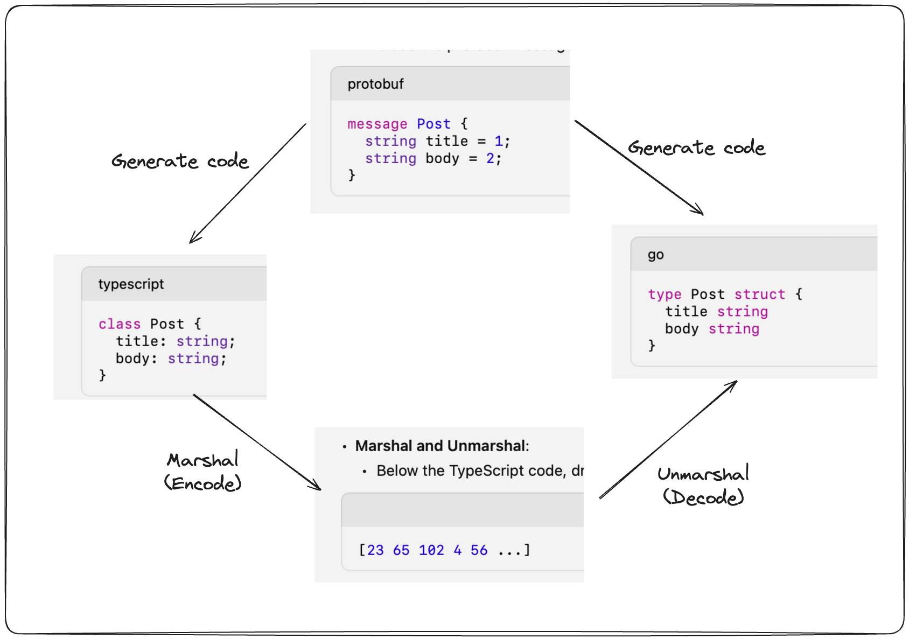
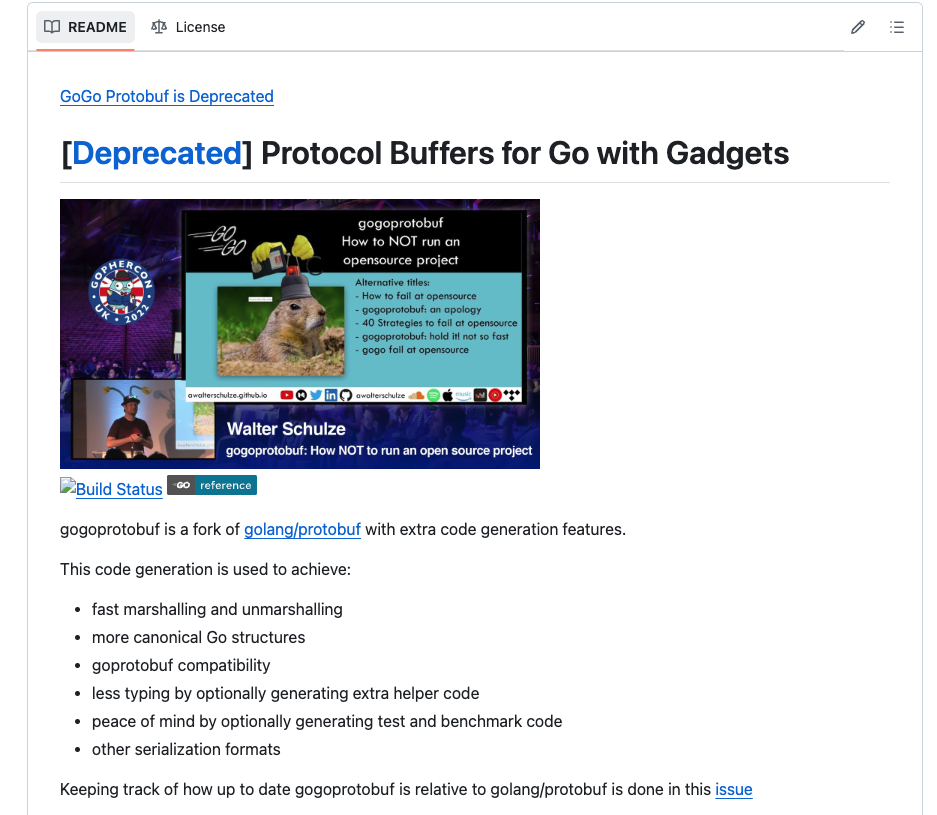

# Protobuf

### Preview

**Hello World!**! Welcome to the Cosmos Basic course module chapter. Today's topic is `Protocol Buffers`. You might be wondering why we're talking about `Protobuf` when we're talking about cosmos-sdk and modules, but it's because we're borrowing the codec from the sdk, and it's also helpful from a development perspective because there are teams that are creating GRPC APIs based on protobuf instead of json-based REST APIs.

---

### Background of Protobuf

`Protocol Buffers` (protobuf), developed by Google, is a binary serialization format optimized for structuring and transferring data. While text-based data formats such as JSON and XML are easy for humans to read and understand, they have limitations in terms of data transfer and processing performance. To overcome these limitations, Google developed Protocol Buffers to create a format that maximizes performance and efficiency.

---

### Comparison with JSON Data Format

JSON data format is a human-readable, text-based data format that is widely used on the web. However, JSON can be inefficient in terms of data size and processing power. Protocol Buffers, on the other hand, serializes and transmits data in a binary format, which is smaller in size and about six times faster to process (see reference below).

While JSON and Protobuf messages are interchangeable, the two technologies were designed with different goals. JSON is a textual message format and is supported by almost all programming languages. Protobuf, on the other hand, is not only a message format, but also a set of rules for defining and exchanging messages. Google makes Protobuf open source and provides code generation tools for many languages, including JavaScript, Java, PHP, C#, Ruby, Objective C, Python, C++, and Go. Protobuf also has more data types and methods than JSON, and is heavily used in remote procedure calls (RPC).



So, now that we've learned about protobuf, let's take a quick look at its features.

### Protobuf Features

-  **Read and write speed**: Protobuf is faster to read and write than JSON
-  **Data size**: Being a binary format, Protobuf has a smaller data size than JSON
-  **Schema**: Protobuf defines data structures through a clear schema, which helps maintain consistency and integrity of data
-  **Extensibility**: Protobuf is backwards compatible, so you can add new fields and still maintain compatibility with existing clients.

If you have control over a private API or client, it may be a better way to structure and transport data than JSON. These protocol buffers (protobuf) were created by Google and are language- and platform-agnostic and extensible.

Because of the above features, when creating the rpc framework, Google took this good data format and borrowed protobuf for gRPC. We define these protobuf messages as a file named `*.proto` instead of coding them directly.

```proto
syntax = "proto3";

package Lecture;

message Class {
    string name = 1 ;
}
```
 
For more information, check out the official documentation below.

https://protobuf.dev/

---

### gogoprotobuf compiler

Additionally, I'm not sure if it exists for each language, but for the golang we're dealing with, there is an extended version of the compiler called gogoprotobuf. When I say compiler, I mean a compiler that generates protomessages for each language when supporting each language as mentioned above.

GOGOPROTOBUF is an improved version of the original official Google compiler. The history is that Google's Go and protobuf teams first created the runtime together, and an external team forked it to create the faster gogoprotobuf.

However, in March 2020, the Go team released a major version of the Go API (APIv2) with performance improvements for protocol buffers and a reflection API like gogoprotobuf. Therefore, it's better to just use [golang protobuf(APIv2)](https://github.com/golang/protobuf) these days.

Currently, [gogoprotobuf seems to be unmaintained due to ownership issues](https://github.com/gogo/protobuf/issues/691)



However, there are often discussions in the development community about which compiler to use [like this](https://www.reddit.com/r/golang/comments/oy0ob1/which_protobuf_compiler_to_choose/).

---

### gogoprotobuf in cosmos-sdk

The reason this article was a bit longer than expected is because we are currently using protobuf as a codec in the cosmos-sdk. Initially, cosmos used the gogoprotobuf compilation mentioned above.

This is why you can often see a replace in the go.mod of our ludiumapp chain from v0.45.4.

```go
https://github.com/regen-network/protobuf/tree/v1.3.3-alpha.regen.1
```

And since cosmos v0.47.x, due to maintenance issues, it is maintained as a [repo](https://github.com/cosmos/gogoproto?tab=readme-ov-file) forked from the cosmos side.

> Migration from gogo/protobuf to cosmos/gogoproto. The SDK was using the now unmaintained gogo/protobuf library. This has been replaced by cosmos/gogoproto which is a fork of gogo/protobuf with some improvements and fixes, that is maintained by the Cosmos SDK team. This change is not transparent for applications developers. All proto files should be regenerated with the new library. Use the ghcr.io/cosmos/proto-builder image (version >= 0.11.5) for generating protobuf files.

#### References

- https://auth0.com/blog/beating-json-performance-with-protobuf/

- https://github.com/orgs/cosmos/discussions/6

- https://github.com/cosmos/gogoproto?tab=readme-ov-file
