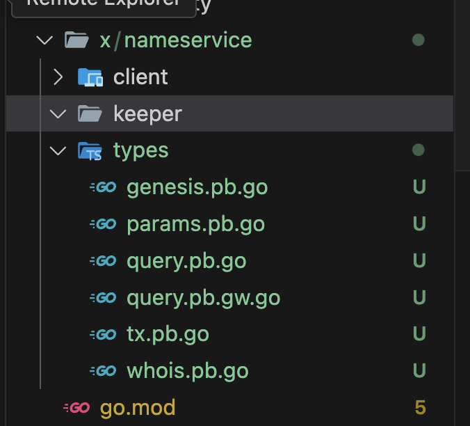
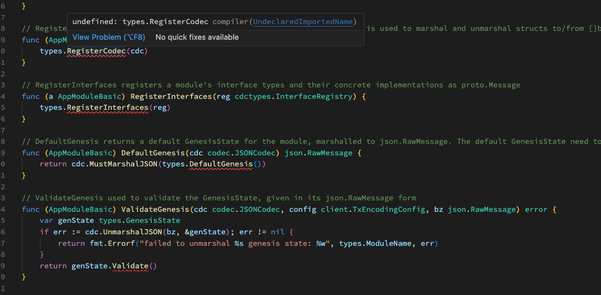
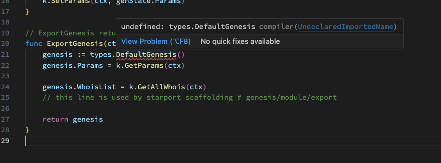
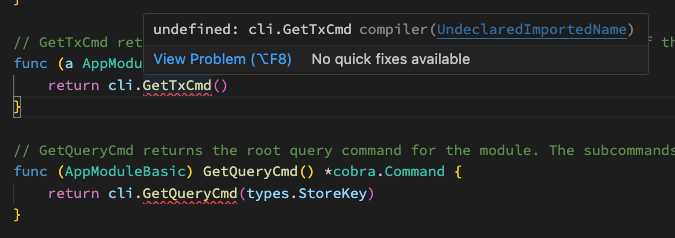

# 32. Build custom module

### Preview

**Hello World!**! Welcome to the Cosmos Basic course module chapters. This is the final chapter. The last thing we'll cover is custom modules. As an app chain developer, you will naturally need to develop new modules from time to time to develop your own applications, such as library app chains. And if you finish this course well, you will really become a cosmos-sdk appchain developer. And actually, this course is a repeat of what we already did in the 8th article.

However, you can also use a good CLI like ignite to develop, but the reason I'm hand-coding this is because I think that in the process of generating a lot of code, a lot of the process of how a module is developed is left out in your head, and it doesn't make sense. The boilerplate process can be cumbersome, but I think it's really helpful to do it at least once. 

So let's get started
<!-- 
### Overview of a module

We're going to recreate a module called nameservice that we previously learned about with a tool called ignite.

The steps are 

1. modeling a protobuf message

2. protobuf message generating... 

3. finalize the module

- Messages(txs)
- Queries
- Params
- Storage
- Begin Block & End Block
- Can communicate with other modules -->


### Clone ludiumapp chain again 

Start by re-cloning the Ludium appchain we created last time, and switching to a new brunch called `build_custom_module-start` to start.

```bash
# clone
git clone https://github.com/Jeongseup/ludiumapp-chain.git

# change dir
cd ludiumapp-chain 

# switch branch
git switch build_custom_module-start
```
### Build a nameservice module's proto message

First of all, I have prepared the proto files in advance. However, if you want to build and integrate a custom module from your own app chain (not from the cloned ludiumapp chain), you can follow the steps below.


First, create a proto directory `$ROOT_PATH/proto/<module-name>/<version | sub-name>/*.proto` Basically, it should look something like this, but there's no exact specification, so we'll borrow from the ignite CLI for now.

```bash
mkdir -p proto/nameservice/nameservice
```

Next, we'll create each of these files.

```bash
touch proto/nameservice/nameservice/genesis.proto
touch proto/nameservice/nameservice/params.proto
touch proto/nameservice/nameservice/query.proto
touch proto/nameservice/nameservice/tx.proto
touch proto/nameservice/nameservice/whois.proto
```

Then copy&paste the third_party proto files that should be used in each file. In actual development, we use a package manager called buf to easily import and define these third-party proto files. However, for a more basic understanding and to illustrate the process, we don't use buf and put the third_party proto files directly into the repo like this.

If you have time after all this, I'll explain how to use buf, or you can use it in your own hackathon.
- https://github.com/cosmos/cosmos-sdk/issues/11991
- https://buf.build/cosmos/cosmos-sdk/docs/main

Let's start with `whois.proto`. The reason we're looking at this file first is because it's the actual data structure we'll be storing. Whatever business logic process we go through will eventually define the data model that will be stored on the blockchain. The nameservice module we'll be working with will implement several additional RPCs, but you can think of all the RPC calls as CRUDing a single message like the one below.

Depending on your business model, the number and type of messages you need to define may vary. When you look at it this way, it's a pretty simple module.

```proto
// NOTE: Specify the version
syntax = "proto3";
// NOTE: Specify the packages
package nameservice.nameservice;

// NOTE: Output location
option go_package = "github.com/Jeongseup/ludiumapp-chain/x/nameservice/types";

message Whois {
	// NOTE: index is always required.
  string index = 1; 
  string name = 2; 
  string value = 3; 
  string price = 4; 
  string owner = 5; 
}
```

Next, we'll create `tx.proto` and `query.proto` to CRUD those messages. 

First up is `tx.proto`. In the service section, we first define the messages to be passed to the RPC call. Then we define what messages will be responded with. You can think of it as defining the actual functionality of our module. And each of these functions will CRUD the WhoIs message we already defined above through some logic.

```proto
syntax = "proto3";

package nameservice.nameservice;

// NOTE: Output location
option go_package = "github.com/Jeongseup/ludiumapp-chain/x/nameservice/types";

// Msg defines the Msg service.
service Msg {
  rpc BuyName    (MsgBuyName   ) returns (MsgBuyNameResponse   );
  rpc DeleteName (MsgDeleteName) returns (MsgDeleteNameResponse);
  rpc SetName    (MsgSetName   ) returns (MsgSetNameResponse   );
}
message MsgBuyName {
  string creator = 1;
  string name    = 2;
  string bid     = 3;
}

message MsgBuyNameResponse {}

message MsgDeleteName {
  string creator = 1;
  string name    = 2;
}

message MsgDeleteNameResponse {}

message MsgSetName {
  string creator = 1;
  string name    = 2;
  string value   = 3;
}

message MsgSetNameResponse {}
```

It looks a bit complicated, but it's `query.proto`. However, the difference with the previous tx service is that all of these functions only define messages to query (GET) data from the blockchain. Note that the option `option (google.api.http).get = “/nameservice/nameservice/params”;` is the part that makes the restapi call grpc even if it is not grpc in the future.

For an example, see the [swagger](https://cosmos-rest.publicnode.com/swagger) swagger page for a better understanding.

```proto
syntax = "proto3";

package nameservice.nameservice;

import "gogoproto/gogo.proto";
import "google/api/annotations.proto";
import "cosmos/base/query/v1beta1/pagination.proto";
import "nameservice/nameservice/params.proto";
import "nameservice/nameservice/whois.proto";

option go_package = "github.com/Jeongseup/ludiumapp-chain/x/nameservice/types";

// Query defines the gRPC querier service.
service Query {
  
  // Parameters queries the parameters of the module.
  rpc Params (QueryParamsRequest) returns (QueryParamsResponse) {
    option (google.api.http).get = "/nameservice/nameservice/params";
  
  }
  
  // Queries a list of Whois items.
  rpc Whois    (QueryGetWhoisRequest) returns (QueryGetWhoisResponse) {
    option (google.api.http).get = "/nameservice/nameservice/whois/{index}";
  
  }
  rpc WhoisAll (QueryAllWhoisRequest) returns (QueryAllWhoisResponse) {
    option (google.api.http).get = "/nameservice/nameservice/whois";
  
  }
}
// QueryParamsRequest is request type for the Query/Params RPC method.
message QueryParamsRequest {}

// QueryParamsResponse is response type for the Query/Params RPC method.
message QueryParamsResponse {
  
  // params holds all the parameters of this module.
  Params params = 1 [(gogoproto.nullable) = false];
}

message QueryGetWhoisRequest {
  string index = 1;
}

message QueryGetWhoisResponse {
  Whois whois = 1 [(gogoproto.nullable) = false];
}

message QueryAllWhoisRequest {
  cosmos.base.query.v1beta1.PageRequest pagination = 1;
}

message QueryAllWhoisResponse {
  repeated Whois                                  whois      = 1 [(gogoproto.nullable) = false];
           cosmos.base.query.v1beta1.PageResponse pagination = 2;
}
```

And genesis and params don't matter for now, so just copy & paste and skip them.

```proto
// genesis.proto
syntax = "proto3";

package nameservice.nameservice;

import "gogoproto/gogo.proto";
import "nameservice/nameservice/params.proto";
import "nameservice/nameservice/whois.proto";

option go_package = "github.com/Jeongseup/ludiumapp-chain/x/nameservice/types";

// GenesisState defines the nameservice module's genesis state.
message GenesisState {
  Params params    = 1 [(gogoproto.nullable) = false];
  repeated Whois  whoisList = 2 [(gogoproto.nullable) = false];
}

// params.proto
syntax = "proto3";
package nameservice.nameservice;

import "gogoproto/gogo.proto";

option go_package = "github.com/Jeongseup/ludiumapp-chain/x/nameservice/types";

// Params defines the parameters for the module.
message Params {
  option (gogoproto.goproto_stringer) = false;
  
}

```


### Create a nameservice module directory & Generate gofiles from proto messages

First, create the nameservice module directory and generate the proto messages defined above for golang, the language we are using. (The make command may be unfamiliar to those who haven't done backend development, but it's just a collection of commands into a single function, so we'll skip it for now)

```bash
# mkdir.. 
mkdir -p x/nameservice/client/cli
mkdir -p x/nameservice/keeper

# generate *.pg.go files in x/nameservice/keeper/types
# https://github.com/cosmos/cosmos-sdk/blob/v0.45.4/scripts/protocgen.sh
make proto-gen
```




### Build nameservice appmodule basic

First, take a look at [this commit](https://github.com/Jeongseup/ludiumapp-chain/commit/cc0e0e7a248f87a1be74bfdcce0176072efe6d0f) and create each of these files and write some code. There are several steps, which will be explained in detail in the training, but I'll try to summarize them below.

First, the structure. Each of the files you'll be copying and writing has the following structure. 

```bash
- x/nameservice
x/nameservice/genesis.go
x/nameservice/module.go

- x/nameservice/client

x/nameservice/client/cli/tx.go
x/nameservice/client/cli/query.go

- x/nameservice/keeper
x/nameservice/keeper/keeper.go
x/nameservice/keeper/msg_server.go
x/nameservice/keeper/query.go

- x/nameservice/types
x/nameservice/types/codec.go
```

Let's describe each section.


#### 1. root path in module

The root of a module is where you write the module.go file, which is the part that implements the interface methods to conform to the module `AppModule` defined by the cosmos-sdk. For a more detailed explanation, see Module files are boilerplate. Since genesis is also boilerplate, and since we're using v0.45.4, we've left out the deprecated legacy methods to legacy.go to satisfy the interface.

#### 2. client directory

The client directory defines what is used at the CLI level.

#### 3. keeper directory

The keeper directory will contain the business logic for the actual CRUD. The way to write the code is to catch the basic cosmos-sdk level interfaces like keeper, msg_server, and query, and then implement the things you need for your implementation one by one. 

The msg_server will define the functions for the RPC calls that we defined in the proto, query will literally define the query, and keeper will define the getters, setters, etc. that the previous msg_server functions and query functions will perform internally.

#### 4. types directory

This is where you define the structure and types of data that the getter and setter mentioned above will handle.


---

### Create boBoilerplate codes

And now we'll go step by step, creating the necessary boilerplate code and explaining each of them.

#### 1. create keys files in types package

It's going to be a rough boilerplate road ahead... Let's do it one by one. First, we need to create keys.go and keys_whois.go for our module to use. This is simple code, so copy & paste it. The important thing to note here is that the `StoreKey` is usually `ModuleName`. And when storing the specific messages inside each module, we'll create a KVStore key for each message, which will look like this: `key = nameservice/<kv-key>` followed by the key. If you then look at the keys_whois file, you will see that the key for the message `Whois` is defined. 

However, in real-world development, these humanizable keys are often used as byte indexes [like this](https://github.com/cosmos/cosmos-sdk/blob/v0.47.0-rc1/x/bank/types/keys.go#L31), because if they are repeated, unnecessary data will be loaded into the debi over and over again.

```go
// x/nameservice/types/keys.go
package types

const (
	// ModuleName defines the module name
	ModuleName = "nameservice"

	// StoreKey defines the primary module store key
	StoreKey = ModuleName

	// RouterKey defines the module's message routing key
	RouterKey = ModuleName

	// MemStoreKey defines the in-memory store key
	MemStoreKey = "mem_nameservice"
)

func KeyPrefix(p string) []byte {
	return []byte(p)
}

```

```go
// x/nameservice/types/keys_whois.go
package types

import "encoding/binary"

var _ binary.ByteOrder

const (
	// WhoisKeyPrefix is the prefix to retrieve all Whois
	WhoisKeyPrefix = "Whois/value/"
)

// WhoisKey returns the store key to retrieve a Whois from the index fields
func WhoisKey(
	index string,
) []byte {
	var key []byte

	indexBytes := []byte(index)
	key = append(key, indexBytes...)
	key = append(key, []byte("/")...)

	return key
}

```


#### 2. create module.go & genesis.go

module.go is basically one of the boilerplate parts that implements the default signatures that any module based on the cosmos-sdk should be happy with, as mentioned above. In this example, we will create module.go and genesis.go in the module root directory using [this resource](https://github.com/Jeongseup/ludiumapp-chain/blob/cc0e0e7/x/nameservice/module.go). And check out the methods that are not yet implemented as shown in the photo below.






#### 3. create keeper

keeper.go in the keeper directory is also boilerplate. Refer to the code below to create the file and copy&paste it. Then again, if you look at the error in vscode, you will see an error in bankkeeper, and if you write the code, you will see an error due to a dependency issue with the bank module that the module we are defining has, but in the types dir, we also define an expected_keeper for the bank module that our module will use. (In this way, when modules exchange data with each other, they do so by defining an interface to the external module's keeper from within one module)

```go
// x/nameservice/keeper/keeper.go
package keeper

import (
	"fmt"

	"github.com/cosmos/cosmos-sdk/codec"
	storetypes "github.com/cosmos/cosmos-sdk/store/types"
	sdk "github.com/cosmos/cosmos-sdk/types"
	paramtypes "github.com/cosmos/cosmos-sdk/x/params/types"
	"github.com/tendermint/tendermint/libs/log"

	"github.com/Jeongseup/ludiumapp/x/nameservice/types"
)

type (
	Keeper struct {
		cdc        codec.BinaryCodec
		storeKey   storetypes.StoreKey
		memKey     storetypes.StoreKey
		paramstore paramtypes.Subspace

		bankKeeper types.BankKeeper
	}
)

func NewKeeper(
	cdc codec.BinaryCodec,
	storeKey,
	memKey storetypes.StoreKey,
	ps paramtypes.Subspace,

	bankKeeper types.BankKeeper,
) *Keeper {
	// set KeyTable if it has not already been set
	if !ps.HasKeyTable() {
		ps = ps.WithKeyTable(types.ParamKeyTable())
	}

	return &Keeper{
		cdc:        cdc,
		storeKey:   storeKey,
		memKey:     memKey,
		paramstore: ps,

		bankKeeper: bankKeeper,
	}
}

func (k Keeper) Logger(ctx sdk.Context) log.Logger {
	return ctx.Logger().With("module", fmt.Sprintf("x/%s", types.ModuleName))
}

```

The methods below are now methods that should already be defined in each auth or bank. However, rather than importing and using other modules from the current nameservice module perspective, we define interfaces to the expected types in this way.

```go
// x/nameservice/types/expected_keepers.go
package types

import (
	sdk "github.com/cosmos/cosmos-sdk/types"
	"github.com/cosmos/cosmos-sdk/x/auth/types"
)

// AccountKeeper defines the expected account keeper used for simulations (noalias)
type AccountKeeper interface {
	GetAccount(ctx sdk.Context, addr sdk.AccAddress) types.AccountI
	// Methods imported from account should be defined here
}

// BankKeeper defines the expected interface needed to retrieve account balances.
type BankKeeper interface {
	SendCoinsFromAccountToModule(ctx sdk.Context, senderAddr sdk.AccAddress, recipientModule string, amt sdk.Coins) error
	SendCoins(ctx sdk.Context, fromAddr sdk.AccAddress, toAddr sdk.AccAddress, amt sdk.Coins) error
}

```


#### 4. create params for bolerplate
Next, we create params.go. This part is almost boilerplate for the cosmos-sdk module. Similarly to before, you can think of the structs defined in cosmos types as just satisfying methods.

```go
// x/nameservice/types/params.go
package types

import (
	paramtypes "github.com/cosmos/cosmos-sdk/x/params/types"
	"gopkg.in/yaml.v2"
)

// NOTE: This means that
var _ paramtypes.ParamSet = (*Params)(nil)

// ParamKeyTable the param key table for launch module
func ParamKeyTable() paramtypes.KeyTable {
	return paramtypes.NewKeyTable().RegisterParamSet(&Params{})
}

// NewParams creates a new Params instance
func NewParams() Params {
	return Params{}
}

// DefaultParams returns a default set of parameters
func DefaultParams() Params {
	return NewParams()
}

// ParamSetPairs get the params.ParamSet
func (p *Params) ParamSetPairs() paramtypes.ParamSetPairs {
	return paramtypes.ParamSetPairs{}
}

// Validate validates the set of params
func (p Params) Validate() error {
	return nil
}

// String implements the Stringer interface.
func (p Params) String() string {
	out, _ := yaml.Marshal(p)
	return string(out)
}

```


#### 5. create codec for bolerplate

The codec file is also boilerplate. The important thing to note is that if you create a specific codec at each appchain level and try to accommodate all messages (e.g. MsgBuyName), it will naturally become heavy, or you can inject arbitrary malicious message types, or you can have problems with overrides, etc. For this reason, each AppChain creates a codec and instead of importing the messages that each module needs (e.g. MsgBuyName, MsgSetName, MsgDeleteName), it creates an interfaceRegistry to register what the module needs (mapped to a specific key, such as nameservice/BuyName) to avoid duplicate messages.

If there are duplicates, an error is thrown with duplicate message.

```go
// x/nameservice/types/codec.go
package types

import (
	"github.com/cosmos/cosmos-sdk/codec"
	cdctypes "github.com/cosmos/cosmos-sdk/codec/types"
	sdk "github.com/cosmos/cosmos-sdk/types"
	"github.com/cosmos/cosmos-sdk/types/msgservice"
)

func RegisterCodec(cdc *codec.LegacyAmino) {
	cdc.RegisterConcrete(&MsgBuyName{}, "nameservice/BuyName", nil)
	cdc.RegisterConcrete(&MsgSetName{}, "nameservice/SetName", nil)
	cdc.RegisterConcrete(&MsgDeleteName{}, "nameservice/DeleteName", nil)
}

func RegisterInterfaces(registry cdctypes.InterfaceRegistry) {
	registry.RegisterImplementations((*sdk.Msg)(nil),
		&MsgBuyName{},
	)
	registry.RegisterImplementations((*sdk.Msg)(nil),
		&MsgSetName{},
	)
	registry.RegisterImplementations((*sdk.Msg)(nil),
		&MsgDeleteName{},
	)

	msgservice.RegisterMsgServiceDesc(registry, &_Msg_serviceDesc)
}

var (
	Amino     = codec.NewLegacyAmino()
	ModuleCdc = codec.NewProtoCodec(cdctypes.NewInterfaceRegistry())
)


```

#### 6. create genesis for bolerplate

The genesis file is also boilerplate (with so much boilerplate, it's easier to use a tool like ignite CLI, which I recommend for real hackathons). copy & patch to create the genesis.

```go
// x/nameservice/types/genesis.go
package types

import (
	"fmt"
)

// DefaultIndex is the default global index
const DefaultIndex uint64 = 1

// DefaultGenesis returns the default genesis state
func DefaultGenesis() *GenesisState {
	return &GenesisState{
		WhoisList: []Whois{},
		// this line is used by starport scaffolding # genesis/types/default
		Params: DefaultParams(),
	}
}

// Validate performs basic genesis state validation returning an error upon any
// failure.
func (gs GenesisState) Validate() error {
	// Check for duplicated index in whois
	whoisIndexMap := make(map[string]struct{})

	for _, elem := range gs.WhoisList {
		index := string(WhoisKey(elem.Index))
		if _, ok := whoisIndexMap[index]; ok {
			return fmt.Errorf("duplicated index for whois")
		}
		whoisIndexMap[index] = struct{}{}
	}
	// this line is used by starport scaffolding # genesis/types/validate

	return gs.Params.Validate()
}

```

#### 7. implements msg_servers for methods

If you're still getting errors, it's time to catch them and finalize the basic structure of your module. Since we've already defined the following message calls using the proto files, the error is caused by not implementing the corresponding method for each message.

```proto
service Msg {
	rpc BuyName (MsgBuyName ) returns (MsgBuyNameResponse );
	rpc DeleteName (MsgDeleteName) returns (MsgDeleteNameResponse);
	rpc SetName (MsgSetName ) returns (MsgSetNameResponse );
}
```

It first maps msg_server, which is already implemented in types as a file named *.pb.go. 

```go
// x/nameservice/keeper/genesis.go
package keeper

import (
	"github.com/Jeongseup/ludiumapp/x/nameservice/types"
)

type msgServer struct {
	Keeper
}

// NewMsgServerImpl returns an implementation of the MsgServer interface
// for the provided Keeper.
func NewMsgServerImpl(keeper Keeper) types.MsgServer {
	return &msgServer{Keeper: keeper}
}

var _ types.MsgServer = msgServer{}

```

Once added, we need to implement each of the methods below for the message services as mentioned earlier. First, we'll skip the internal business logic and just match the input and output to eliminate errors.


```go
// x/nameservice/keeper/msg_server_set_name.go
package keeper

import (
	"context"

	sdk "github.com/cosmos/cosmos-sdk/types"
	"nameservice/x/nameservice/types"
)

func (k msgServer) SetName(goCtx context.Context, msg *types.MsgSetName) (*types.MsgSetNameResponse, error) {
	ctx := sdk.UnwrapSDKContext(goCtx)

	// TODO: Handling the message
	_ = ctx

	return &types.MsgSetNameResponse{}, nil
}


```

```go
// x/nameservice/keeper/msg_server_delete_name.go
package keeper

import (
	"context"

	sdk "github.com/cosmos/cosmos-sdk/types"
	"nameservice/x/nameservice/types"
)

func (k msgServer) DeleteName(goCtx context.Context, msg *types.MsgDeleteName) (*types.MsgDeleteNameResponse, error) {
	ctx := sdk.UnwrapSDKContext(goCtx)

	// TODO: Handling the message
	_ = ctx

	return &types.MsgDeleteNameResponse{}, nil
}

```

```go
// x/nameservice/keeper/msg_server_buy_name.go
package keeper

import (
	"context"

	sdk "github.com/cosmos/cosmos-sdk/types"
	"nameservice/x/nameservice/types"
)

func (k msgServer) BuyName(goCtx context.Context, msg *types.MsgBuyName) (*types.MsgBuyNameResponse, error) {
	ctx := sdk.UnwrapSDKContext(goCtx)

	// TODO: Handling the message
	_ = ctx

	return &types.MsgBuyNameResponse{}, nil
}

```

And when you're done with one, a similar process remains for queries!

#### 8. implements queries for methods

First, create a query the same as above. Then implement the methods needed by the query.


```go
// x/nameservice/keeper/query.go
package keeper

import (
	"github.com/Jeongseup/ludiumapp/x/nameservice/types"
)

var _ types.QueryServer = Keeper{}

```

The query to be implemented will have params, whois, whoisAll, etc. as defined in query.proto.

```go
// QueryServer is the server API for Query service.
type QueryServer interface {
	// Parameters queries the parameters of the module.
	Params(context.Context, *QueryParamsRequest) (*QueryParamsResponse, error)
	// Queries a list of Whois items.
	Whois(context.Context, *QueryGetWhoisRequest) (*QueryGetWhoisResponse, error)
	WhoisAll(context.Context, *QueryAllWhoisRequest) (*QueryAllWhoisResponse, error)
}
```

Each part is also implemented as above, but without the detailed business logic.

```go
package keeper

import (
	"context"

	"github.com/Jeongseup/ludiumapp/x/nameservice/types"

	sdk "github.com/cosmos/cosmos-sdk/types"
	"google.golang.org/grpc/codes"
	"google.golang.org/grpc/status"
)

func (k Keeper) Params(goCtx context.Context, req *types.QueryParamsRequest) (*types.QueryParamsResponse, error) {
	if req == nil {
		return nil, status.Error(codes.InvalidArgument, "invalid request")
	}
	ctx := sdk.UnwrapSDKContext(goCtx)
	_ = ctx

	return &types.QueryParamsResponse{Params: types.Params{}}, nil
}

```

```go
package keeper

import (
	"context"

	"github.com/Jeongseup/ludiumapp/x/nameservice/types"
	"github.com/cosmos/cosmos-sdk/types/query"
)

func (k Keeper) WhoisAll(goCtx context.Context, req *types.QueryAllWhoisRequest) (*types.QueryAllWhoisResponse, error) {


	return &types.QueryAllWhoisResponse{Whois: []types.Whois{}, Pagination: &query.PageResponse{}}, nil
}

func (k Keeper) Whois(goCtx context.Context, req *types.QueryGetWhoisRequest) (*types.QueryGetWhoisResponse, error) {


	return &types.QueryGetWhoisResponse{Whois: types.Whois{}}, nil
}

```
---

#### 9. implements keepers

It's been a while now, but if you think about it, we don't actually have any Set, Update, or Select in the actual chain through the messages we receive. The msg_server that I've outlined above is just a handler for rpc calls. Then we implement a keeper that actually CRUDs arbitrary data through a store abstracted from the app blockchain leveldb. I've commented out the details, so copy & paste that part.

```go
// x/nameservice/keeper/keeper_whois.go
package keeper

import (
	"github.com/Jeongseup/ludiumapp/x/nameservice/types"

	"github.com/cosmos/cosmos-sdk/store/prefix"
	sdk "github.com/cosmos/cosmos-sdk/types"
)

// SetWhois set a specific whois in the store from its index
func (k Keeper) SetWhois(ctx sdk.Context, whois types.Whois) {
	// NOTE: At each keeper level, let's build on the code that is now mostly implemented.
    // We use the context passed in to create a div called store using the module's keeper store and message prefix.
    // and marshal the whois data we're passed via protobuf to compress it.
    // Save the whois data to the div using the div's Set function.
    // GetWhois and RemoveWhois are similar, so we'll skip them.
	store := prefix.NewStore(ctx.KVStore(k.storeKey), types.KeyPrefix(types.WhoisKeyPrefix))
	b := k.cdc.MustMarshal(&whois)
	store.Set(types.WhoisKey(
		whois.Index,
	), b)
}

// GetWhois returns a whois from its index
func (k Keeper) GetWhois(
	ctx sdk.Context,
	index string,
) (val types.Whois, found bool) {
	store := prefix.NewStore(ctx.KVStore(k.storeKey), types.KeyPrefix(types.WhoisKeyPrefix))

	b := store.Get(types.WhoisKey(
		index,
	))
	if b == nil {
		return val, false
	}

	k.cdc.MustUnmarshal(b, &val)
	return val, true
}

// RemoveWhois removes a whois from the store
func (k Keeper) RemoveWhois(
	ctx sdk.Context,
	index string,

) {
	store := prefix.NewStore(ctx.KVStore(k.storeKey), types.KeyPrefix(types.WhoisKeyPrefix))
	store.Delete(types.WhoisKey(
		index,
	))
}

// GetAllWhois returns all whois
func (k Keeper) GetAllWhois(ctx sdk.Context) (list []types.Whois) {
	store := prefix.NewStore(ctx.KVStore(k.storeKey), types.KeyPrefix(types.WhoisKeyPrefix))
	iterator := sdk.KVStorePrefixIterator(store, []byte{})

	defer iterator.Close()

	for ; iterator.Valid(); iterator.Next() {
		var val types.Whois
		k.cdc.MustUnmarshal(iterator.Value(), &val)
		list = append(list, val)
	}

	return
}

```

Next, we'll implement one more keeper for genesis.go because we also need set and get for the param messages we need for our part.

```go
// x/nameservice/keeper/keeper_param.go
package keeper

import (
	"github.com/Jeongseup/ludiumapp/x/nameservice/types"
	sdk "github.com/cosmos/cosmos-sdk/types"
)

// GetParams get all parameters as types.Params
func (k Keeper) GetParams(ctx sdk.Context) types.Params {
	return types.NewParams()
}

// SetParams set the params
func (k Keeper) SetParams(ctx sdk.Context, params types.Params) {
	k.paramstore.SetParamSet(ctx, &params)
}

```

#### 10. implements cli 

Afterward, you can see the error that the cli side is also required as below. Implement the same as above and finish.



Below 
https://github.com/Jeongseup/ludiumapp-chain/blob/cc0e0e7a248f87a1be74bfdcce0176072efe6d0f/x/nameservice/client/cli/tx.go

https://github.com/Jeongseup/ludiumapp-chain/blob/cc0e0e7a248f87a1be74bfdcce0176072efe6d0f/x/nameservice/client/cli/query.go


### Create MsgTypes for cosmos-sdk msg standard

And we've come a long way! Now we create the missing methods as shown below to make each message conform to the cosmos-sdk msg. By default, the golang msg struct generated by *.pb.go has some methods implemented by default, but it's still not good enough to be used at the sdk module level. Therefore, we implement the missing methods as below. Below is a sample for one message, and you can refer to this [commit](https://github.com/Jeongseup/ludiumapp-chain/commit/eb5ee661b6632f2e24ad2b17ed7ec8466fc6450b) for the rest.

```go
// x/nameservice/types/message_buy_name.go
package types

import (
	sdk "github.com/cosmos/cosmos-sdk/types"
	sdkerrors "github.com/cosmos/cosmos-sdk/types/errors"
)

const TypeMsgBuyName = "buy_name"

var _ sdk.Msg = &MsgBuyName{}

func NewMsgBuyName(creator string, name string, bid string) *MsgBuyName {
	return &MsgBuyName{
		Creator: creator,
		Name:    name,
		Bid:     bid,
	}
}

// func (msg *MsgBuyName) Route() string {
// 	return RouterKey
// }

// func (msg *MsgBuyName) Type() string {
// 	return TypeMsgBuyName
// }

func (msg *MsgBuyName) GetSigners() []sdk.AccAddress {
	creator, err := sdk.AccAddressFromBech32(msg.Creator)
	if err != nil {
		panic(err)
	}
	return []sdk.AccAddress{creator}
}

// NOTE: For MarshalJSON
func (msg *MsgBuyName) GetSignBytes() []byte {
	bz := ModuleCdc.MustMarshalJSON(msg)
	return sdk.MustSortJSON(bz)
}

func (msg *MsgBuyName) ValidateBasic() error {
	_, err := sdk.AccAddressFromBech32(msg.Creator)
	if err != nil {
		return sdkerrors.Wrapf(sdkerrors.ErrInvalidAddress, "invalid creator address (%s)", err)
	}
	return nil
}
```


### Modify msg_servers to adapt our business logic

And now it's time to modify each of the msg_servers, which we simply implemented first above, to fit the business logic of our module. We'll skip this part because it's largely pointless at this point. You'll just need to see how we've organized the keyvalue mapping code.

For more information, see this [commit](https://github.com/Jeongseup/ludiumapp-chain/commit/d6b4d5c9cf6dba75105d3282232312cdbb452347).


### Add commands(tx & query)

Finally, the module creates the [tx](https://github.com/Jeongseup/ludiumapp-chain/commit/3033fb051384b41e88588b8b5afeae1f564f2671) and [query](https://github.com/Jeongseup/ludiumapp-chain/commit/eeb8ef31ce156927df1141b572ffb59a1d42ced0
) CLIs.


### Integration our module into app.go

This is really the final step in building the module. It integrates our module into app.go. There's not much to worry about except that it expects bankkeeper, so add it like any other module. (Note that bank should be below the bank module, not above it).

You can see the modified code here [link](https://github.com/Jeongseup/ludiumapp-chain/commit/30e5cc33f27652af030601e90a67720992372888).


This is the end of the process. This article had a lot of code parts, so it might have been confusing.


<!-- #### Developement process

TODO: Organize the following as needed and subtract 33 or 40.

If we summarize the process of developing a custom module in the cosmos-sdk based on the contents of today's post, it is as follows

1. envision the business logic
2. define it technically (write optional spec documentation)
3. 
    1. by manually, manually protobuf and boilerplate 
    2. by using ignite CLI 

4. fill out business logic into our codes

I thought it would be good to utilize the repo created by the Cosmos builder group before, so I imported it.

+ Mintstation


 -->
