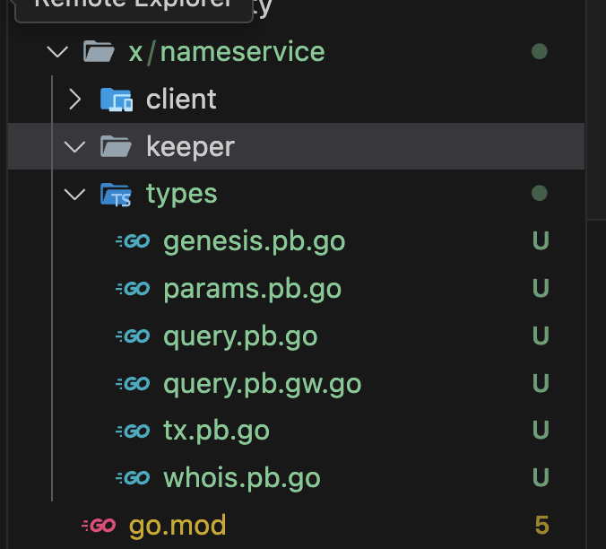
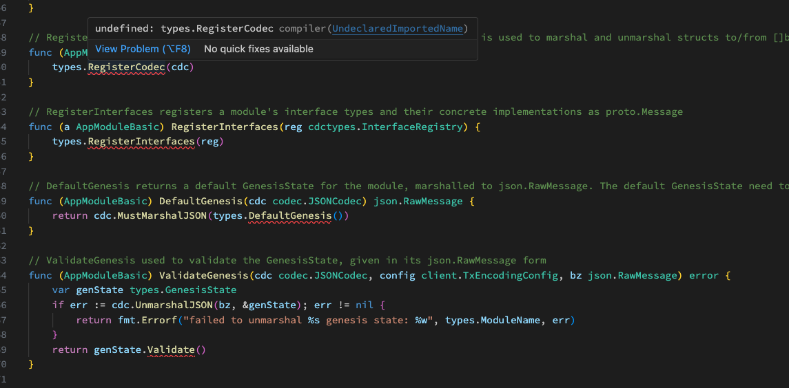
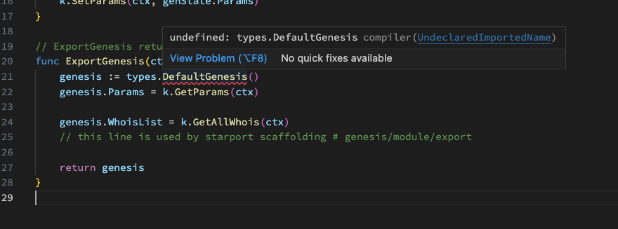
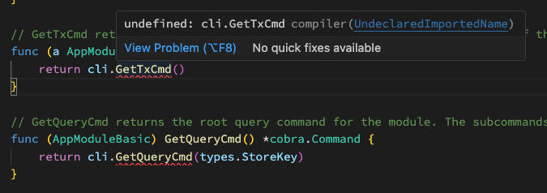

# 32. Build custom module

### Preview

**Hello World!**! 코스모스 베이직 과정 모듈 챕터에 오신 것을 환영한다. 이제 마지막 챕터이다. 마지막으로 다둘 내용은 custom module이다. 앱 체인 개발자들은 자연스럽게 도서관 앱체인처럼 본인이 원하는 어플리케이션을 개발하기 위해서 때로는 새로운 모듈을 개발해야하기도 한다. 그리고 이번 과정을 잘 마무리하면 정말 cosmos-sdk appchain developer가 될 것이다. 그리고 사실 해당 과정은 이전에 8번째 아티클에서 미리했던 내용을 반복하는 것이다.

하지만, ignite와 같은 좋은 CLI를 사용해서 개발하는 방법도 있으나 이렇게 손코딩을 하는 이유는 수많은 코드들이 generate되는 과정에서 각자의 머릿속에 모듈이 개발되는 과정에 대한 많이 프로세스들이 생략되고 이 때문에 이해가 떨어진다고 생각해서이다. 보일러 플레이트 과정이 번거로울 수는 있지만 그래도 한번이라도 해보는게 추후에 정말 큰 도움이 될것이라고 생각한다. 

그럼 시작해보자
<!-- 
### Overview of a module

저희는 예전에 ignite란 툴로 배웠던 nameservice 라는 모듈을 다시 만들어볼 예정이다.

순서는 

1. protobuf 메세지 모델링

2. protobuf message generating.. 

3. 모듈 완성

- Messages(txs)
- Queries
- Params
- Storage
- Begin Block & End Block
- Can communicate with other modules -->


### Clone ludiumapp chain again 

먼저 지난번에 만들었던 루디움 앱체인을 다시 클론하고, 새로 시작할 `build_custom_module-start`란 브런치로 switch하여 시작한다.

```bash
# clone
git clone https://github.com/Jeongseup/ludiumapp-chain.git

# change dir
cd ludiumapp-chain 

# switch branch
git switch build_custom_module-start
```
### Build a nameservice module's proto message

우선 제가 proto파일들은 미리 준비를 해놓았다. 그렇지만 클론받은 ludiumapp chain이 아닌 지난번에 과제로 드렸던 본인의 앱체인에서부터 커스텀 모듈을 빌드하고 integration하실 분들은 해당 과정에 따라 잘 따라하시면 된다.


먼저 proto 디렉토리를 생성한다. `$ROOT_PATH/proto/<module-name>/<version | sub-name>/*.proto` 기본적으로 이와 같은 형식으로 만들게 되는데 정확히 정해진 스펙은 없으나 우선 ignite CLI에서 준수하는 방식을 차용하겠다.

```bash
mkdir -p proto/nameservice/nameservice
```

다음으로는 각 파일들을 생성한다.

```bash
touch proto/nameservice/nameservice/genesis.proto
touch proto/nameservice/nameservice/params.proto
touch proto/nameservice/nameservice/query.proto
touch proto/nameservice/nameservice/tx.proto
touch proto/nameservice/nameservice/whois.proto
```

그리고 각 파일들에서 사용해야할 third_party proto files를 copy&patse한다. 실제 개발단계에서는 이런 third_party proto를 쉽게 import하고 정의하기 위해서 buf라고 하는 package manager를 사용한다. 하지만, 보다 기초적인 이해와 과정을 설명하기 위해서 해당 buf를 사용하지 않고 이와 같이 직접 repo에 third_party proto files를 넣어놨다.

모든 과정 이후에 시간이 여유가 있다면 buf를 쓰는 방법을 설명하거나, 각자 해커톤에서 사용하시길 바란다.
- https://github.com/cosmos/cosmos-sdk/issues/11991
- https://buf.build/cosmos/cosmos-sdk/docs/main

먼저 `whois.proto`부터 보겠다. 해당 파일을 가장 먼저보는 이유는 실질적으로 저장할 데이터 구조이기 때문이다. 어떠한 비즈니스 로직 과정을 통해서든 결국 블록체인이라는 디비에 저장할 데이터 모델을 정의할 것이다. 저희가 다룰 nameservice 모듈은 여러 RPC를 추가적으로 구현하겠지만 모든 RPC콜들은 아래의 단일 메세지 하나를 CRUD한다고만 생각하면 된다.

그리고 각 비즈니스 모델에 따라서 정의해야할 메세지의 개수나 형태는 다를 수 있다. 이렇게 보면 생각보다 굉장히 심플한 모듈이라고 느껴질 것이다.

```proto
// NOTE: 버젼 명시
syntax = "proto3";
// NOTE: 패키지 명시
package nameservice.nameservice;

// NOTE: 아웃풋 위치
option go_package = "github.com/Jeongseup/ludiumapp-chain/x/nameservice/types";

message Whois {
	// NOTE: index 는 항상 필요합니다.
  string index = 1; 
  string name = 2; 
  string value = 3; 
  string price = 4; 
  string owner = 5; 
}
```

다음은 이제 해당 메세지를 CRUD할 `tx.proto`와 `query.proto`를 만들어보자. 

먼저 `tx.proto`이다. 서비스 섹션에서 먼저 RPC 콜로 전달할 메세지들을 정의한다. 그리고 이후에 어떤 메세지로 Response될지 정의한다. 실질적인 우리 모듈의 기능을 정의한다고 생각하시면 된다. 그리고 각 기능들을 어떠한 로직을 통해서 위에서 이미 정의한 WhoIs란 메세지를 CRUD하게 된다.

```proto
syntax = "proto3";

package nameservice.nameservice;

// NOTE: 아웃풋 위치
option go_package = "github.com/Jeongseup/ludiumapp-chain/x/nameservice/types";

// Msg defines the Msg service.
service Msg {
  rpc BuyName    (MsgBuyName   ) returns (MsgBuyNameResponse   );
  rpc DeleteName (MsgDeleteName) returns (MsgDeleteNameResponse);
  rpc SetName    (MsgSetName   ) returns (MsgSetNameResponse   );
}
message MsgBuyName {
  string creator = 1;
  string name    = 2;
  string bid     = 3;
}

message MsgBuyNameResponse {}

message MsgDeleteName {
  string creator = 1;
  string name    = 2;
}

message MsgDeleteNameResponse {}

message MsgSetName {
  string creator = 1;
  string name    = 2;
  string value   = 3;
}

message MsgSetNameResponse {}
```

좀 많이 복잡해보이지만, `query.proto`이다. 다만 이전 tx 서비스와 다른 점은 해당 기능들은 전부 블록체인에서 데이터를 query(GET)하기 위한 메세지만을 정의한다. 참고로 `option (google.api.http).get = "/nameservice/nameservice/params";` 으로 되어있는 옵션은 추후에 grpc가 아니더라도 restapi 콜이 grpc로 연결되도록 만들어주는 부분이다.

예시로는 [swagger](https://cosmos-rest.publicnode.com/swagger) 이 스웨거 페이지를 참조하면 쉽게 이해될 것 같다.

```proto
syntax = "proto3";

package nameservice.nameservice;

import "gogoproto/gogo.proto";
import "google/api/annotations.proto";
import "cosmos/base/query/v1beta1/pagination.proto";
import "nameservice/nameservice/params.proto";
import "nameservice/nameservice/whois.proto";

option go_package = "github.com/Jeongseup/ludiumapp-chain/x/nameservice/types";

// Query defines the gRPC querier service.
service Query {
  
  // Parameters queries the parameters of the module.
  rpc Params (QueryParamsRequest) returns (QueryParamsResponse) {
    option (google.api.http).get = "/nameservice/nameservice/params";
  
  }
  
  // Queries a list of Whois items.
  rpc Whois    (QueryGetWhoisRequest) returns (QueryGetWhoisResponse) {
    option (google.api.http).get = "/nameservice/nameservice/whois/{index}";
  
  }
  rpc WhoisAll (QueryAllWhoisRequest) returns (QueryAllWhoisResponse) {
    option (google.api.http).get = "/nameservice/nameservice/whois";
  
  }
}
// QueryParamsRequest is request type for the Query/Params RPC method.
message QueryParamsRequest {}

// QueryParamsResponse is response type for the Query/Params RPC method.
message QueryParamsResponse {
  
  // params holds all the parameters of this module.
  Params params = 1 [(gogoproto.nullable) = false];
}

message QueryGetWhoisRequest {
  string index = 1;
}

message QueryGetWhoisResponse {
  Whois whois = 1 [(gogoproto.nullable) = false];
}

message QueryAllWhoisRequest {
  cosmos.base.query.v1beta1.PageRequest pagination = 1;
}

message QueryAllWhoisResponse {
  repeated Whois                                  whois      = 1 [(gogoproto.nullable) = false];
           cosmos.base.query.v1beta1.PageResponse pagination = 2;
}
```

그리고 genesis와 params는 일단은 중요하지 않으니 copy & paste만 하고 스킵한다.

```proto
// genesis.proto
syntax = "proto3";

package nameservice.nameservice;

import "gogoproto/gogo.proto";
import "nameservice/nameservice/params.proto";
import "nameservice/nameservice/whois.proto";

option go_package = "github.com/Jeongseup/ludiumapp-chain/x/nameservice/types";

// GenesisState defines the nameservice module's genesis state.
message GenesisState {
  Params params    = 1 [(gogoproto.nullable) = false];
  repeated Whois  whoisList = 2 [(gogoproto.nullable) = false];
}

// params.proto
syntax = "proto3";
package nameservice.nameservice;

import "gogoproto/gogo.proto";

option go_package = "github.com/Jeongseup/ludiumapp-chain/x/nameservice/types";

// Params defines the parameters for the module.
message Params {
  option (gogoproto.goproto_stringer) = false;
  
}

```


### Create a nameservice module directory & Generate gofiles from proto messages

먼저 네임서비스 모듈 디렉토리를 생성하고, 위에서 정의한 proto 메세지들을 이제 우리가 사용하는 언어인 golang에 맞춰서 generate한다. (make 명령어는 백엔드쪽 개발을 안해보신 분들한테는 익숙하지 않을 수 있는데 그냥 커맨드를 모아서 하나의 기능형태로 만들어둔 것인데 일단 생략한다)

```bash
# mkdir.. 
mkdir -p x/nameservice/client/cli
mkdir -p x/nameservice/keeper

# generate *.pg.go files in x/nameservice/keeper/types
# https://github.com/cosmos/cosmos-sdk/blob/v0.45.4/scripts/protocgen.sh
make proto-gen
```




### Build nameservice appmodule basic

먼저 [이 커밋](https://github.com/Jeongseup/ludiumapp-chain/commit/cc0e0e7a248f87a1be74bfdcce0176072efe6d0f)을 보시면서 각 파일들을 만들고 코드를 작성해보자. 여러 과정이 있을텐데, 우선 자세한 과정들은 교육 때 설명하도록 하겠습니다. 아래는 포인트만 잡아서 설명하겠다.

우선 구조이다. 복사하면서 작성하실 파일들은 각각이 아래와 같은 구조로 되어있다. 

```bash
- x/nameservice
x/nameservice/genesis.go
x/nameservice/module.go

- x/nameservice/client

x/nameservice/client/cli/tx.go
x/nameservice/client/cli/query.go

- x/nameservice/keeper
x/nameservice/keeper/keeper.go
x/nameservice/keeper/msg_server.go
x/nameservice/keeper/query.go

- x/nameservice/types
x/nameservice/types/codec.go
```

각 섹션을 설명하도록 하겠습니다.


#### 1. root path in module

module의 루트는 module.go파일을 작성하는 곳으로 cosmos-sdk에서 정의한 모듈 `AppModule`을 준수하도록 interface method를 구현하는 파트이다. 자세한 설명은 모듈 파일이 보일러 플레이트 생략한다. genesis 또한 보일러 플레이트이고, 저희는 v0.45.4를 사용했기 때문에 인터페이스를 만족시키기 위해 현재는 쓰이지 않는 legacy method는 legacy.go로 따로 뺴주었다.

#### 2. client directory

client 디렉토리에는 CLI 레벨에서 사용되는 것들이 정의된다.

#### 3. keeper directory

keeper 디렉토리는 실질적인 CRUD에 대한 비즈니스 로직이 담기게 된다. 코드를 작성하는 방법은 keeper, msg_server, query와 같은 기본 cosmos-sdk 레벨의 인터페이스를 잡아주고 이후에 구현에 필요한 것들을 하나씩 구현하면 된다. 

msg_server는 proto에서 정의했던 RPC콜에 대한 기능들을 정의하게 되고, query에서는 말 그대로 쿼리, 그리고 keeper에서 앞서 있는 msg_server의 기능과 query의 기능들이 내부적으로 수행할 getter, setter등을 정의하게 된다.

#### 4. types directory

위에서 말한 getter, setter가 다룰 데이터들의 구조 및 타입들을 정의하는 곳이다.


---

### Create boBoilerplate codes

그리고 이제 단계별로 필요한 보일러 플레이트 코드를 만들면서 각각 설명하겠다.

#### 1. create keys files in types package

이제부터 험난한 보일러 플레이트의 길이 시작될텐데... 하나씩 해보자. 먼저 저희 모듈이 사용할 키를 우선 keys.go와 keys_whois.go를 만들어준다. 간단한 코드이니 copy & paste해준다. 여기서 중요하게 볼 포인트는  `StoreKey`가 일반적으로 `ModuleName`을 쓴다는 것이다. 그리고 각 모듈 내부의 세부적인 메세지들을 저장할 때에는 메세지별로 KVStore key를 생성하게 된다. 즉, `key = nameservice/<kv-key>`와 같은 형태로 키가 이어질 것이다. 그럼 이어서 keys_whois 파일을 보시면 `Whois`란 메세지의 키가 정의된 것을 보실 수 있다. 

단, 실제 개발에서는 이와같이 humanable한 키들이 반복될 경우 불필요한 데이터를 디비에 계속해서 적재하게 되므로, [이와 같이](https://github.com/cosmos/cosmos-sdk/blob/v0.47.0-rc1/x/bank/types/keys.go#L31) byte index로 사용하기도 한다.

```go
// x/nameservice/types/keys.go
package types

const (
	// ModuleName defines the module name
	ModuleName = "nameservice"

	// StoreKey defines the primary module store key
	StoreKey = ModuleName

	// RouterKey defines the module's message routing key
	RouterKey = ModuleName

	// MemStoreKey defines the in-memory store key
	MemStoreKey = "mem_nameservice"
)

func KeyPrefix(p string) []byte {
	return []byte(p)
}

```

```go
// x/nameservice/types/keys_whois.go
package types

import "encoding/binary"

var _ binary.ByteOrder

const (
	// WhoisKeyPrefix is the prefix to retrieve all Whois
	WhoisKeyPrefix = "Whois/value/"
)

// WhoisKey returns the store key to retrieve a Whois from the index fields
func WhoisKey(
	index string,
) []byte {
	var key []byte

	indexBytes := []byte(index)
	key = append(key, indexBytes...)
	key = append(key, []byte("/")...)

	return key
}

```


#### 2. create module.go & genesis.go

module.go는 위에서 언급했듯이 기본적으로 cosmos-sdk 기반의 모듈이라면 만족해야하는 디폴트 시그니쳐들을 구현하는 부분으로 보일러 플레이트 중 하나이다. 여기선 [해당 리소스](https://github.com/Jeongseup/ludiumapp-chain/blob/cc0e0e7/x/nameservice/module.go)를 참고하여 module 루트 디렉토리 위치에 module.go 와 genesis.go도 만들어준다. 그리고 아래 사진과 같이 아직 implement되지 않은 메소드들은 확인하길 바란다.






#### 3. create keeper

keeper 디렉토리에 있는 keeper.go 또한 보일러 플레이트이다. 아래 코드를 참고하여 파일을 생성하고 copy&paste한다. 그 다음 다시 vscode의 에러를 보면 bankkeeper에 에러가 발생한다. 그리고 코드를 작성하다보면 우리가 정의할 모듈이 가지고 있는 뱅크 모듈에 대한 디펜던시 문제로 인해 에러가 보일텐데 types dir에 우리 모듈에서 사용할 bank 모듈에 대한 expected_keeper도 같이 정의한다. (이와 같이 각 모듈들이 서로 데이터를 주고 받을 때는 한 모듈 내부에서 외부 모듈의 키퍼에 대한 인터페이스를 정의하는 형태로 주고 받는다)

```go
// x/nameservice/keeper/keeper.go
package keeper

import (
	"fmt"

	"github.com/cosmos/cosmos-sdk/codec"
	storetypes "github.com/cosmos/cosmos-sdk/store/types"
	sdk "github.com/cosmos/cosmos-sdk/types"
	paramtypes "github.com/cosmos/cosmos-sdk/x/params/types"
	"github.com/tendermint/tendermint/libs/log"

	"github.com/Jeongseup/ludiumapp/x/nameservice/types"
)

type (
	Keeper struct {
		cdc        codec.BinaryCodec
		storeKey   storetypes.StoreKey
		memKey     storetypes.StoreKey
		paramstore paramtypes.Subspace

		bankKeeper types.BankKeeper
	}
)

func NewKeeper(
	cdc codec.BinaryCodec,
	storeKey,
	memKey storetypes.StoreKey,
	ps paramtypes.Subspace,

	bankKeeper types.BankKeeper,
) *Keeper {
	// set KeyTable if it has not already been set
	if !ps.HasKeyTable() {
		ps = ps.WithKeyTable(types.ParamKeyTable())
	}

	return &Keeper{
		cdc:        cdc,
		storeKey:   storeKey,
		memKey:     memKey,
		paramstore: ps,

		bankKeeper: bankKeeper,
	}
}

func (k Keeper) Logger(ctx sdk.Context) log.Logger {
	return ctx.Logger().With("module", fmt.Sprintf("x/%s", types.ModuleName))
}

```

아래의 메소드들은 이제 각 auth나 bank에서 이미 정의되어있을 메소드들이다. 다만, 현재의 nameservice 모듈 관점에서 다른 모듈을 import하여 쓰기 보다는 이런 형태로 expected types 에 인터페이스를 정의하여 사용한다.

```go
// x/nameservice/types/expected_keepers.go
package types

import (
	sdk "github.com/cosmos/cosmos-sdk/types"
	"github.com/cosmos/cosmos-sdk/x/auth/types"
)

// AccountKeeper defines the expected account keeper used for simulations (noalias)
type AccountKeeper interface {
	GetAccount(ctx sdk.Context, addr sdk.AccAddress) types.AccountI
	// Methods imported from account should be defined here
}

// BankKeeper defines the expected interface needed to retrieve account balances.
type BankKeeper interface {
	SendCoinsFromAccountToModule(ctx sdk.Context, senderAddr sdk.AccAddress, recipientModule string, amt sdk.Coins) error
	SendCoins(ctx sdk.Context, fromAddr sdk.AccAddress, toAddr sdk.AccAddress, amt sdk.Coins) error
}

```


#### 4. create params for bolerplate
그 다음으로는 params.go를 만들어준다. 이 파트도 거의 cosmos-sdk 모듈에 대한 보일러 플레이트이다. 이 전과 비슷하게 cosmos types에 정의된 구조체를 메소드를 만족시켜주는 용도로만 생각하면 된다.

```go
// x/nameservice/types/params.go
package types

import (
	paramtypes "github.com/cosmos/cosmos-sdk/x/params/types"
	"gopkg.in/yaml.v2"
)

// NOTE: 이 부분을 의미한다.
var _ paramtypes.ParamSet = (*Params)(nil)

// ParamKeyTable the param key table for launch module
func ParamKeyTable() paramtypes.KeyTable {
	return paramtypes.NewKeyTable().RegisterParamSet(&Params{})
}

// NewParams creates a new Params instance
func NewParams() Params {
	return Params{}
}

// DefaultParams returns a default set of parameters
func DefaultParams() Params {
	return NewParams()
}

// ParamSetPairs get the params.ParamSet
func (p *Params) ParamSetPairs() paramtypes.ParamSetPairs {
	return paramtypes.ParamSetPairs{}
}

// Validate validates the set of params
func (p Params) Validate() error {
	return nil
}

// String implements the Stringer interface.
func (p Params) String() string {
	out, _ := yaml.Marshal(p)
	return string(out)
}

```


#### 5. create codec for bolerplate

코덱 파일 또한 보일러 플레이트이다. 다만 중요시되는 점은 각각의 앱체인 레벨에서 특정 코덱을 만들 때 모든 메세지 (ex: MsgBuyName)과 같은 것들을 수용하게 되면 당연히 무거워지거나 임의의 악의적인 메세지 타입이 주입될 수 있다. 혹은 override등의 문제가 발생할 수도 있다. 이런 이유로 각 앱체인들은 코덱을 만들고 각 모듈에서 필요로 하는 메세지들(ex: MsgBuyName, MsgSetName, MsgDeleteName)을 그대로 import하지 않고 interfaceRegistry라는 것을 만들어 모듈이 필요로하는 것들을 Register(nameservice/BuyName와 같이 특정 키로 맵핑)하여 중복되는 메세지들이 생기지 않도록 방지한다.

만약 중복한다면 duplicate message라고 에러가 발생한다.

```go
// x/nameservice/types/codec.go
package types

import (
	"github.com/cosmos/cosmos-sdk/codec"
	cdctypes "github.com/cosmos/cosmos-sdk/codec/types"
	sdk "github.com/cosmos/cosmos-sdk/types"
	"github.com/cosmos/cosmos-sdk/types/msgservice"
)

func RegisterCodec(cdc *codec.LegacyAmino) {
	cdc.RegisterConcrete(&MsgBuyName{}, "nameservice/BuyName", nil)
	cdc.RegisterConcrete(&MsgSetName{}, "nameservice/SetName", nil)
	cdc.RegisterConcrete(&MsgDeleteName{}, "nameservice/DeleteName", nil)
}

func RegisterInterfaces(registry cdctypes.InterfaceRegistry) {
	registry.RegisterImplementations((*sdk.Msg)(nil),
		&MsgBuyName{},
	)
	registry.RegisterImplementations((*sdk.Msg)(nil),
		&MsgSetName{},
	)
	registry.RegisterImplementations((*sdk.Msg)(nil),
		&MsgDeleteName{},
	)

	msgservice.RegisterMsgServiceDesc(registry, &_Msg_serviceDesc)
}

var (
	Amino     = codec.NewLegacyAmino()
	ModuleCdc = codec.NewProtoCodec(cdctypes.NewInterfaceRegistry())
)


```

#### 6. create genesis for bolerplate

제네시스 파일도 보일러 플레이트이다. (이렇게 보일러 플레이트가 많은 탓에 ignite CLI와 같은 툴을 사용하는 것이 편하다, 실제 해커톤에선 이용하길 권유한다) copy & patse로 제네시스를 만들어준다.

```go
// x/nameservice/types/genesis.go
package types

import (
	"fmt"
)

// DefaultIndex is the default global index
const DefaultIndex uint64 = 1

// DefaultGenesis returns the default genesis state
func DefaultGenesis() *GenesisState {
	return &GenesisState{
		WhoisList: []Whois{},
		// this line is used by starport scaffolding # genesis/types/default
		Params: DefaultParams(),
	}
}

// Validate performs basic genesis state validation returning an error upon any
// failure.
func (gs GenesisState) Validate() error {
	// Check for duplicated index in whois
	whoisIndexMap := make(map[string]struct{})

	for _, elem := range gs.WhoisList {
		index := string(WhoisKey(elem.Index))
		if _, ok := whoisIndexMap[index]; ok {
			return fmt.Errorf("duplicated index for whois")
		}
		whoisIndexMap[index] = struct{}{}
	}
	// this line is used by starport scaffolding # genesis/types/validate

	return gs.Params.Validate()
}

```

#### 7. implements msg_servers for methods

여전히 에러가 발생한다면, 이제 에러를 잡아주면서 모듈의 기본적인 구조를 완성해나가면 된다. 이미 proto 파일들을 사용해서 아래와 같은 메세지콜들을 정의해놨기 때문에 각 메세지와 부합하는 메소드를 구현하지 않아 에러가 발생한 것이다.

```proto
service Msg {
	rpc BuyName (MsgBuyName ) returns (MsgBuyNameResponse );
	rpc DeleteName (MsgDeleteName) returns (MsgDeleteNameResponse);
	rpc SetName (MsgSetName ) returns (MsgSetNameResponse );
}
```

이미 *.pb.go 라는 파일들로 types에 구현된 msg_server를 우선 맵핑시켜준다. 

```go
// x/nameservice/keeper/genesis.go
package keeper

import (
	"github.com/Jeongseup/ludiumapp/x/nameservice/types"
)

type msgServer struct {
	Keeper
}

// NewMsgServerImpl returns an implementation of the MsgServer interface
// for the provided Keeper.
func NewMsgServerImpl(keeper Keeper) types.MsgServer {
	return &msgServer{Keeper: keeper}
}

var _ types.MsgServer = msgServer{}

```

그리고 추가해주고 나면 앞서 말했다시피 메세지 서비스들로 인해서 아래의 각 메소드들을 구현해야한다. 우선 내부의 비즈니스 로직은 생략하고 input과 output만 맞춰서 에러를 제거하도록 한다.


```go
// x/nameservice/keeper/msg_server_set_name.go
package keeper

import (
	"context"

	sdk "github.com/cosmos/cosmos-sdk/types"
	"nameservice/x/nameservice/types"
)

func (k msgServer) SetName(goCtx context.Context, msg *types.MsgSetName) (*types.MsgSetNameResponse, error) {
	ctx := sdk.UnwrapSDKContext(goCtx)

	// TODO: Handling the message
	_ = ctx

	return &types.MsgSetNameResponse{}, nil
}


```

```go
// x/nameservice/keeper/msg_server_delete_name.go
package keeper

import (
	"context"

	sdk "github.com/cosmos/cosmos-sdk/types"
	"nameservice/x/nameservice/types"
)

func (k msgServer) DeleteName(goCtx context.Context, msg *types.MsgDeleteName) (*types.MsgDeleteNameResponse, error) {
	ctx := sdk.UnwrapSDKContext(goCtx)

	// TODO: Handling the message
	_ = ctx

	return &types.MsgDeleteNameResponse{}, nil
}

```

```go
// x/nameservice/keeper/msg_server_buy_name.go
package keeper

import (
	"context"

	sdk "github.com/cosmos/cosmos-sdk/types"
	"nameservice/x/nameservice/types"
)

func (k msgServer) BuyName(goCtx context.Context, msg *types.MsgBuyName) (*types.MsgBuyNameResponse, error) {
	ctx := sdk.UnwrapSDKContext(goCtx)

	// TODO: Handling the message
	_ = ctx

	return &types.MsgBuyNameResponse{}, nil
}

```

그리고 이렇게 하나를 마무리 지었으면, 비슷한 과정이 query에도 남아있다!

#### 8. implements queries for methods

우선 위에서와 동일하게 query를 만들어준다. 그리고 이후 query에서 필요로 하는 method들을 implement 해준다.


```go
// x/nameservice/keeper/query.go
package keeper

import (
	"github.com/Jeongseup/ludiumapp/x/nameservice/types"
)

var _ types.QueryServer = Keeper{}

```

구현해야할 query는 query.proto에서 정의했듯이 params, whois, whoisAll등이 있을 것이다.

```go
// QueryServer is the server API for Query service.
type QueryServer interface {
	// Parameters queries the parameters of the module.
	Params(context.Context, *QueryParamsRequest) (*QueryParamsResponse, error)
	// Queries a list of Whois items.
	Whois(context.Context, *QueryGetWhoisRequest) (*QueryGetWhoisResponse, error)
	WhoisAll(context.Context, *QueryAllWhoisRequest) (*QueryAllWhoisResponse, error)
}
```

각 파트 또한 위에서 처럼 우선 구현만 해주고 자세한 비즈니스 로직은 생략한다.

```go
package keeper

import (
	"context"

	"github.com/Jeongseup/ludiumapp/x/nameservice/types"

	sdk "github.com/cosmos/cosmos-sdk/types"
	"google.golang.org/grpc/codes"
	"google.golang.org/grpc/status"
)

func (k Keeper) Params(goCtx context.Context, req *types.QueryParamsRequest) (*types.QueryParamsResponse, error) {
	if req == nil {
		return nil, status.Error(codes.InvalidArgument, "invalid request")
	}
	ctx := sdk.UnwrapSDKContext(goCtx)
	_ = ctx

	return &types.QueryParamsResponse{Params: types.Params{}}, nil
}

```

```go
package keeper

import (
	"context"

	"github.com/Jeongseup/ludiumapp/x/nameservice/types"
	"github.com/cosmos/cosmos-sdk/types/query"
)

func (k Keeper) WhoisAll(goCtx context.Context, req *types.QueryAllWhoisRequest) (*types.QueryAllWhoisResponse, error) {


	return &types.QueryAllWhoisResponse{Whois: []types.Whois{}, Pagination: &query.PageResponse{}}, nil
}

func (k Keeper) Whois(goCtx context.Context, req *types.QueryGetWhoisRequest) (*types.QueryGetWhoisResponse, error) {


	return &types.QueryGetWhoisResponse{Whois: types.Whois{}}, nil
}

```
---

#### 9. implements keepers

이제 많이 되었는데 생각해보면 실질적으로 전달받은 메세지를 통해서 실제 체인에 Set, Update, Select하는 것들이 없는 상태이다. 위에서 간단히 잡아둔 msg_server는 rpc 콜에 대한 핸들러라고 보면 된다. 그럼 실질적으로 앱 블록체인 leveldb에서 추상화된 store를 통해 임의의 데이터를 CRUD하는 keeper라는 녀석을 구현한다. 주석으로 자세한 설명을 달아뒀으니 해당 파트는 copy & paste한다.

```go
// x/nameservice/keeper/keeper_whois.go
package keeper

import (
	"github.com/Jeongseup/ludiumapp/x/nameservice/types"

	"github.com/cosmos/cosmos-sdk/store/prefix"
	sdk "github.com/cosmos/cosmos-sdk/types"
)

// SetWhois set a specific whois in the store from its index
func (k Keeper) SetWhois(ctx sdk.Context, whois types.Whois) {
	// NOTE: 각 키퍼 레벨에서 이제 대부분 구현된 코드를 바탕으로 이해를 해봅시다.
	// 우린 전달받은 컨텍스트를 이용해서, 모듈의 키퍼 스토어와 메세지 프리픽스를 통해서 스토어란 디비를 만들어냅니다.
	// 그리고 전달받은 whois란 데이터를 압축시키기 위해서 protobuf를 통해서 marshal하고
	// 디비의 Set함수를 이용해서 whois데이터를 디비에 저장합니다.
	// GetWhois, RemoveWhois 또한 비슷하므로 생략하겠습니다.
	store := prefix.NewStore(ctx.KVStore(k.storeKey), types.KeyPrefix(types.WhoisKeyPrefix))
	b := k.cdc.MustMarshal(&whois)
	store.Set(types.WhoisKey(
		whois.Index,
	), b)
}

// GetWhois returns a whois from its index
func (k Keeper) GetWhois(
	ctx sdk.Context,
	index string,
) (val types.Whois, found bool) {
	store := prefix.NewStore(ctx.KVStore(k.storeKey), types.KeyPrefix(types.WhoisKeyPrefix))

	b := store.Get(types.WhoisKey(
		index,
	))
	if b == nil {
		return val, false
	}

	k.cdc.MustUnmarshal(b, &val)
	return val, true
}

// RemoveWhois removes a whois from the store
func (k Keeper) RemoveWhois(
	ctx sdk.Context,
	index string,

) {
	store := prefix.NewStore(ctx.KVStore(k.storeKey), types.KeyPrefix(types.WhoisKeyPrefix))
	store.Delete(types.WhoisKey(
		index,
	))
}

// GetAllWhois returns all whois
func (k Keeper) GetAllWhois(ctx sdk.Context) (list []types.Whois) {
	store := prefix.NewStore(ctx.KVStore(k.storeKey), types.KeyPrefix(types.WhoisKeyPrefix))
	iterator := sdk.KVStorePrefixIterator(store, []byte{})

	defer iterator.Close()

	for ; iterator.Valid(); iterator.Next() {
		var val types.Whois
		k.cdc.MustUnmarshal(iterator.Value(), &val)
		list = append(list, val)
	}

	return
}

```

다음은 genesis.go를 부분에 필요한 param메세지에 대해서 set, get도 필요하니 키퍼를 하나 더 구현한다.

```go
// x/nameservice/keeper/keeper_param.go
package keeper

import (
	"github.com/Jeongseup/ludiumapp/x/nameservice/types"
	sdk "github.com/cosmos/cosmos-sdk/types"
)

// GetParams get all parameters as types.Params
func (k Keeper) GetParams(ctx sdk.Context) types.Params {
	return types.NewParams()
}

// SetParams set the params
func (k Keeper) SetParams(ctx sdk.Context, params types.Params) {
	k.paramstore.SetParamSet(ctx, &params)
}

```

#### 10. implements cli 

이후에는 cli쪽도 아래와 같이 필요하다는 에러를 보실 수 있다. 위와 동일하게 구현해주고 끝낸다.



아래 
https://github.com/Jeongseup/ludiumapp-chain/blob/cc0e0e7a248f87a1be74bfdcce0176072efe6d0f/x/nameservice/client/cli/tx.go

https://github.com/Jeongseup/ludiumapp-chain/blob/cc0e0e7a248f87a1be74bfdcce0176072efe6d0f/x/nameservice/client/cli/query.go


### Create MsgTypes for cosmos-sdk msg standard

그리고 정말 많이 왔는데! 이젠 각 메세지들이 cosmos-sdk msg를 준수할 수 있도록 아래와 같이 부족한 method를 만들어준다. 기본적으로 *.pb.go로 generated된 golang msg struct에는 어느정도 method가 기본적으로 구현되어있지만 sdk module 레벨에서 사용하기에 아직 부족한 단계이다. 따라서 아래와 같이 부족한 메소드들은 구현해줍니다. 아래는 하나의 메세지에 대한 샘플이고 나머지는 이 [커밋](https://github.com/Jeongseup/ludiumapp-chain/commit/eb5ee661b6632f2e24ad2b17ed7ec8466fc6450b)을 참조하면 된다.

```go
// x/nameservice/types/message_buy_name.go
package types

import (
	sdk "github.com/cosmos/cosmos-sdk/types"
	sdkerrors "github.com/cosmos/cosmos-sdk/types/errors"
)

const TypeMsgBuyName = "buy_name"

var _ sdk.Msg = &MsgBuyName{}

func NewMsgBuyName(creator string, name string, bid string) *MsgBuyName {
	return &MsgBuyName{
		Creator: creator,
		Name:    name,
		Bid:     bid,
	}
}

// func (msg *MsgBuyName) Route() string {
// 	return RouterKey
// }

// func (msg *MsgBuyName) Type() string {
// 	return TypeMsgBuyName
// }

func (msg *MsgBuyName) GetSigners() []sdk.AccAddress {
	creator, err := sdk.AccAddressFromBech32(msg.Creator)
	if err != nil {
		panic(err)
	}
	return []sdk.AccAddress{creator}
}

// NOTE: MarshalJSON를 위함
func (msg *MsgBuyName) GetSignBytes() []byte {
	bz := ModuleCdc.MustMarshalJSON(msg)
	return sdk.MustSortJSON(bz)
}

func (msg *MsgBuyName) ValidateBasic() error {
	_, err := sdk.AccAddressFromBech32(msg.Creator)
	if err != nil {
		return sdkerrors.Wrapf(sdkerrors.ErrInvalidAddress, "invalid creator address (%s)", err)
	}
	return nil
}
```


### Modify msg_servers to adapt our business logic

그리고 이제 위에서 간단히 우선 구현만 해두었던 각 msg_server들을 우리 모듈의 비즈니스 로직에 맞춰서 수정할 단계이다. 이 파트는 사실 크게 현재로서는 의미가 없기 때문에 생략합니다. 단순히 키밸류 맵핑 코드를 어떻게 구성하였는가 정도만 살피시면 될 것 같다.

자세한 내용은 이 [커밋](https://github.com/Jeongseup/ludiumapp-chain/commit/d6b4d5c9cf6dba75105d3282232312cdbb452347)을 참고한다.


### Add commands(tx & query)

모듈의 마지막으로 [tx](https://github.com/Jeongseup/ludiumapp-chain/commit/3033fb051384b41e88588b8b5afeae1f564f2671)와 [query](https://github.com/Jeongseup/ludiumapp-chain/commit/eeb8ef31ce156927df1141b572ffb59a1d42ced0
) cli를 만들어준다.


### Integration our module into app.go

정말 모듈 빌드의 마지막 단계이다. 저희가 잘 만들어둔 모듈을 app.go에 integration해준다. bankkeeper를 expected한다는 점 외에는 크게 신경 쓸게 없으니 다른 모듈과 비슷하게 추가해준다. (단, bank에 대해서는 bank module보다는 아래에 있어야한다.)

수정된 코드만 보면 되니 [해당 링크](https://github.com/Jeongseup/ludiumapp-chain/commit/30e5cc33f27652af030601e90a67720992372888)를 참고하시길 바한다.


이렇게 모든 과정이 마무리가 되었다. 이번 아티클은 코드 파트가 많아서 헷갈리셨을텐데 고생 많았다.


<!-- #### Developement process

TODO: 아래 내용은 필요에 따라서 정리 후 33이나 40으로 뺄 것.

오늘 했던 내용들을 토대로 cosmos-sdk 의 custom module 개발과정을 정리해본다면

1. 비즈니스 로직을 구상하고
2. 테크니컬하게 정의하고(optional spec 설명문서 작성)
3. 
	1. By manually, 매뉴얼하게 protobuf 및 보일러 플레이트 
	2. by using ignite CLI 

4. fill out business logic into our codes

에전에 코스모스 빌더그룹에서 만들었던 레포도 활용하면 좋을 것 같아서 가져와봤습니다.

+ 민트스테이션


 -->
