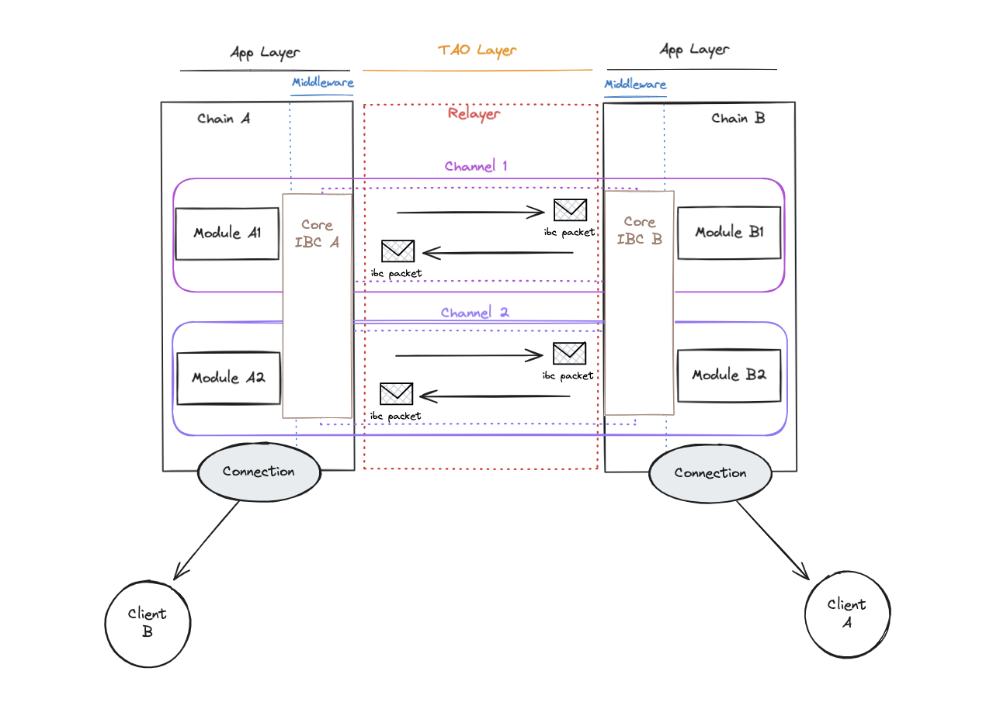
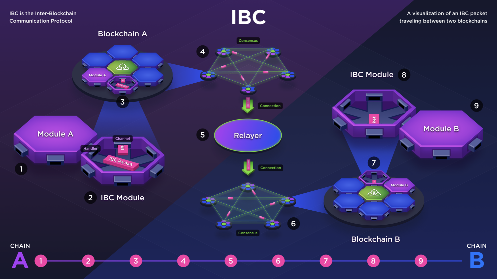

# IBC overview

## 0. IBC(Inter-Blockchain Communication) protocol
Since the birth of Bitcoin, blockchain technology has exploded with a variety of designs and use cases. While these distributed ledgers have many uses, interactions between different blockchains have been limited. Just as the internet revolutionized the world by connecting different computers around the globe, blockchains have realized that in order to create true value, they need to be interoperable so that they can connect with each other and move freely across platforms. This is where the Inter-Blockchain Communication (IBC) protocol comes in. 

The IBC(Inter-Blockchain Communication) protocol is a general-purpose interoperability protocol designed to allow two different blockchains to communicate in a secure and reliable manner. It is now one of the leading technologies in blockchain interoperability and has created a wide range of use cases for connecting blockchains. For example, users can use stablecoins from one blockchain on a decentralized exchange (DEX) on another blockchain, or take advantage of the privacy features of different blockchains. 

### How IBC work 
To understand how IBCs work, it's important to distinguish between two layers
1. the Transport Layer
2. the Application Layer

The overall structure is as follows

   

 

The image provided by IBC shows this in a more three-dimensional way:

   

 

A simple analogy that can help you understand this technology is the postal delivery system:
1. when you send a letter to someone, you send it through a postal service that collects the envelope containing the letter and places it in the recipient's mailbox. 
2. you address the envelope to the recipient.
   1. This is similar to how an IBC packet contains information about who sent the packet (specified by the channel ID) and the destination (specified by the other party's channel ID). 
   2. It is ultimately the responsibility of the recipient (application) to open the envelope (data packet) and interpret the contents of the letter.
3. The recipient then opens the envelope and reads the letter. The transport layer of an IBC can be thought of as a postal service. 
   1. The postal service does not know the content of the letter or how the recipient should interpret the message, and it does not know the contents of the envelope. 
   2. the envelope itself can be thought of as an IBC packet that is sent from one chain to another, and its only job is to collect the envelope at point A and send it to point B. 

## 1. Transport Layer (TAO Layer)
TAO stands for Transport, Authentication, and Ordering. We will refer to it simply as the Transport Layer. 

### 1. Universal Message Delivery Protocol (Transport)
IBC is a general-purpose message delivery protocol that can deliver various types of data beyond simple token transfers. All types of data such as FT/NFTs, account information, app chain status, etc. can be transmitted through IBC.

### 2. Minimizing Trust (Authentication)
One of the most important attributes of IBC is trust minimization. Unlike most bridging solutions, IBC does not use a trusted third party. If two blockchains trust each other's functionality and consensus mechanisms, no additional trust assumptions are required while interacting through IBC.

### 3. Secure and Orderly Communication (Ordering)
IBC ensures reliable, orderly, and authenticated communication. This can be compared to HTTPS in traditional web environments, but whereas HTTPS is secured by a trusted third party, IBC ensures trust through the blockchain's decentralized consensus mechanism. IBC maintains orderly communication and verifies the integrity of data in the following ways
- Packet ordering: Packet sequence numbers ensure that packets sent and received are processed in the correct order. 
- Packet authentication: Verify that packets are properly signed and authenticated to prevent forgery.
- Data integrity verification: Use Merkle trees and light clients to prove the integrity of data and track and verify the status of each chain. Merkle trees provide proof of packet commit, and light clients verify state on both blockchains.

## 2. Transport Layer Core Components 
The core components of the transport layer are light clients, relayers, connections, and channels. The functionality provided by these components is as follows
- Messages passed through the IBC are transmitted in data packets. 
- They are responsible for transporting, authenticating, and ordering these data packets. 
- It does not specify anything about the data content of the packets or how they should be interpreted by the receiving chain. The information in the data packets is just random bytes at the transport layer. 

### 1. Light Client (Light Client or Client)
A light client is a lightweight representation of a blockchain. It is sometimes referred to simply as a client. Unlike full nodes, light clients do not store a complete history of all messages on the blockchain. Nor does it execute transactions. Instead, light clients are designed to connect to full nodes and read block headers (a summary of the data contained in a block). This makes light clients efficient in terms of storage space and computational resources.

Imagine two independent blockchains, A and B, interacting via IBC. They have light clients of the other chain, i.e., Chain A has a light client that serves as a lightweight representation of Chain B's blockchain on its own blockchain. The role of the light client is to provide a simple representation of the state of the other blockchain that can be verified. The process is as follows
1. Set up a light client: Chains A and B each set up a light client on their respective chains.
2. Message delivery: Chain A wants to deliver a specific message 'X' to Chain B. 
3. Prepare message verification: Chain A prepares the header of the block containing message 'X' and the proof of commit for that message.
   - Block header: This is a summary of the data contained in the block. This includes the block number, timestamp, hash of the previous block, merkle root, etc.
   - Proof of commit: A cryptographic proof that message 'X' is actually contained in the block. This is usually done using a method called Merkle Proof. Merkle Proof uses a data structure called a Merkle Tree to efficiently verify that a certain data is included in a block.
4. Send a message: Chain A sends the block header and proof of commit to Chain B.
5. Message verification: Chain B uses the received block header and commit proof to verify that Chain A actually did message 'X' through a pre-built light client of Chain A.
   - Block header validation: Blockchain B verifies that the block header is valid. This validates the state of A through the light client of Blockchain A.
   - Proof-of-commit verification: Blockchain B verifies that message 'X' is actually included in the block through Merkle proofs.

This process allows Blockchain B to be confident that Blockchain A actually caused the transaction 'X' to occur. This way, trust between the two blockchains can be established without the need for a third party. Instead of sending these messages or data packets back and forth directly, chains A and B commit or store a hash of the data packet containing the message in their state machines. They then allow the other party to access and verify the state directly through their light clients.

As we've seen before, but worth repeating, IBC's light client-based verification approach has the advantage of simplifying the authentication process when compared to the HTTPS protocol.
- HTTPS protocol: Authentication is performed using asymmetric encryption through a third-party authority. 
- IBC protocol: Trust is achieved through direct verification between blockchains via a light client.

However, the number of external chains you want to communicate with increases, which means more elements to manage. This can be solved by a middleware layer added in the future. See the following proposals and packet-forward-middleware: 
- [proposal 56: Add IBC Router to Hub](https://www.mintscan.io/cosmos/proposals/56)
- [strangelove-ventures/packet-forward-middleware repository](https://github.com/strangelove-ventures/packet-forward-middleware)

### 2. Relayers
As an off-chain process, a relayer is responsible for continuously observing and relaying message delivery between blockchains. To summarize, it is as follows
- A relayer is a non-privileged process, so anyone can run it.
- When the relayer sees in its state machine that a message has been committed from chain A to chain B, it receives it and forwards it to chain B.

Relayers don't perform packet validation, so they don't need to be trusted, but they play a particularly important role in an IBC setup, in addition to IBC network liveness through packet submission. Here's why
- Relayers are responsible for submitting initial messages to create new clients, and for updating client status on each chain to ensure that attestation verification of submitted packets is successful. 
- The relay is also responsible for sending connection and channel handshakes to establish connections and channels between chains.  
- The relayer can submit evidence of misbehavior if the chain at the other end of the connection attempts to fork or perform other types of malicious behavior.

### 3. Connections
Connections are established through a light client on each chain. In the example structure image above, a connection from Chain A uses Chain B's light client, and a connection from Chain B uses Chain A's light client. The connection allows the two chains to see each other's status and synchronize.

### 4. Channels
A channel is a pathway for sending packets between modules on different chains. Application modules in each chain send data packets through channels. The data packets passed through the channel are forwarded to other chains by relayers. 

So the connections are chain-specific, but the channels are module-specific. Each channel end has a unique channel ID (and port ID) that is used to accurately route packets between two modules.

## 2. Application Layer
The application layer is the layer that end users interact with. As we've seen, the transport layer doesn't care about the data being sent over the wire. It is the responsibility of the application layer to handle the business logic that decodes the packet data bytes and applies the appropriate state transition logic.

The application layer includes application modules such as FT/NFT token transfers, cross-chain oracle feeds, interchain accounts (ICAs), interchain queries (ICQs), fee middleware (relayer incentives), etc.
- For example, the IBC-level application for token transfers, called [ICS 20](https://github.com/cosmos/ibc/blob/main/spec/app/ics-020-fungible-token-transfer/README.md), specifies how to structure data packets and how they should be interpreted by the receiving chain. 
- For FT token transfers, the data packet contains information about the sender, receiver, amount, and face value (in IBC denominations).
   - The denomination field tracks the path a particular token has traveled to reach a particular chain. 
   - The logic for how to process the packet is also specified in ICS 20.

These application modules can be composed together using basic packet reception, acknowledgments, timeouts, callbacks, and middleware. This gives developers the flexibility to stack multiple apps like Lego blocks to create new end-user products.

## 3. Key IBC Use Cases
Beyond simple token transfers, two other IBC-level applications are Interchain Accounts (ICA) and Interchain Security (ICS). 

### 1. Interchain Accounts (ICA)
- Facilitates interaction between chains while maintaining a single interface. This means that virtually any action that can be performed on chain B (called the “host chain”), such as sending, staking, or voting on governance proposals, can be performed on chain A (called the “controller chain”). 
- Interchain accounts improve the user experience, greatly increasing the configurability within the interchain. 

### 2. Interchain Security (ICS)
- This is a shared security version of the Cosmos ecosystem. It allows blockchains to rent security from other chains on a fully opt-in basis. 
- This is especially useful for new chains that can utilize the security provided by an already established network like the Cosmos Hub. 
- With interchain security, chains don't have to bootstrap their own validator sets.

The range of applications that can be performed using IBC as a core primitive is constantly growing. Currently, cross-chain NFT transfers and interchain queries (ICQ, the ability for one chain to read state from another chain) are possible.
- https://medium.com/@quasar.fi/introducing-interchain-queries-d6243e7b45cf
- https://github.com/strangelove-ventures/async-icq

## Resources
- https://github.com/cosmos/ibc
- https://github.com/cosmos/ibc-go
- https://medium.com/the-interchain-foundation/eli5-what-is-ibc-def44d7b5b4c