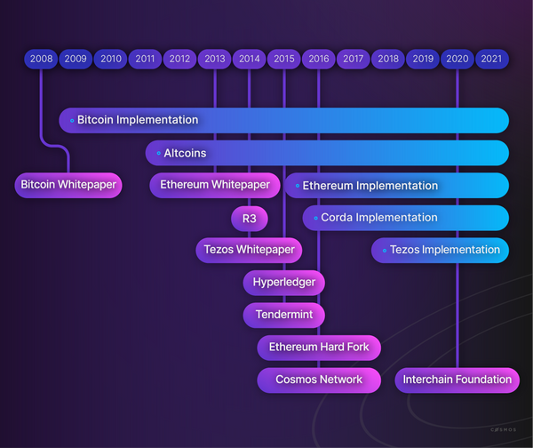
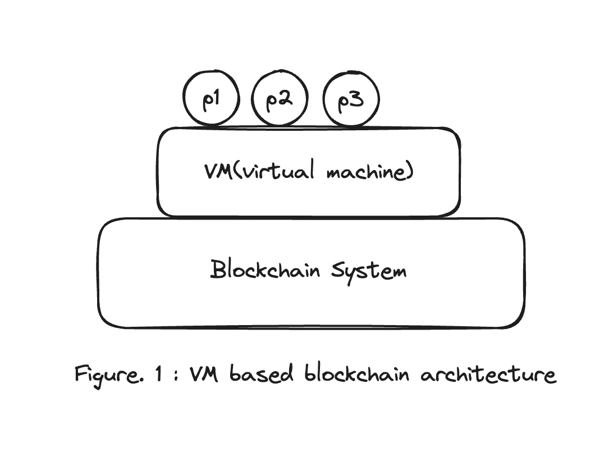
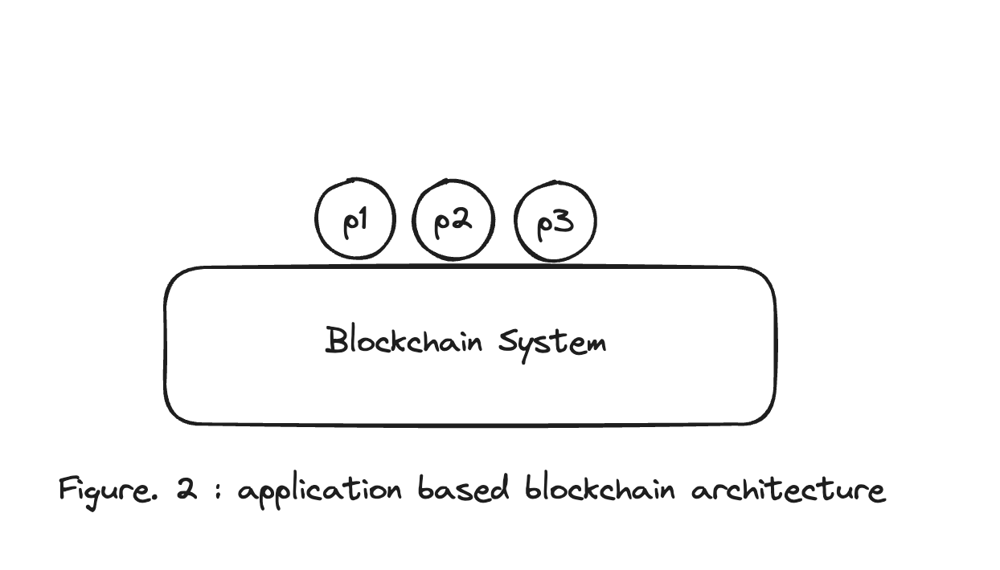
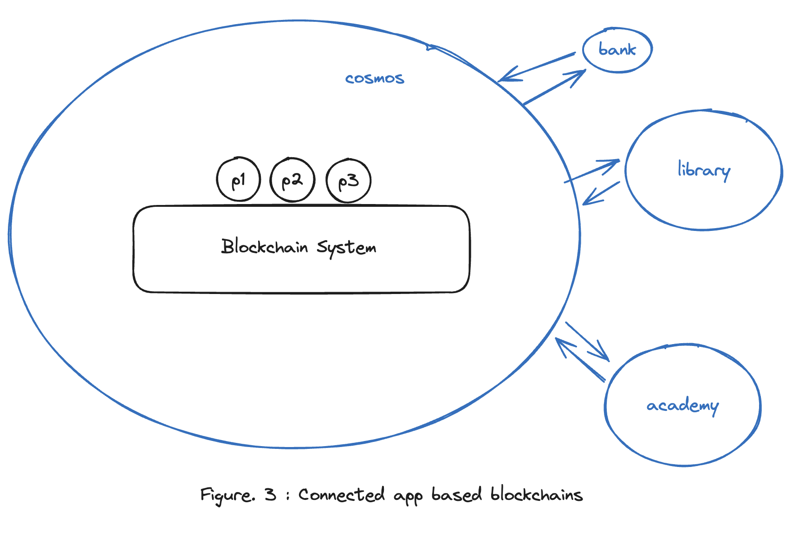

# 코스모스와 앱체인의 출현 배경

### Preview

**Hello Earth 🌏!, Welcome to Cosmos 🌌**, Welcome to the first chapter of the Cosmos Basics course.

첫번째로 우리가 다룰 주제는 ‘왜 App Specific Chain(이하 app chain)이 등장했는가?**(Understanding Why App-Specific blockcahins Emerged)**’ 이다.

이번 챕터를 코스모스 베이직 과정에 있어 가장 먼저 화두에 꺼낸 이유는 코스모스 생태계를 공부하고 이해하고 나아가 이 생태계에서 무언가를 개발하기 위해 먼저 왜 앱체인이 필요한지를 공감하는 것이 매우 중요하다고 생각했기 때문이다.

우리가 앞으로 빠져들게 될 **'코스모스 베이직'** 과정은 블록체인이란 큰 생태계 내에 한 분야로 이더리움과 같은 커다란 커뮤니티 플랫폼을 가지고 있는 섹터에 비해 부족한 점들이 많이 보일 수 있고, ‘이런게 있으면 좋겠는데?’ 라는 생각을 종종 하게 될 것이다.

그리고 사실상 블록체인 분야 자체가 아직은 무르익지 않았기 때문에 개발 커뮤니티가 다른 여타 커뮤니티에 비해 더욱 더 작은 것도 사실이다.

이런 생태계에 입성하게 될 여러분들을 위해, 빠르게 이 생태계를 배우고 익히고 나아가 로드 투 두바이에서 좋은 성과를 만드는 사람이 되기 위해 내가 제안하고자 하는 방법은 **이 기술이 왜 나오게 되었는지에 대한 공감하자!** 이다.

아마, 이 글을 통해서 충분히 이 생태계의 방향성과 추구하고자 하는 목적을 깨닫고 공감한다면, 앞으로의 긴 로드 투 두바이 교육여정에 있어서의 좋은 모티베이션이 될 것 같다.

### Why Do We Need an App-Specific Chain?

자! 먼저 이번 챕터를 공부하기 앞서 질문을 하나 하겠다.

- **Question: Cosmos SDK와 Cosmos라는 App specific blockchain 테마는 왜 나오게 되었을까?**

정답은 없다. 다만, 모두가 적어도 이 질문에 대해 각자 스스로 머릿속으로 **'생각'** 이라는 것을 해볼 수 있었다라는 것만으로도 이번 강의가 충분히 의미가 있어진 것이다.

우선! 이후 글을 진행할테니 모두 위에 제시된 메인 질문은 머릿속에 품고 계속해서 설명을 들으면 된다.

### Review of Blockchain History

먼저! 우리가 **app-specific chain**이라는 관점을 공감을 하기 위해서 앱 체인 이전에 블록체인이 어떻게 발전되어있는지를 간단하게 볼 것이다.

커다란 블록체인이라는 기술의 큰 챕터에서 볼 때, 과거의 블록체인들이 어떻게 발전해왔길래 코스모스가 출시될 수 있었을지를 맥락적으로 이해하자는 말이다.

대게 새로운 기술은 기존의 기술의 문제점이 있다고 생각해서 아이디어를 얹혀서 개선하려고 하기 때문에 앱 체인 또한 기존의 블록체인들에 어떤 문제가 있다고 생각해서 앱 체인이란 관점이 제안될 수 있었을지를 보고 이해할 수 있을 것이다. 자, 그럼 먼저 기존 비트코인과 이더리움의 특징을 살펴보고 코스모스 SDK의 필요성에 얘기해도록 하겠다.

아래 그림은 'Interchain Developer Academy'에서 0주차에 나오는 도식이다.

우린는 간단히 비트코인, 이더리움, 텐더민트(현 CometBFT)&코스모스와 같은 블록체인에만 집중해서 살펴보도록 하자.

- In 2008 years, Bitcoin Whitepaper was released

- In 2013 years, Ethereum Whitepare was released

- In 2016 years, Cosmos Whitepaper was released

이렇게 시간적 순서로 볼 때 새로운 블록체인 관점의 제안은 **비트코인 → 이더리움 → 코스모스** 순서대로 제안되던 알 수 있다. 그러면, 이 순서대로 좀 더 살펴보도록 하겠다.

_prod : interchain developer academy 0 week course_

### Purpose of App-Specific Chains 1

위에서 우리가 주목했던 블록체인들은 '비트코인, 이더리움, 코스모스'였다. 이제 각 체인들이 어떤 목적을 가지고 기존 체인을 개선하기 위해 제안을 헀는가를 살펴볼 차례이다.

우선 블록체인이라는 굉장히 함축적인 의미를 재정립하고 각자의 이해를 돕기 위해서, 비트코인을 payment용 블록체인 시스템이라고 간주해보자.
(여기서 TPS 때문에 비트코인은 결제 시스템으로서의 실질적인 사용성이 떨어진다와 같은 얘기는 생략)

우리가 여기서 비트코인을 **payment용 블록체인 시스템**이라고 표현한 뒤 이를 사용한다는 의미는 아래와 같은 두 가지 측면에서의 목적성이 있기 때문이다.

1. 앨리스가 밥에게 일정량의 코인(ex: 1BTC)를 보내기 위해서
2. 앨리스가 밥에게 보낸다는 행위(하나의 트랜잭션)를 글로벌한 장부를 통해서 증명하기 위해서

지금 생각해보면 굉장히 단순히 '돈을 보내고' 혹은 '돈을 받고' 하는 송수신 결제 용도의 블록체인 시스템이 비트코인이라고 볼 수 있다.

**단! 어떤 주고 받는 행위(트랜잭션 단위)를 해당 시스템을 사용하고 있는 모두가 인정할 수 있도록 합의를 해주는 시스템(컨센서스 시스템)위에 말이다.**

자, 그럼 이렇게 블록체인 시스템을 용도적인 측면에서 재해석하는 과정을 비트코인, 이더리움, 코스모스에 적용해도록 하자.

- 1. 비트코인 (consensus system + payment)

- 2. 비트코인 → 이더리움 (consensus system + computing)

- 3. 이더리움 → 코스모스 (horizontal consensus system + horizontal computing)

이렇게 바라보면 좀 더 직관적으로 이해할 수 있을 것이다.

### Purpose of App-Specific Chains 2

#### 1. 비트코인 → 이더리움 (consensus system + computing)

1번인 비트코인에 대한 재해석은 이미 위에서 마쳤으니 (비트코인 -> 이더리움) 과정에 대해 설명을 덧 붙일까한다.

비탈릭은 아마도 이런 생각을 했을 것 이다. **어떠한 글로벌한 합의 시스템이 존재한다면! 거기에 programable한 computing을 올려보는 것은 어떨까?** 라고 말이다.

(**_목적성을 빗대어 볼 때 비슷하다고 간주하여 표현한 개인적인 사견임_**)

그리고 이게 바로 현재의 Smart Contract(Program)가 되었고, Solidity란 언어가 등장하게 된 이유가 되었다.

이더리움 블록체인은 이렇게 기존 블록체인(페이먼트) 새로운 프레임을 제안한 것으로 볼 수 있다. 글로벌 컨센서스 시스템 위에 단순히 페이먼트 시스템을 올리는 것이 아닌 컴퓨터 자체를 올리는 프레임으로 말이다. 따라서, 기존 블록체인의 용도의 확장이라고 볼 수도 있을 것 같다.

#### 2. 이더리움 → 코스모스 (horizontal consensus system + horizontal computing)

이제 우리가 배울 코스모스에 대해서도 생각해보자.

이 파트가 바로 위에서 언급했던 질문(**Cosmos SDK와 Cosmos라는 App-Specific Blockchain 테마는 대체 왜 나오게 되었을까?**)에 대한 단서가 될 수 있는 부분이니 집중과 공감을 반드시 해보길 바란다.

앞서 언급한 이더리움은 블록체인을 페이먼트 시스템이 아닌 컴퓨팅 시스템이라는 새로운 관점을 제안했다고 하였다. 그렇지만, 이를 우리 삶에 대변해본다면 **각자 노트북, 스마트폰과 같은 컴퓨터가 하나 이상씩을 가지고 있는 이 시대에 글로벌 컴퓨터를 여러명이 사용할 수 있을까?**란 생각을 하게 될 것이다.

이 생각을 확장해서, **컴퓨팅이 가능한 블록체인을 차라리 특정용도에 맞게 수평적인 확장을 하는 건 어떨까?**라고 생각해볼 수도 있을 것이다.

이런 생각을 구현한 것이 바로 코스모스 생태계이다.

아마도 재권은 **컴퓨팅 블록체인의 수평적 확장이라는 새로운 프레임을 제안하여, 코스모스란 app specific chain ecosystem을 개발하고자 했을 것이다**
(**_이 멘트 또한 목적성에 맞는 개인적인 견해일 뿐이다_**)

다시 정리해보자. 위에서 말한 수평적 확장이 가능한 블록체인이라는 프레임이 처음에는 잘 이해가 안될수도 있을 것이다. 그래서, app specific chain이 어떻게 수평적 확장을 하는 블록체인인지를 예시를 들어서 설명하도록 하겠다.

먼저, 이더리움은 어떠한 임의의 프로그램이든 올릴 수 있는 글로벌 컴퓨터를 하나 만들고 유저들이 그 위에 올리고 싶은 거 올리면 돼! 라고 말하는 것이라고 볼 수 있다.

따라서, 아래의 도식을 머릿속으로 그릴 수 있을 것이다.

하지만, 코스모스는 은행용 시스템에는 은행에 필요한 송금, 대출, 적금등의 딱 필요한 프로그램만 가지고 컴퓨팅 시스템을 구축하고, 또 다른 도서관 시스템이라고 하면 도서관에 필요한 대출, 연체등의 프로그램만 올라가있는 시스템을 만들어서 여러 목적에 맞게 컴퓨팅 시스템을 분할해서 구축하고 이를 연결짓는 것이라고 볼 수 있다.

따라서, 아래의 도식도 그려볼 수 있을 것이다.

그리고 코스모스 생태계는 각자의 목적에 맞는 앱 체인이 연결된 생태계이므로, 여러 프로그램이 하나의 체인에 올라간 것이 아닌 필요한 만큼의 프로그램만 올라가있는 체인1, 체인2, 체인3 등이 연결된 모습일 것이다.

### Consider the First Question Again

여기서 질문을 다시 하도록 하겠다. 여기까지의 설명을 듣고, 각자가 생각하기에는 어떤 프레임 혹은 생태계가 더 좋거나 혹은 여러 개발자들이 온보딩하기 좋은 생태계일까? 각자 대답하는 것을 이번 시간의 [과제](./homework/01.md)로 하겠다.

.
.
.
.
.
.
.
.
.

혹시나 해서 적는 것이지만, 정답은 없다. 그저 다양한 관점에서의 기술의 발전에 대해서 이해해보고 한 분야의 목적성을 공감해볼 수 있는 것으로 굉장히 의미있던 시간이기 때문에 과제화 시킨 것 뿐이다.

다만 과제 결과에 대한 예시를 하나 적어두도록 하겠다. 나중에 참고하길 바란다.

> EVM 같이 VM을 올리는 체인들은 좀 더 자유도가 높고 새로운 프로그램을 온체인에 배포하는데 부담이 덜 되기도 한다고 생각한다. 퍼블릭 컴퓨팅이기 때문에 유저가 그냥 배포하면 되기 때문이다. 그에 반해, 앱 체인의 경우 새로운 프로그램을 추가하는데 있어서 자유롭지 못하여 거버넌스를 통해서 여러 주체들의 합의가 필요하다. (다만 모든 체인이 일괄적이진 않고 체인 바이 체인으로 일정 제한을 부여할 수는 있긴하다)

> 하지만, VM 기반의 체인의 경우 여러명이 똑같은 프로그램을 굳이 불필요하게 반복해서 올리게 될 수도 있을 것 같다. 생각해보면 굳이 EVM에 잘 짜둔 은행 프로그램 하나만 올리고 여러명이 그걸 다같이 사용하면 되는데. EVM은 퍼블릭하게 열려있어서 똑같은 프로그램을 여러명이 각자 다 배포하고 각자가 배포한 자신의 프로그램을 사용하는 형태로 운영되기 때문이다.

> 이런 관점에서는 코스모스와 같은 app specific chain들은 어떤 프로그램을 모듈로서 관리하기 때문에 하나의 시스템 위에 불필요한 반복적인 프로그램이 올라가지 않고 딱 하나만 올리고 모두가 그걸 사용하게 되어있어서 보다 효율적인 시스템이 유지될 수 있다.

해당 예제를 반복해서 자기만의 언어로 표현해도 좋으니, 앞서 얘기했던 것들과 추가로 IDA에 표현된 자료들을 바탕으로 다시 자신만의 어휘력으로 앱체인과 퍼블릭 컴퓨팅 블록체인을 비교하도록 한다.

### Somethings from IDA

마지막으로는 IDA에 있던 내용들 중 이번 챕터와 관련된 내용 중 한번씩 읽어보면 좋을 것 같은 내용을 가져와보았다. 각자 간단히 한번씩 읽어보도록 하자.

- limitations about dapps which deployed on general purpose blockchains

> Not all dApps have the same throughput requirements, but they all have to make do with the *average* resulting throughput of the platform itself if they are implemented on a general-purpose blockchain. This impacts the **scalability** of dApps.

- How does the interchain solve the scalability issue?

> Scalability is a core challenge of blockchain technology. The interchain allows applications to scale to millions of users. This degree of scalability is possible as the interchain addresses two types of scalability:

> Horizontal scalability: scaling by adding similar machines to the network. When "scaling out", the network can accept more nodes to participate in the state replication, consensus observation, and any activity that queries the state.

> Vertical scalability: scaling by improving the network's components to increase its computational power. When "scaling up", the network can accept more transactions and any activity that modifies the state.

### Somethings Special About the Cosmos Ecosystem?

여기는 plus +a이다. 내가 현직 코스모스 생태계에서 종사하면서 느낀 코스모스란 에코시스템의 현재를 표현해보았다. 참고로 [이 글](./99_$ATOM과%20인터체인%20보안.md)에서 아곤이 추가적으로 좋은 글을 써두었으니 여기 섹션과 저 글을 이어서보면 매우 좋을 것이다.

코스모스 생태계는 사실상 처음에는 스케일이슈로 인해 app specific 한 블록체인을 만들고 이들을 연결한 형태로의 생태계가 구축되는 것이 본래 앱 체인의 방향성이었다.

하지만, 이더리움과 같은 vm based의 블록체인의 너무나 강력한 개발자 생태계를 이끌었고 이와 비슷한 메타로 결국 코스모스에도 SDK레벨에서의 모듈 자체로 VM이 올라가는 형태로도 발전이 되었다.

대표적으로 WASM, EVM, MOVE-VM etc. 그래서 이런 것들을 바탕으로 cosmwasm과 함께 wasm-based 체인들이, ethermint & polarisEVM(더 많음) 바탕으로 evm-based체인들도 생겨나고 있는 것이 현재의 코스모스 생태계이다.

여기서 우리가 알 수 있는 점은 반드시 기술의 발전이 모든 자원을 효율적으로 운용하는 형태보다는 그 자원을 가지고 유틸리티를 만드는 개발자(UX or DX)의 사용경험들도 매우 중요한 기술발전의 요소인 것을 알 수 있다.

### References

https://ida.interchain.io/ida-course/lps/week-0
https://ida.interchain.io/ida-course/lps/week-1
