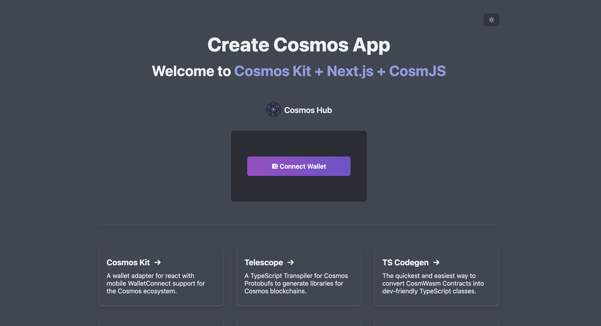

# cosmos-kit template project

Create and understand several template projects provided by cosmos-kit.

## Prepare in Adfacne

### cosmos-kit?

Cosmos-kit can easily communicate with app chains using Cosmos-SDK by utilizing Cosmos-SDK and various wallet connections such as Cosmos Ecosystem Cosmostation, Keplr, and Leap.

In addition to the basic modules provided by Cosmos-SDK, examples also utilize the representative NFT Marketplace, DEX Stargaze, and Osmosis Contract.

## Implementation

### Verifying nodejs Installation

```
$ node -v
> v20.11.1
# If you don't need to match the version, but you can't support it, try changing the nodejs version using nvm.
```

### Install cosmos-kit
```
$ npm i -g create-cosmos-app
> ... added 79 packages in 8s ...


# After installation, use cca command to perform cosmos-kit related tasks.
$ cca -v
> 2.3.3
```

### Create cosmos-kit project

```
# Create a proejct through `cca` or `create-cosmos-app`.
$ cca

? [name] Enter your new app name rtd-example
> Cloning into 'rtd-example'...

? [template] which template connect-chain
> ✨ Have fun! Now you can start on your project ⚛️
> Now, run this command:
> cd ./rtd-example && yarn dev


# yarn을 입력시, yarn version / corepack 관련 오류가 나게 되면
# package.json에서 "packageManager": "yarn@4.3.1" 부분을 제거 후 실행한다
```

### Start Project

```
$ yarn
$ yarn dev
```

## Result

Test the result through http://localhost:3000 

### Single Chain Project



Find the installed wallet to connect and look for the address.


### Multichain Project

Select the projct as connect-multi-chain on the template when initiating cosmos-kit.


See that the account can select multichain. (Cosmos Appchain hass Address Prefix per chain.)

## Reference - Analyzing Other cosmos-kit Templates

Create a template provided in https://cosmology.zone/products/create-cosmos-app to analyze the code.

- Stake Tokens
  - `cca --name stake-example --example stake-tokens`
  - As an example that would be most helpful to create a dashboard, you can understand the stacking functions of Cosmos-SDK. Functions related to Delegation and Reward are implemented.
- Vote Proposals
  - `cca --name vote-example --example vote-proposal`
  - Proposal and Vote-related functions are implemented as examples that are easy to analyze the governance function.
- IBC Transfer
  - `cca --name ibc-example --example ibc-transfer`
  - A template for understanding how IBC works through IBC, an inter-appchain data transfer
- Swap Tokens
  - `cca --name swap-example --example swap-tokens`
  - The Swap function of Osmosis, a DEX, is implemented.
- Provide Liquidity
  - `cca --name liquidity-example --example provide-liquidity`
  - The Liquidity function of Osmosis, a DEX, is implemented.
- Asset List
  - `cca --name asset-list-example --example asset-list`
  - It is a good example to understand the tokens of Cosmos-SDK. x/bank is implemented.
- NFT
  - `cca --name nft-example --example nft`
  - Here's an example where you can use the NFT app chain Stargaze to mint.
- Authz
  - `cca --name authz-example --example authz`
  - You can test the authz module that can delegate Cosmos-SDK's account permissions.