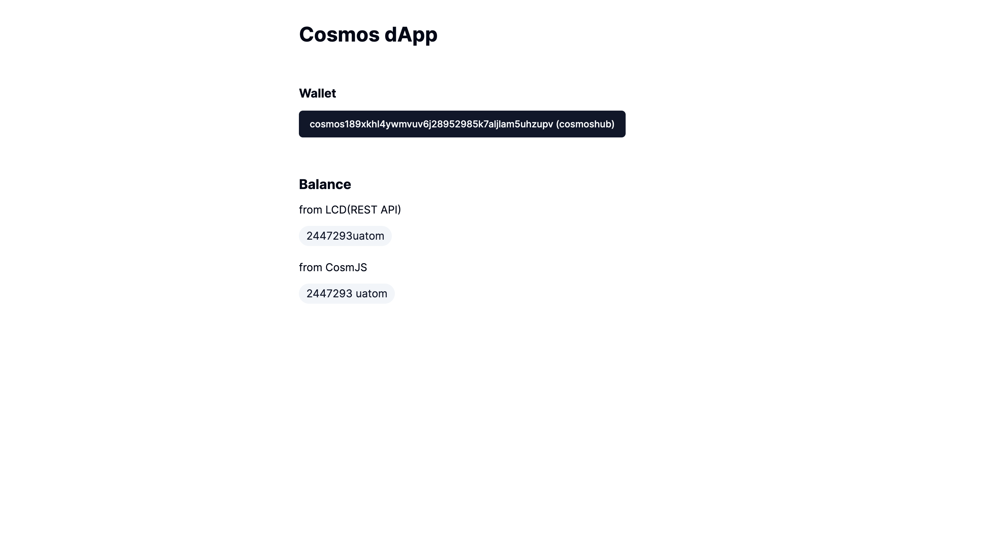

# Balance

The Token Balance of the connected wallet account is searched using various methods of checking the state of app chains using Cosmos-SDK.

## Preparedness

There are methods of inquiring the data of the app chain, such as 'RPC Endpoint Call', 'REST Endpoint Call', and 'Use Cosmjs Library'.

### cosmos-kit endpoint hooks

Cosmos-kit provides a function that calls information registered in the https://github.com/cosmology-tech/chain-registry/tree/main/v2/chain-registry repository and finds and utilizes endpoints with normal responses.

In the mission, RPC data inquiry is omitted because it can be sufficiently implemented with functions using Cosmjs and REST APIs. For related codes and examples, refer to the hook and repository below for RPC Endpoint.

```ts
import { useChain } from "@cosmos-kit/react";
...

const { getRestEndpoint, getRpcEndpoint } =
    useChain("cosmoshubtestnet");
```

https://github.com/cosmology-tech/interchain

### cosmos-kit + cosmjs

Cosmjs provides the following method through the client for state inquiry.

`getChainId()`
`getHeight()`
`getAccount(searchAddress: string)`
`getSequence(address: string)`
`getBlock(height?: number)`
`getBalance(address: string, searchDenom: string)`
`getAllBalances(address: string)`
`getBalanceStaked(address: string)`
`getDelegation(delegatorAddress: string, validatorAddress: string)`
`getTx(id: string)`

## Implementation

### Add shadcn/uibadge component for result screen
```bash
npx shadcn-ui@latest add badge
```

### Inquire data with cosmos-kit

Through the following example, we implement a function to look up all the balances of addresses connected to the current wallet of the cosmoshubtestnet chain.

Use the 'useChain' hook to obtain the address and client of the connected wallet.
```ts
//import and hook
import { useChain } from "@cosmos-kit/react";
const { address, getStargateClient } = useChain("cosmoshubtestnet");
//Create cosmjs clinet object and query balance
const client = await getStargateClient();
const result = await client.getAllBalances(address);
console.log(result);
```

### Data Inquiry via REST API

Cosmos-SDK may provide REST API Endpoint called LCD in addition to RPC communication. It may be controlled in settings when the node is driven (including Swagger)

The following is a Swagger that lets you view REST API Endpoint provided by the Cosmos chain.
https://cosmos-rest.publicnode.com/swagger/

If you look at the swaggers of other chains, you can check the REST APIs supported by Custom Modules for each chain.
```ts
//import and hook
import { useChain } from "@cosmos-kit/react";
const { address, getRestEndpoint } = useChain("cosmoshubtestnet");
//Query Balance and call REST API
const balances = await fetch(
  `${await getRestEndpoint()}/cosmos/bank/v1beta1/balances/${address}`
);
const result = await balances.json();
console.log(result);
```

### Apply to Mission

#### **`components/balance.tsx`**

```ts
"use client";

import { useChain } from "@cosmos-kit/react";
import { useEffect, useState } from "react";
import { Badge } from "./ui/badge";

export default function Balance() {
  const { address, getRestEndpoint, getStargateClient } =
    useChain("cosmoshubtestnet");

  const [restBalances, setRestBalances] = useState<any>();
  const [cosmjsBalances, setCosmjsBalances] = useState<any>();

  useEffect(() => {
    if (!address) {
      return;
    }

    const fetchRestBalance = async () => {
      const balances = await fetch(
        `${await getRestEndpoint()}/cosmos/bank/v1beta1/balances/${address}`
      );
      const result = await balances.json();
      setRestBalances(result.balances);
    };
    fetchRestBalance();

    const fetchCosmjsBalance = async () => {
      const client = await getStargateClient();
      const result = await client.getAllBalances(address);
      setCosmjsBalances(result);
    };
    fetchCosmjsBalance();
  }, [address]);

  return (
    <div className="space-y-3">
      <h3 className="text-xl font-bold">Balance</h3>
      <h4>from LCD(REST API)</h4>
      {restBalances &&
        restBalances.map((balance: any) => (
          <Badge
            variant="secondary"
            className="text-md font-normal mr-3"
            key={balance.denom}
          >
            {balance.amount}
            {balance.denom}
          </Badge>
        ))}
      <h4 className="pt-2">from CosmJS</h4>
      {cosmjsBalances &&
        cosmjsBalances.map((balance: any) => (
          <Badge
            variant="secondary"
            className="text-md font-normal  mr-3"
            key={balance.denom}
          >
            {balance.amount} {balance.denom}
          </Badge>
        ))}
    </div>
  );
}
```

#### **`app/pages.tsx`**

```ts
import Balance from "@/components/balance";
import Wallet from "@/components/wallet";

export default function Home() {
  return (
    <main>
      <div className="m-10 grid gap-14 w-2/5 mx-auto">
        <h1 className="text-3xl font-bold">Cosmos dApp</h1>
        <Wallet />
        <Balance />
      </div>
    </main>
  );
}
```

## Result


At first, the upper balance part is not exposed, but the balance is confirmed by receiving the cosmostestnet faucet.

Note. The decimal of Cosmos-SDK is modifiable, but the default is 6 digits. (1000000uatom = 1ATOM)