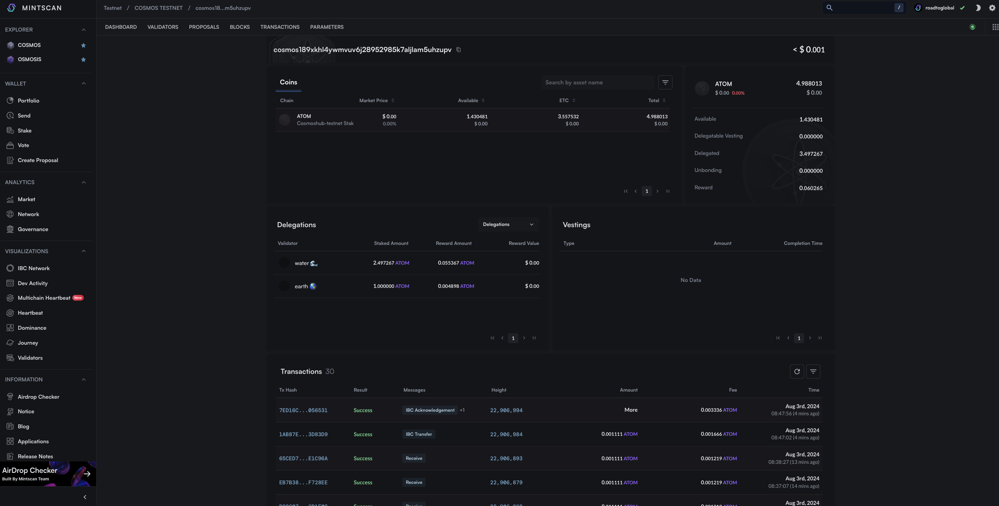

# Send

Use the send function of the x/bank module, which is the basic module of Cosmos-SDK, to find out how to create and sign and transmit send messages.

## Prepare in Advance

### Modify Project Settings

Add signing options to the ChainProvider setting of the cosmos-kit. This option is for specifying the following options when using the cosmjs client.
```ts
readonly registry?: Registry;
readonly aminoTypes?: AminoTypes;
readonly broadcastTimeoutMs?: number;
readonly broadcastPollIntervalMs?: number;
readonly gasPrice?: GasPrice;
```

In the mission, gasPrice is set so that it does not interfere with the progress of the mission, and then the corresponding setting is performed to use the gas option as "auto".
#### **`app/providers.tsx`**

```ts
"use client";
import React from "react";
import { wallets } from "@cosmos-kit/cosmostation";
import assets from "chain-registry/assets";
import { chains } from "chain-registry";
import { ChainProvider } from "@cosmos-kit/react";
import "@interchain-ui/react/styles";
import { SignerOptions } from "@cosmos-kit/core";
import { GasPrice } from "@cosmjs/stargate";
import { Chain } from "@chain-registry/types";
export default function Providers({ children }: { children: React.ReactNode }) {
  const signerOptions: SignerOptions = {
    signingStargate(chain) {
      if ((chain as Chain)?.chain_name === "cosmoshubtestnet") {
        return {
          gasPrice: GasPrice.fromString("0.025uatom"),
        };
      }
    },
  };
  return (
    <ChainProvider
      chains={chains}
      assetLists={assets}
      wallets={wallets}
      signerOptions={signerOptions}
    >
      {children}
    </ChainProvider>
  );
}
```

### Add shadcn/ui input component for input

```bash
npx shadcn-ui@latest add input
```

## Implement

### Send Transaction Using cosmjs

Cosmjs provides the following methods through the client for send, sign, and broadcast.
`simulate`
`sign`
`broadcastTxSync`
`broadcastTx`
`signAndBroadcastSync`
`signAndBroadcast`
`sendTokens`
`delegateTokens`

For the mission, we send token by using sendToken method.

```ts
//import and hook
import { useChain } from "@cosmos-kit/react";

const { address, getSigningStargateClient } = useChain("cosmoshubtestnet");
//`getSigningStargateClient` : client for query
//`getStargateClient` signing(tx sign, broadcast, etc) clint for the actual state change

//Create cosmjs signing clinet object and token send
const receiver = "cosmos1xxxxxxxx";
const balance = "10000";
const client = await getSigningStargateClient();
const res = await client.sendTokens(
  address,
  receiver,
  [{ amount: balance, denom: "uatom" }],
  "auto"
);

console.log(res);
```

### Apply to Mission

#### **`components/send.tsx`**

```ts
"use client";

import { useChain } from "@cosmos-kit/react";
import { useState } from "react";
import { Button } from "./ui/button";
import { Input } from "./ui/input";

export default function Send() {
  const { address, getSigningStargateClient } = useChain("cosmoshubtestnet");
  const [receiver, setReceiver] = useState("");
  const [balance, setBalance] = useState("");

  const send = async () => {
    if (!address) {
      return;
    }

    const client = await getSigningStargateClient();
    try {
      const res = await client.sendTokens(
        address,
        receiver,
        [{ amount: balance, denom: "uatom" }],
        "auto"
      );
      console.log(res);
      window.open(
        `https://mintscan.io/cosmoshub-testnet/address/${res.transactionHash}`,
        "_blank"
      );
    } catch (e) {
      window.open(
        `https://mintscan.io/cosmoshub-testnet/address/${address}`,
        "_blank"
      );
    }
  };

  return (
    <div className="space-y-3">
      <h3 className="text-xl font-bold">Send</h3>
      <Input
        type="text"
        placeholder="Receiver address"
        value={receiver}
        className="max-w-md"
        onChange={(e) => setReceiver(e.target.value)}
      />
      <Input
        type="text"
        value={balance}
        placeholder="Amount"
        className="max-w-md"
        onChange={(e) => setBalance(e.target.value)}
      />
      <Button onClick={send}>Send</Button>
    </div>
  );
}
```

#### **`app/pages.tsx`**

```ts
import Balance from "@/components/balance";
import Send from "@/components/send";
import Wallet from "@/components/wallet";

export default function Home() {
  return (
    <main>
      <div className="m-10 grid gap-14 w-2/5 mx-auto">
        <h1 className="text-3xl font-bold">Cosmos dApp</h1>
        <Wallet />
        <Send />
        <Balance />
      </div>
    </main>
  );
}
```

## Result


Cehck if the Tx is onchain through Mintscan. https://mintscan.io/cosmoshub-testnet/address/${address}



