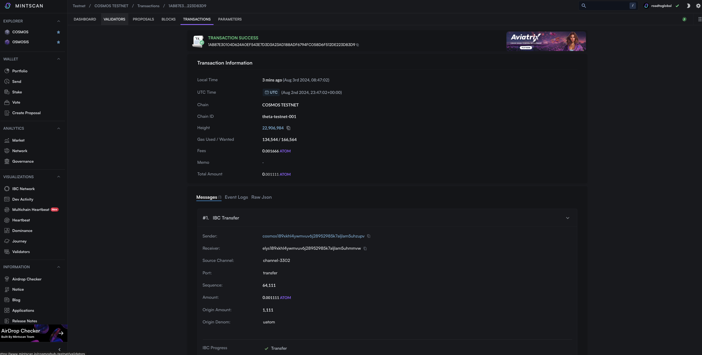

# IBC

In order to find out the IBC technology for connecting between app chains in Cosmos-SDK, we try to transfer tokens from cosmos testnet to other osmosis testnet using the ibc-transer function.

## Prepar in Advance

### IBC Foundation

The cosmos ecosystem is also called the interchain ecosystem.
Inter-chain communication (IBC) enables inter-chain transmission.

IBC has a set protocol between app chains and is transmitted through Relayer. There may be several relays between chains A and B, and channels exist as the connection is established.

Therefore, sender, receiver, sourceport, sourceChannel, token, and timeout information are required when transmitting IBC tokens.

The transmitted IBC token is created under a different denom name, and the denom represents the same token when the channel, source, target, and source denom information are the same. After IBC transmission, if it exists as a denom such as IBC/XXXX in the target chain and returns to the same channel, it is restored to the original denom.

- cosmos ATOM --channel1-> osmosis IBC/11111(ATOM)
- cosmos ATOM --channel2-> osmosis IBC/22222(ATOM)

### Creating and sending messages using cosmjs

Cosmjs provides convenient methods such as sendToken delete Tokens. IBC transmission was provided by a method called sendIbcTokens, but is now Deprecated. Perhaps it is not possible to cover the IBC, which is becoming complicated by the development such as packet-forward-middleware and inter chain query, with that content, so it seems to guide the creation of a message yourself.

Therefore, in this example, you will create your own IBC message and send tx.

## Implementation

Send uatom from cosmoshub-testnet to elys-testnet.

### Creating a Message for the IBC

In @cosmjs/stargate, type EncodeObjects are declared for various messages. Find the desired message of the required modules and declare the EncodeObject that matches the message.

The message below is a message for token transfer through the IBC. The chain to be transmitted is the testnet of the chain called channel-3302 is the chain called elys, and the timeout is designated by three block height.
```ts
import { MsgTransferEncodeObject } from "@cosmjs/stargate";

const msg: MsgTransferEncodeObject = {
  typeUrl: "/ibc.applications.transfer.v1.MsgTransfer",
  value: {
    sender: address,
    receiver: receiver,
    sourcePort: "transfer",
    sourceChannel: "channel-3302",
    token: { denom: "uatom", amount: balance },
    timeoutHeight: { revisionNumber: BigInt(3), revisionHeight: BigInt(0) },
    timeoutTimestamp: BigInt(0),
    memo: "",
  },
};
```

### Send a message

Sign and transmit messages (or messages) made above using the signingStargate Client.
```ts
const { address, getSigningStargateClient } = useChain("cosmoshubtestnet");

const client = await getSigningStargateClient();
const res = await client.signAndBroadcast(address, [msg], "auto");
```

### Apply to Mission

#### **`components/ibc-send.tsx`**

```ts
"use client";

import { useChain } from "@cosmos-kit/react";
import { MsgTransferEncodeObject } from "@cosmjs/stargate";
import { useState } from "react";
import { Input } from "./ui/input";
import { Button } from "./ui/button";

export default function IbcSend() {
  const { address, getSigningStargateClient } = useChain("cosmoshubtestnet");
  const { address: elysAddress } = useChain("elystestnet");

  const [balance, setBalance] = useState("");

  const send = async () => {
    if (!address) {
      return;
    }

    const msg: MsgTransferEncodeObject = {
      typeUrl: "/ibc.applications.transfer.v1.MsgTransfer",
      value: {
        sender: address,
        receiver: elysAddress,
        sourcePort: "transfer",
        sourceChannel: "channel-3302",
        token: { denom: "uatom", amount: balance },
        timeoutHeight: { revisionNumber: BigInt(3), revisionHeight: BigInt(0) },
        timeoutTimestamp: BigInt(0),
        memo: "",
      },
    };

    const client = await getSigningStargateClient();

    try {
      const res = await client.signAndBroadcast(address, [msg], "auto");
      console.log(res);
      window.open(
        `https://mintscan.io/cosmoshub-testnet/address/${res.transactionHash}`,
        "_blank"
      );
    } catch (e) {
      window.open(
        `https://mintscan.io/cosmoshub-testnet/address/${address}`,
        "_blank"
      );
    }
  };

  return (
    <div className="space-y-3">
      <h3 className="text-xl font-bold">IBC</h3>
      <Input
        type="text"
        className="max-w-md"
        placeholder="Receiver address"
        value={elysAddress}
        disabled
      />
      <Input
        type="text"
        value={balance}
        className="max-w-md"
        placeholder="Amount"
        onChange={(e) => setBalance(e.target.value)}
      />
      <Button onClick={send}>IBC Send</Button>
    </div>
  );
}
```

#### **`app/pages.tsx`**

```ts
import Balance from "@/components/balance";
import IbcSend from "@/components/ibc-send";
import Send from "@/components/send";
import Wallet from "@/components/wallet";

export default function Home() {
  return (
    <main>
      <div className="m-10 grid gap-14 w-2/5 mx-auto">
        <h1 className="text-3xl font-bold">Cosmos dApp</h1>
        <Wallet />
        <IbcSend />
        <Send />
        <Balance />
      </div>
    </main>
  );
}
```

## Result




Check to see if the Tx is onchain thorug Mintscan after transfering with IBC.

Check the elys testnet result. https://testnet.ping.pub/elys/account/{address}
