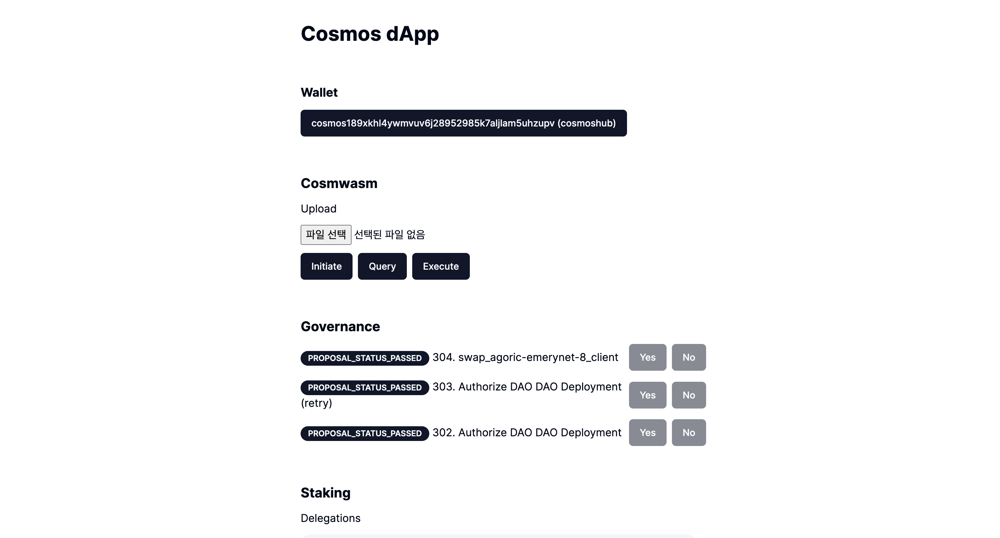

# Cosmwasm

Cosmwasm is one of the projects to use Smart Contracts in Cosmos-SDK.

It functions as code, contract, contract state management, and wasmvm through the 'x/wasm' module.

Through this mission, we will learn Cosmwasm code / contract structure, query, and execution.

## Prepare In Advance

Cosmos-SDK's Cosmwasm is a bit different from EVM's smart contract.

[Code](https://www.mintscan.io/neutron/wasm?sector=code) and [Contract](https://www.mintscan.io/neutron/wasm/code/491) are divided, and it is a structure that allows you to distribute the code first and initiate the code to distribute the contact.

Cosmwasm code, contract upload, initiate can be managed through permission.

- You can only upload code uploads through governance.
- Only those who specify the code can initiate.
- You can generate Code/Contact publicly.

We conduct missions based on the Public Contact chain, Neutron Testnet.

I've learned to develop a contract at Cosmwasm,
Learn to distribute, initiate, query, and execute the already implemented code.

### Add Neutron signing option

Cosmwasm mission is carried out in the Neutron Testnet, so add the signing option related to the Neutron testnet.

#### **`app/providers.tsx`**

```ts
"use client";
import React from "react";
import { wallets } from "@cosmos-kit/cosmostation";
import assets from "chain-registry/assets";
import { chains } from "chain-registry";
import { ChainProvider } from "@cosmos-kit/react";
import "@interchain-ui/react/styles";
import { SignerOptions } from "@cosmos-kit/core";
import { GasPrice } from "@cosmjs/stargate";
import { Chain } from "@chain-registry/types";
export default function Providers({ children }: { children: React.ReactNode }) {
  const signerOptions: SignerOptions = {
    signingStargate(chain) {
      if ((chain as Chain)?.chain_name === "cosmoshubtestnet") {
        return {
          gasPrice: GasPrice.fromString("0.025uatom"),
        };
      }
    },
    signingCosmwasm(chain) {
      if ((chain as Chain)?.chain_name === "neutrontestnet") {
        return {
          gasPrice: GasPrice.fromString("0.025untrn"),
        };
      }
    },
  };
  return (
    <ChainProvider
      chains={chains}
      assetLists={assets}
      wallets={wallets}
      signerOptions={signerOptions}
    >
      {children}
    </ChainProvider>
  );
}
```

## Implementation

Cosmoshub is a chain not supported by Cosmwasm, so it is tested on the Neutron chain.

The client hook, which was previously the getSigningClient, is also changed to getSigningCosmWasmClient, which is exclusive to wasm, to create a client.
```ts
const { address, getSigningCosmWasmClient } = useChain("neutrontestnet");
```

### Code Upload

Distribute the cw20-base contract, a project like ERC20, to Cosmwasm's cw-plus (https://github.com/CosmWasm/cw-plus/). [See cw20_base.wasm](..//files/cw20_base.wasm)
```ts
const upload = async (uploadCode: Uint8Array) => {
  if (!address || !uploadCode) {
    return;
  }

  const client = await getSigningCosmWasmClient();
  const code = await client.upload(address, uploadCode, "auto");
  console.log(code);
};

<input
  type="file"
  placeholder="Amount"
  onChange={(e) => {
    const file = e.target.files?.item(0);
    if (file) {
      file.arrayBuffer().then((buff) => {
        upload(new Uint8Array(buff));
      });
      console.log("call finished");
    }
  }}
/>;
```

### Initiate

Check the ID of the uploaded code.

https://neutron.celat.one/pion-1/codes/5541/schema

Check the schema information of the corresponding code and initiate it.
(For information on Schema, please refer to Cosmwism.)
```ts
const client = await getSigningCosmWasmClient();
const init = await client.instantiate(
  address,
  5541,
  {
    decimals: 2,
    initial_balances: [{ address: address, amount: "1000000" }],
    name: "CW20 TEST",
    symbol: "aCW",
  },
  "CW20 TEST",
  "auto"
);
console.log(init);
const contractAddress = init.contractAddress;
```

Through the above initiation, the cw20 token contract is generated, and the token is assigned to the information in the initial_balances.

### Query

Through the generated contactAddress information, query and execute are performed.

In order to query contact, check the schema information for Query, create a structure according to the specifications, call, and inquire.

Below is an example of calling a `{balance:{address:address}}` smart query that inquires about the token balance of cw20.
```ts
const client = await getSigningCosmWasmClient();
const query = await client.queryContractSmart(contractAddress, {
  balance: { address: address },
});
console.log(query);
```

### Execute

Execute is a function that sends transactions into a contract with the same function as Ethereum's call.

Below is an example of transmitting the cw20 100 token, and check the schema information for other executions.
```ts
const client = await getSigningCosmWasmClient();
const execute = await client.execute(
  address,
  contractAddress,
  { transfer: { recipient: address, amount: "100" } },
  "auto"
);
console.log(execute);
```

### Apply to Mission

Understand the Cosmwasm driving method through an example implementing the above contents.

#### **`components/wasm.tsx`**

```ts
"use client";

import { useChain } from "@cosmos-kit/react";
import { Button } from "./ui/button";
import { useState } from "react";

export default function Wasm() {
  const { address, getSigningCosmWasmClient } = useChain("neutrontestnet");
  const [contractAddress, setContractAddress] = useState("");

  const upload = async (uploadCode: Uint8Array) => {
    if (!address || !uploadCode) {
      return;
    }

    const client = await getSigningCosmWasmClient();
    const code = await client.upload(address, uploadCode, "auto");
    console.log(code);
  };

  const initiate = async () => {
    if (!address) {
      return;
    }

    const client = await getSigningCosmWasmClient();
    const init = await client.instantiate(
      address,
      5541,
      {
        decimals: 2,
        initial_balances: [{ address: address, amount: "1000000" }],
        name: "CW20 TEST",
        symbol: "CWT",
      },
      "CW20 TEST",
      "auto"
    );
    console.log(init);
    setContractAddress(init.contractAddress);
  };

  const query = async () => {
    if (!address) {
      return;
    }

    const client = await getSigningCosmWasmClient();
    const query = await client.queryContractSmart(contractAddress, {
      balance: { address: address },
    });
    console.log(query);
  };

  const execute = async () => {
    if (!address) {
      return;
    }

    const client = await getSigningCosmWasmClient();
    const execute = await client.execute(
      address,
      contractAddress,
      { transfer: { recipient: address, amount: "100" } },
      "auto"
    );
    console.log(execute);
  };

  return (
    <div className="space-y-3">
      <h3 className="text-xl font-bold">Cosmwasm</h3>
      <h4 className="text-md">Upload</h4>
      <input
        type="file"
        placeholder="Amount"
        onChange={(e) => {
          const file = e.target.files?.item(0);
          if (file) {
            file.arrayBuffer().then((buff) => {
              upload(new Uint8Array(buff));
            });
            console.log("call finished");
          }
        }}
      />
      <div className="space-x-2 flex">
        <Button onClick={initiate}>Initiate</Button>
        <Button onClick={query}>Query</Button>
        <Button onClick={execute}>Execute</Button>
      </div>
    </div>
  );
}
```

#### **`app/pages.tsx`**

```ts
import Balance from "@/components/balance";
import Gov from "@/components/gov";
import IbcSend from "@/components/ibc-send";
import Send from "@/components/send";
import Staking from "@/components/staking";
import Wallet from "@/components/wallet";
import Wasm from "@/components/wasm";

export default function Home() {
  return (
    <main>
      <div className="m-10 grid gap-14 w-2/5 mx-auto">
        <h1 className="text-3xl font-bold">Cosmos dApp</h1>
        <Wallet />
        <Wasm />
        <Gov />
        <Staking />
        <IbcSend />
        <Send />
        <Balance />
      </div>
    </main>
  );
}
```

## Result


