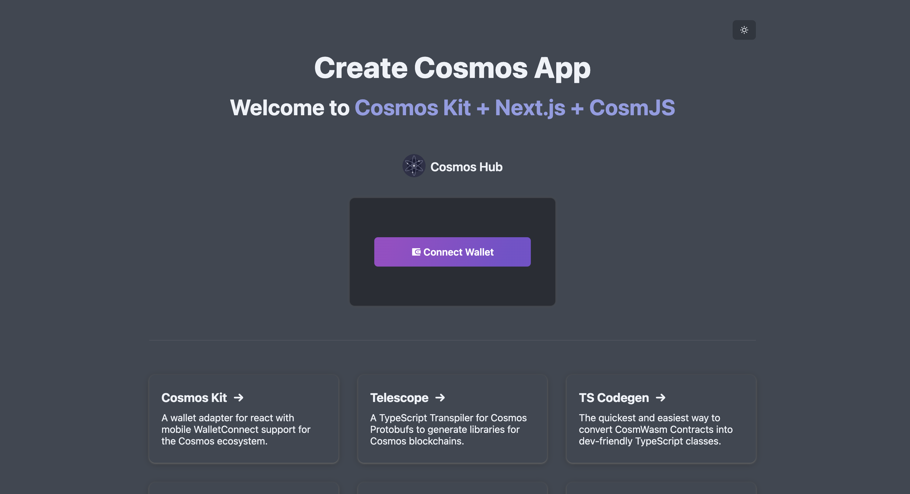
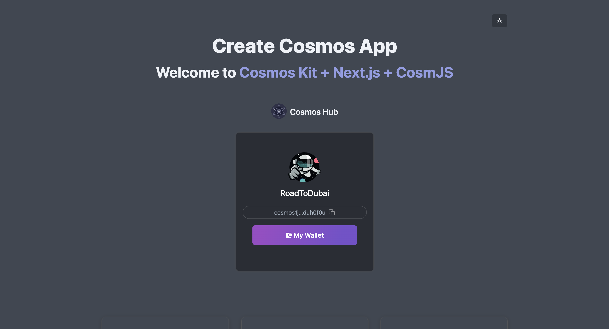

# cosmos-kit template project

Create and understand several template projects provided by cosmos-kit.

## Prepare in Adfacne

### cosmos-kit?

Cosmos-kit can easily communicate with app chains using Cosmos-SDK by utilizing Cosmos-SDK and various wallet connections such as Cosmos Ecosystem Cosmostation, Keplr, and Leap.

In addition to the basic modules provided by Cosmos-SDK, examples also utilize the representative NFT Marketplace, DEX Stargaze, and Osmosis Contract.

## Implementation

### Verifying nodejs Installation

```
$ node -v
> v20.11.1
# If you don't need to match the version, but you can't support it, try changing the nodejs version using nvm.
```

### Install cosmos-kit
```
$ npm i -g create-cosmos-app
> ... added 79 packages in 8s ...


# After installation, use cca command to perform cosmos-kit related tasks.
$ cca -v
> 2.3.3
```

### Create cosmos-kit project

```
# `cca` 또는 `create-cosmos-app`을 통해 프로젝트 생성을 한다.
$ cca

? [name] Enter your new app name rtd-example
> Cloning into 'rtd-example'...

? [template] which template connect-chain
> ✨ Have fun! Now you can start on your project ⚛️
> Now, run this command:
> cd ./rtd-example && yarn dev


# yarn을 입력시, yarn version / corepack 관련 오류가 나게 되면
# package.json에서 "packageManager": "yarn@4.3.1" 부분을 제거 후 실행한다
```

### 프로젝트 실행

```
$ yarn
$ yarn dev
```

## 결과

http://localhost:3000 주소로 테스트를 진행한다.

### 단일 체인 프로젝트



설치된 지갑을 찾아서 연결 및 주소를 확인한다.


### 멀티 체인 프로젝트

cosmos-kit 생성시 template 를 connect-multi-chain으로 설정하여 프로젝트를 생성 후 실행한다.


여러 체인으로 계정이 변경 되는 것을 확인한다.(Cosmos 앱 체인은 체인별로 Address의 Prefix가 존재한다.)

## 참조 - 기타 cosmos-kit 템플릿 분석

https://cosmology.zone/products/create-cosmos-app 에 제공되는 템플릿을 생성하여 코드를 분석한다.

- Stake Tokens
  - `cca --name stake-example --example stake-tokens`
  - 대시보드를 만들게 된다면 가장 도움이 될 만한 예제로, Cosmos-SDK의 Staking 기능들을 잘 파악할 수 있다. Delegation, Reward 관련된 기능들이 구현되어 있다.
- Vote Proposals
  - `cca --name vote-example --example vote-proposal`
  - Governance 기능을 분석하기 쉬운 예제로 Proposal, Vote 관련된 기능들이 구현되어 있다.
- IBC Transfer
  - `cca --name ibc-example --example ibc-transfer`
  - 앱체인간 데이터전송인 IBC를 통해 IBC의 작동 방식을 이해하기 위한 템플릿
- Swap Tokens
  - `cca --name swap-example --example swap-tokens`
  - DEX인 Osmosis의 Swap 기능이 구현되어 있다.
- Provide Liquidity
  - `cca --name liquidity-example --example provide-liquidity`
  - DEX인 Osmosis의 Liquidity 기능이 구현되어 있다.
- Asset List
  - `cca --name asset-list-example --example asset-list`
  - Cosmos-SDK의 토큰들에 대한 이해를 하기 좋은 예제이다. x/bank이 구현되어 있다.
- NFT
  - `cca --name nft-example --example nft`
  - NFT 앱체인인 Stargaze를 사용하여 민팅을 할 수 있는 예제이다.
- Authz
  - `cca --name authz-example --example authz`
  - Cosmos-SDK의 계정 권한 위임을 할 수 있는 authz 모듈을 테스트 해볼 수 있다.