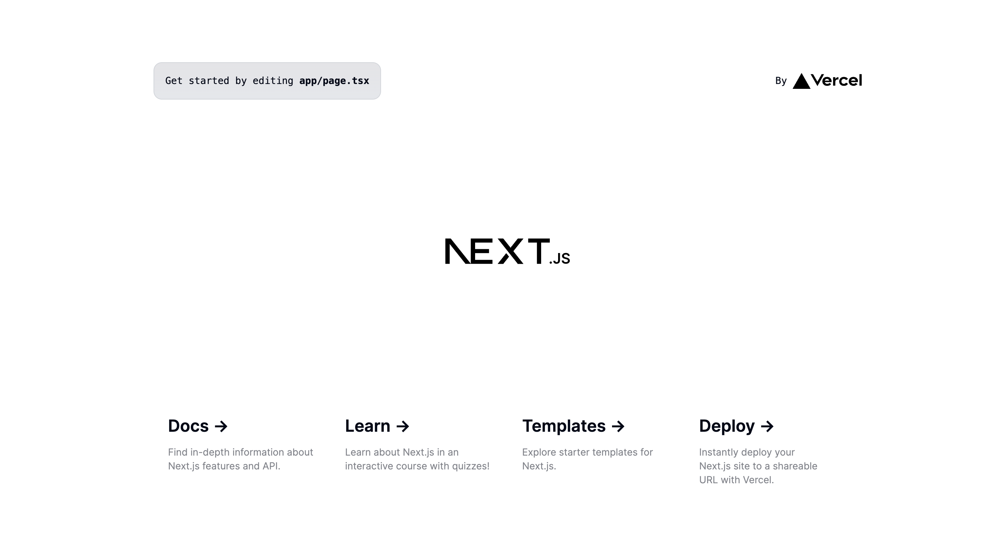
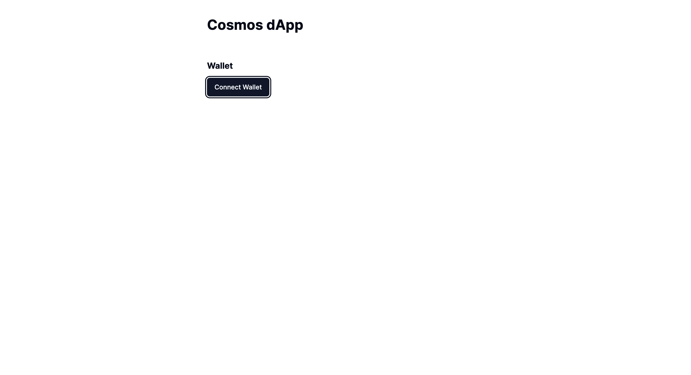
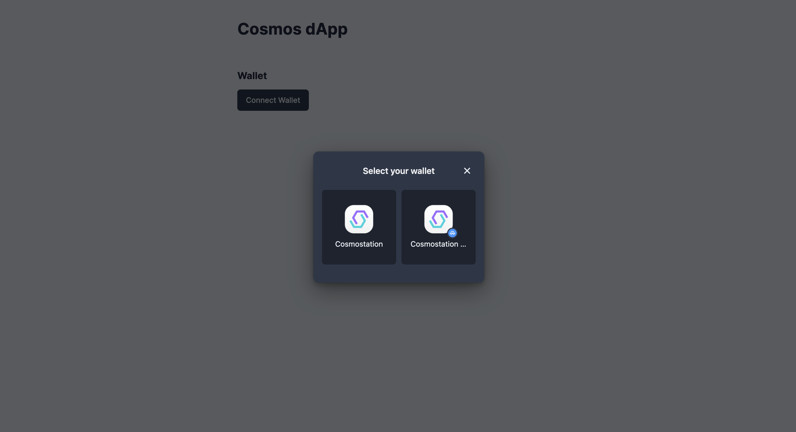
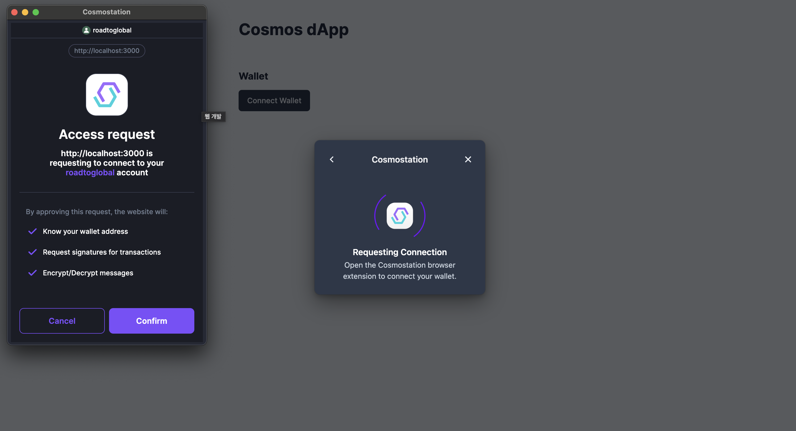
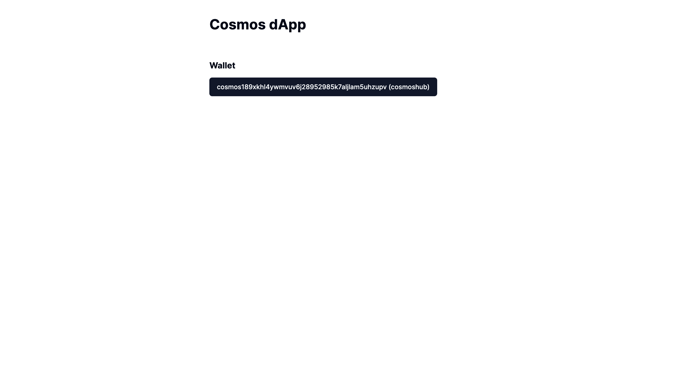

# interlock cosmos-kit

Create a new nextjs project and link cosmos-kit without using a template.


## Implementation

Create the nextjs project below to add the library and cosmos-kit you need from the blank project.

### Create nextjs project
```bash
$ npx create-next-app@latest my-app --typescript --tailwind --eslint
$ ✔ Would you like to use `src/` directory? … No
$ ✔ Would you like to use App Router? (recommended) … Yes
$ ✔ Would you like to customize the default import alias (@/*)? … No
```

### shadcn/ui

Library for easy UI application
https://ui.shadcn.com/docs/installation

```bash
$ npx shadcn-ui@latest init
$ ✔ Which style would you like to use? › Default
$ ✔ Which color would you like to use as base color? › Slate
$ ✔ Would you like to use CSS variables for colors? … no / yes

> ✔ Writing components.json...
> ✔ Initializing project...
> ✔ Installing dependencies...
> Success! Project initialization completed. You may now add components.
```

### Run the nextjs + shadcn/ui project

```bash
$ yarn
$ yarn dev
```

If it's worked out so far, the default nextjs project shows a screen with the shadcn/ui theme.


### Integration to cosmos-kit

https://docs.cosmology.zone/cosmos-kit/get-started

```bash
$ yarn add @cosmos-kit/react @cosmos-kit/cosmostation chain-registry
# Library for @cosmos-kit/react react/nextjs
# @cosmos-kit/cosmostation Library for wallet support
# Library for importing chain-registry appchain information
```

Create a 'provider.tsx' class for linkage and connect ChainProvider for cosmos-kit.

#### **`Add app/provider.tsx`**

```ts
"use client";
import React from "react";
import { wallets } from "@cosmos-kit/cosmostation";
import assets from "chain-registry/assets";
import { chains } from "chain-registry";
import { ChainProvider } from "@cosmos-kit/react";
import "@interchain-ui/react/styles";
export default function Providers({ children }: { children: React.ReactNode }) {
  return (
    <ChainProvider chains={chains} assetLists={assets} wallets={wallets}>
      {children}
    </ChainProvider>
  );
}
```

#### **`Edit app/layout.tsx`**

```ts
import type { Metadata } from "next";
import { Inter } from "next/font/google";
import "./globals.css";
//Add Code
import Providers from "./provider";

const inter = Inter({ subsets: ["latin"] });

export const metadata: Metadata = {
  title: "Create Next App",
  description: "Generated by create next app",
};

export default function RootLayout({
  children,
}: Readonly<{
  children: React.ReactNode;
}>) {
  return (
    <html lang="en">
      <body className={inter.className}>
        <Providers>{children}</Providers>
      </body>
    </html>
  );
}
```

### Implementing Wallet Connectivity

Add shadcn/ui button module

```bash
npx shadcn-ui@latest add button
```

#### **`components/wallet.tsx 추가`**

```ts
"use client";

import { useChain } from "@cosmos-kit/react";
import { Button } from "./ui/button";

export default function Wallet() {
  const { chain, status, address, openView } = useChain("cosmoshubtestnet");
  return (
    <Button onClick={openView}>
      {status === "Connected" ? (
        <>
          {chain.chain_name} {address}
        </>
      ) : (
        <>Connect Wallet</>
      )}
    </Button>
  );
}
```

The cosmoshubtestnet chain and wallet are connected using the useChain hook, and if there is no chain information, the app chain information is automatically added to the wallet with the information in the chain-registry.

Wallet connection status, chain information, wallet address, and connection pop-up are available.

#### **`Edit app/page.tsx`**

```ts
import Wallet from "@/components/wallet";

export default function Home() {
  return (
    <main>
      <div className="m-10 grid gap-14 w-2/5 mx-auto">
        <h1 className="text-3xl font-bold">Cosmos dApp</h1>
        <Wallet />
      </div>
    </main>
  );
}
```

Check if the wallet connection is normal through the code above.

## Result

Check the wallet connection and address.








