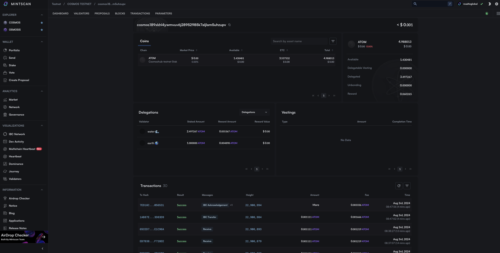

# Send

Cosmos-SDK의 기본 모듈인 x/bank 모듈의 send 기능을 활용하여 Send 메시지를 만들고 사인 및 전송하는 법을 알아본다.

## 사전 준비

### 프로젝트 설정 수정

cosmos-kit의 ChainProvider 설정에 signingOptions를 추가한다. 해당 옵션은 아래와 같은 옵션들을 cosmjs client를 사용할 때 지정하기 위한 옵션이다.

```ts
readonly registry?: Registry;
readonly aminoTypes?: AminoTypes;
readonly broadcastTimeoutMs?: number;
readonly broadcastPollIntervalMs?: number;
readonly gasPrice?: GasPrice;
```

미션에서는 미션 진행에 지장이 없도록 gasPrice를 설정 후 gas 옵션을 "auto"로 사용하기 위해 해당 설정을 진행한다.

#### **`app/providers.tsx`**

```ts
"use client";
import React from "react";
import { wallets } from "@cosmos-kit/cosmostation";
import assets from "chain-registry/assets";
import { chains } from "chain-registry";
import { ChainProvider } from "@cosmos-kit/react";
import "@interchain-ui/react/styles";
import { SignerOptions } from "@cosmos-kit/core";
import { GasPrice } from "@cosmjs/stargate";
import { Chain } from "@chain-registry/types";
export default function Providers({ children }: { children: React.ReactNode }) {
  const signerOptions: SignerOptions = {
    signingStargate(chain) {
      if ((chain as Chain)?.chain_name === "cosmoshubtestnet") {
        return {
          gasPrice: GasPrice.fromString("0.025uatom"),
        };
      }
    },
  };
  return (
    <ChainProvider
      chains={chains}
      assetLists={assets}
      wallets={wallets}
      signerOptions={signerOptions}
    >
      {children}
    </ChainProvider>
  );
}
```

### 입력을 위한 shadcn/ui input 컴퍼넌트 추가

```bash
npx shadcn-ui@latest add input
```

## 구현

### cosmjs를 이용한 Send Transaction 전송

cosmjs에서는 send, sign, broadcast를 위해 client를 통해 다음과 같은 method를 제공한다.

`simulate`
`sign`
`broadcastTxSync`
`broadcastTx`
`signAndBroadcastSync`
`signAndBroadcast`
`sendTokens`
`delegateTokens`

미션에서는 method중 sendTokens를 통해 토큰을 전송해본다.

```ts
//import 및 hook
import { useChain } from "@cosmos-kit/react";

const { address, getSigningStargateClient } = useChain("cosmoshubtestnet");
//`getSigningStargateClient` : 조회를 위한 client
//`getStargateClient` signing(tx sign, broadcast 등) 실제 state 변경을 위한 client

//cosmjs signing clinet 객채 생성 및 token send
const receiver = "cosmos1xxxxxxxx";
const balance = "10000";
const client = await getSigningStargateClient();
const res = await client.sendTokens(
  address,
  receiver,
  [{ amount: balance, denom: "uatom" }],
  "auto"
);

console.log(res);
```

### 미션 적용

#### **`components/send.tsx`**

```ts
"use client";

import { useChain } from "@cosmos-kit/react";
import { useState } from "react";
import { Button } from "./ui/button";
import { Input } from "./ui/input";

export default function Send() {
  const { address, getSigningStargateClient } = useChain("cosmoshubtestnet");
  const [receiver, setReceiver] = useState("");
  const [balance, setBalance] = useState("");

  const send = async () => {
    if (!address) {
      return;
    }

    const client = await getSigningStargateClient();
    try {
      const res = await client.sendTokens(
        address,
        receiver,
        [{ amount: balance, denom: "uatom" }],
        "auto"
      );
      console.log(res);
      window.open(
        `https://mintscan.io/cosmoshub-testnet/address/${res.transactionHash}`,
        "_blank"
      );
    } catch (e) {
      window.open(
        `https://mintscan.io/cosmoshub-testnet/address/${address}`,
        "_blank"
      );
    }
  };

  return (
    <div className="space-y-3">
      <h3 className="text-xl font-bold">Send</h3>
      <Input
        type="text"
        placeholder="Receiver address"
        value={receiver}
        className="max-w-md"
        onChange={(e) => setReceiver(e.target.value)}
      />
      <Input
        type="text"
        value={balance}
        placeholder="Amount"
        className="max-w-md"
        onChange={(e) => setBalance(e.target.value)}
      />
      <Button onClick={send}>Send</Button>
    </div>
  );
}
```

#### **`app/pages.tsx`**

```ts
import Balance from "@/components/balance";
import Send from "@/components/send";
import Wallet from "@/components/wallet";

export default function Home() {
  return (
    <main>
      <div className="m-10 grid gap-14 w-2/5 mx-auto">
        <h1 className="text-3xl font-bold">Cosmos dApp</h1>
        <Wallet />
        <Send />
        <Balance />
      </div>
    </main>
  );
}
```

## 결과


전송 후 Mintscan에서 Tx가 잘 반영되었는지 확인해본다. https://mintscan.io/cosmoshub-testnet/address/${address}



