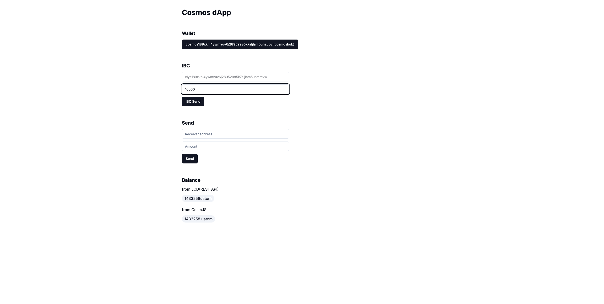
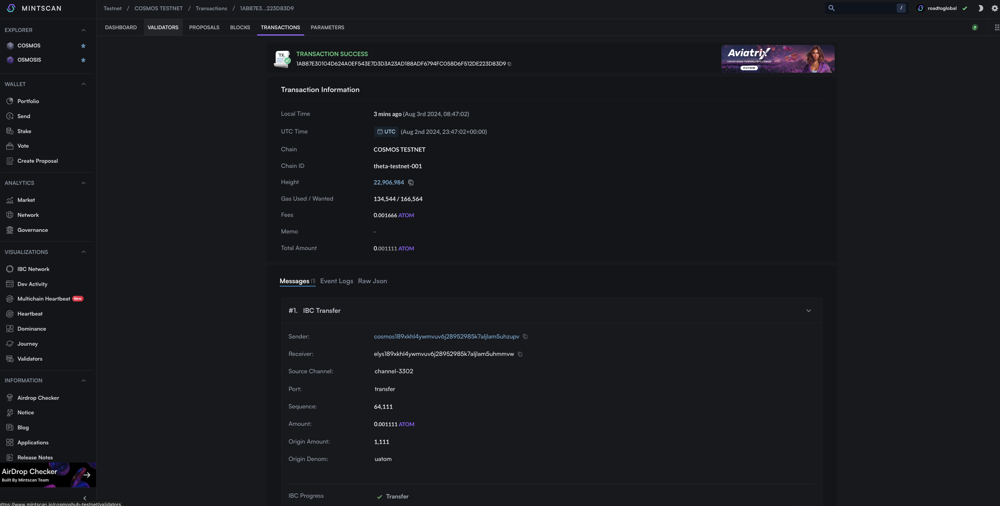

# IBC

Cosmos-SDK에서 앱 체인간 연결을 위한 IBC기술을 알아보기 위해 ibc-tranfser 기능을 활용하여 cosmos testnet에서 다른 osmosis testnet으로 토큰을 전송해본다.

## 사전 준비

### IBC 기초

코스모스 생태계는 인터체인 생태계로도 불린다.
앱체인간 IBC(Inter-Blockchain Communication)라는 기능을 통해 체인간 전송을 가능하도록 한다.

IBC는 앱체인간 프로토콜이 정해져 있고, Relayer를 통해 전송된다. A, B 체인간 여러 릴레이어가 있을 수 있고, 연결이 맺어지면서 채널이 존재한다.

따라서 IBC 토큰 전송을 할 때는 sender, receiver, sourcePort, sourceChannel, token, timeout 정보가 필요하다.

전송 된 IBC 토큰은 다른 denom이름으로 생기게 되며 해당 denom은 channel, source, target, source denom 정보가 같을 때 같은 토큰을 나타낸다. IBC 전송 후 target 체인에서 IBC/XXXX와 같은 denom으로 존재하게 되고 같은 채널로 돌아가게 되는 경우 원래 denom으로 복구 된다.

- cosmos ATOM --channel1-> osmosis IBC/11111(ATOM)
- cosmos ATOM --channel2-> osmosis IBC/22222(ATOM)

### cosmjs를 활용한 메시지 생성 및 전송

cosmjs에서는 sendToken delegateTokens 등 편리하게 이용할 수 있는 method들을 제공해준다. IBC 전송은 sendIbcTokens이란 method로 제공 되었는데, 현재는 Deprecated 되어있다. 아마도 packet-forward-middleware, inter chain query 등 발전하여 복잡해 지는 IBC를 저 내용으로 커버할 수 없어서 직접 message를 만들도록 가이드 하는 것 같다.

따라서 이번 예제에서는 직접 IBC 메시지를 만들고 tx를 전송하도록 한다.

## 구현

cosmoshub-testnet에서 elys-testnet으로 uatom을 전송한다.

### IBC용 메시지 만들기

@cosmjs/stargate에는 여러 메시지들에 대한 타입 EncodeObject들이 선언 되어 있다. 필요한 모듈들의 원하는 메시지를 찾아 해당 메시지에 맞는 EncodeObject를 선언한다.

아래 메시지는 IBC를 통해 token transfer를 하는 메시지이다. 전송할 체인은 channel-3302는 elys라는 체인의 testnet이고, 타임아웃을 3개 block height만큼 지정을 하였다.

```ts
import { MsgTransferEncodeObject } from "@cosmjs/stargate";

const msg: MsgTransferEncodeObject = {
  typeUrl: "/ibc.applications.transfer.v1.MsgTransfer",
  value: {
    sender: address,
    receiver: receiver,
    sourcePort: "transfer",
    sourceChannel: "channel-3302",
    token: { denom: "uatom", amount: balance },
    timeoutHeight: { revisionNumber: BigInt(3), revisionHeight: BigInt(0) },
    timeoutTimestamp: BigInt(0),
    memo: "",
  },
};
```

### 메시지 전송

위에서 만든 메시지(또는 메시지들)을 signingStargateClient를 이용해 사인 및 전송한다.

```ts
const { address, getSigningStargateClient } = useChain("cosmoshubtestnet");

const client = await getSigningStargateClient();
const res = await client.signAndBroadcast(address, [msg], "auto");
```

### 미션 적용

#### **`components/ibc-send.tsx`**

```ts
"use client";

import { useChain } from "@cosmos-kit/react";
import { MsgTransferEncodeObject } from "@cosmjs/stargate";
import { useState } from "react";
import { Input } from "./ui/input";
import { Button } from "./ui/button";

export default function IbcSend() {
  const { address, getSigningStargateClient } = useChain("cosmoshubtestnet");
  const { address: elysAddress } = useChain("elystestnet");

  const [balance, setBalance] = useState("");

  const send = async () => {
    if (!address) {
      return;
    }

    const msg: MsgTransferEncodeObject = {
      typeUrl: "/ibc.applications.transfer.v1.MsgTransfer",
      value: {
        sender: address,
        receiver: elysAddress,
        sourcePort: "transfer",
        sourceChannel: "channel-3302",
        token: { denom: "uatom", amount: balance },
        timeoutHeight: { revisionNumber: BigInt(3), revisionHeight: BigInt(0) },
        timeoutTimestamp: BigInt(0),
        memo: "",
      },
    };

    const client = await getSigningStargateClient();

    try {
      const res = await client.signAndBroadcast(address, [msg], "auto");
      console.log(res);
      window.open(
        `https://mintscan.io/cosmoshub-testnet/address/${res.transactionHash}`,
        "_blank"
      );
    } catch (e) {
      window.open(
        `https://mintscan.io/cosmoshub-testnet/address/${address}`,
        "_blank"
      );
    }
  };

  return (
    <div className="space-y-3">
      <h3 className="text-xl font-bold">IBC</h3>
      <Input
        type="text"
        className="max-w-md"
        placeholder="Receiver address"
        value={elysAddress}
        disabled
      />
      <Input
        type="text"
        value={balance}
        className="max-w-md"
        placeholder="Amount"
        onChange={(e) => setBalance(e.target.value)}
      />
      <Button onClick={send}>IBC Send</Button>
    </div>
  );
}
```

#### **`app/pages.tsx`**

```ts
import Balance from "@/components/balance";
import IbcSend from "@/components/ibc-send";
import Send from "@/components/send";
import Wallet from "@/components/wallet";

export default function Home() {
  return (
    <main>
      <div className="m-10 grid gap-14 w-2/5 mx-auto">
        <h1 className="text-3xl font-bold">Cosmos dApp</h1>
        <Wallet />
        <IbcSend />
        <Send />
        <Balance />
      </div>
    </main>
  );
}
```

## 결과





IBC 전송 후 Mintscan에서 Tx가 잘 반영되었는지 확인해본다.

elys testnet의 수신 결과를 확인한다. https://testnet.ping.pub/elys/account/{address}
