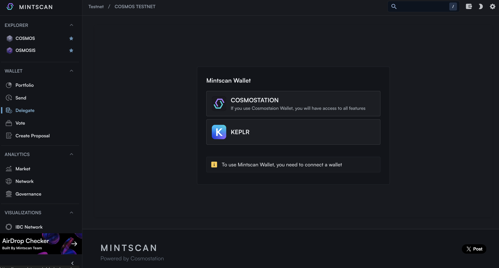
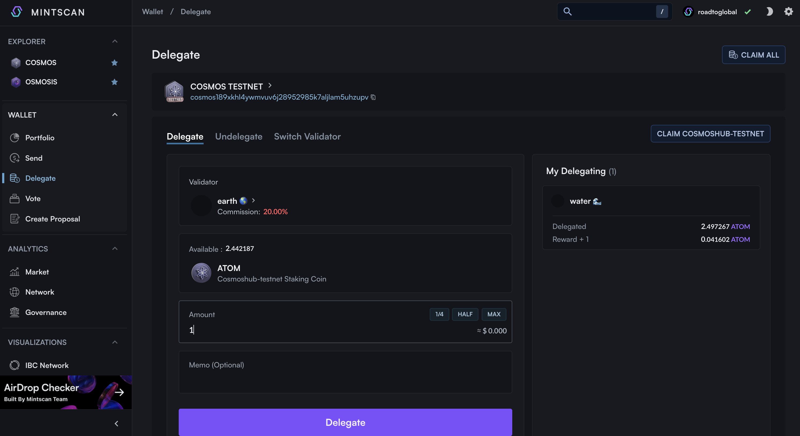
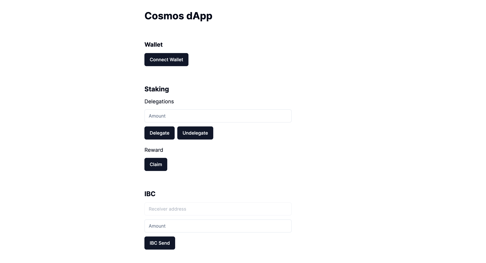
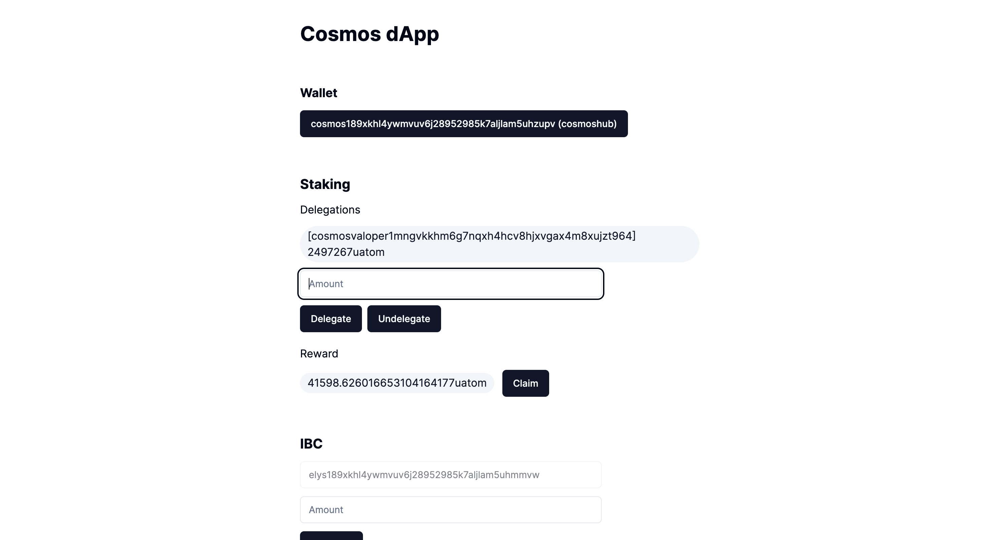

# Staking

We will learn about the stacking-related functions that are key to Cosmos-SDK.

## Preparedness

Cosmos-SDK is dpoS, which has validators per chain, delegates to validators, and receives rewards. Details are found in Cosmos Basic.

The user's delegation to the Validator is called Delegate, the delegation withdrawal is called Undelegate, and the delegated compensation is called Reward.

Through the mission below, we test basic staking functions such as delegation/reward confirmation and delegation/withdrawal/claim.

Note - Check the Swagger distribution, staking-related methods
https://cosmos-rest.publicnode.com/swagger/

### Data generation

Staking is performed in advance before data inquiry, and data is generated.
https://www.mintscan.io/wallet/delegate?chain=cosmoshub-testnet&type=stake




## Implementation

### Check Delegation Info

```ts
const balances = await fetch(
  `${await getRestEndpoint()}/cosmos/staking/v1beta1/delegations/${address}`
);
const result = await balances.json();
console.log(result);
```

### Check Reward Info

```ts
const reward = await fetch(
  `${await getRestEndpoint()}/cosmos/distribution/v1beta1/delegators/${address}/rewards`
);
const result = await reward.json();
console.log(result);
```

### Delegate

You can chceck the Validator information on the Explorer.
https://www.mintscan.io/cosmoshub-testnet/validators/cosmosvaloper1mngvkkhm6g7nqxh4hcv8hjxvgax4m8xujzt964

```ts
const validator = "cosmosvaloper1mngvkkhm6g7nqxh4hcv8hjxvgax4m8xujzt964";
const msg: MsgDelegateEncodeObject = {
  typeUrl: "/cosmos.staking.v1beta1.MsgDelegate",
  value: {
    delegatorAddress: address,
    validatorAddress: validator,
    amount: { amount: amount, denom: "uatom" },
  },
};
const client = await getSigningStargateClient();
const res = await client.signAndBroadcast(address, [msg], "auto");
console.log(res);
```

### Undelegate

```ts
const msg: MsgUndelegateEncodeObject = {
  typeUrl: "/cosmos.staking.v1beta1.MsgUndelegate",
  value: {
    delegatorAddress: address,
    validatorAddress: "cosmosvaloper1mngvkkhm6g7nqxh4hcv8hjxvgax4m8xujzt964",
    amount: { amount: amount, denom: "uatom" },
  },
};
const client = await getSigningStargateClient();
const res = await client.signAndBroadcast(address, [msg], "auto");
console.log(res);
```

### Withdraw Reward

```ts
const msg: MsgWithdrawDelegatorRewardEncodeObject = {
  typeUrl: "/cosmos.distribution.v1beta1.MsgWithdrawDelegatorReward",
  value: {
    delegatorAddress: address,
    validatorAddress: "cosmosvaloper1mngvkkhm6g7nqxh4hcv8hjxvgax4m8xujzt964",
  },
};
const client = await getSigningStargateClient();
const res = await client.signAndBroadcast(address, [msg], "auto");
console.log(res);
```

### Apply to Mission

#### **`components/staking.tsx`**

```ts
"use client";

import { useChain } from "@cosmos-kit/react";
import { useEffect, useState } from "react";
import {
  MsgDelegateEncodeObject,
  MsgUndelegateEncodeObject,
  MsgWithdrawDelegatorRewardEncodeObject,
} from "@cosmjs/stargate";
import { Input } from "./ui/input";
import { Button } from "./ui/button";
import { Badge } from "./ui/badge";

export default function Staking() {
  const { address, getRestEndpoint, getSigningStargateClient } =
    useChain("cosmoshubtestnet");

  const [delegations, setDelegations] = useState<any>();
  const [rewards, setRewards] = useState<any>();
  const [amount, setAmount] = useState("");

  const delegate = async () => {
    if (!address) {
      return;
    }

    const msg: MsgDelegateEncodeObject = {
      typeUrl: "/cosmos.staking.v1beta1.MsgDelegate",
      value: {
        delegatorAddress: address,
        validatorAddress:
          "cosmosvaloper1mngvkkhm6g7nqxh4hcv8hjxvgax4m8xujzt964",
        amount: { amount: amount, denom: "uatom" },
      },
    };
    const client = await getSigningStargateClient();
    const res = await client.signAndBroadcast(address, [msg], "auto");
    console.log(res);
  };

  const undelegate = async () => {
    if (!address) {
      return;
    }

    const msg: MsgUndelegateEncodeObject = {
      typeUrl: "/cosmos.staking.v1beta1.MsgUndelegate",
      value: {
        delegatorAddress: address,
        validatorAddress:
          "cosmosvaloper1mngvkkhm6g7nqxh4hcv8hjxvgax4m8xujzt964",
        amount: { amount: amount, denom: "uatom" },
      },
    };
    const client = await getSigningStargateClient();
    const res = await client.signAndBroadcast(address, [msg], "auto");
    console.log(res);
  };

  const claim = async () => {
    if (!address) {
      return;
    }

    const msg: MsgWithdrawDelegatorRewardEncodeObject = {
      typeUrl: "/cosmos.distribution.v1beta1.MsgWithdrawDelegatorReward",
      value: {
        delegatorAddress: address,
        validatorAddress:
          "cosmosvaloper1mngvkkhm6g7nqxh4hcv8hjxvgax4m8xujzt964",
      },
    };
    const client = await getSigningStargateClient();
    const res = await client.signAndBroadcast(address, [msg], "auto");
    console.log(res);
  };

  useEffect(() => {
    if (!address) {
      return;
    }

    const fetchDelegations = async () => {
      const balances = await fetch(
        `${await getRestEndpoint()}/cosmos/staking/v1beta1/delegations/${address}`
      );
      const result = await balances.json();
      setDelegations(result);
    };
    fetchDelegations();

    const fetchRewards = async () => {
      const reward = await fetch(
        `${await getRestEndpoint()}/cosmos/distribution/v1beta1/delegators/${address}/rewards`
      );
      const result = await reward.json();
      setRewards(result);
    };
    fetchRewards();
  }, [address]);

  return (
    <div className="space-y-3">
      <h3 className="text-xl font-bold">Staking</h3>
      <h4 className="text-md">Delegations</h4>
      {delegations &&
        delegations.delegation_responses &&
        delegations.delegation_responses.map((delegation: any) => (
          <Badge
            variant="secondary"
            className="text-md font-normal mr-3"
            key={delegation.delegation.validator_address}
          >
            [{delegation.delegation.validator_address}]{" "}
            {delegation.balance.amount}
            {delegation.balance.denom}
          </Badge>
        ))}
      <Input
        type="text"
        value={amount}
        placeholder="Amount"
        className="max-w-md"
        onChange={(e) => setAmount(e.target.value)}
      />
      <div className="space-x-2 flex">
        <Button onClick={delegate}>Delegate</Button>
        <Button onClick={undelegate}>Undelegate</Button>
      </div>
      <h4 className="text-md pt-2">Reward</h4>
      {rewards &&
        rewards.total &&
        rewards.total.map((reward: any) => (
          <Badge
            variant="secondary"
            className="text-md font-normal mr-3"
            key={reward.denom}
          >
            {reward.amount}
            {reward.denom}
          </Badge>
        ))}
      <Button onClick={claim}>Claim</Button>
    </div>
  );
}
```

#### **`app/pages.tsx`**

```ts
import Balance from "@/components/balance";
import IbcSend from "@/components/ibc-send";
import Send from "@/components/send";
import Staking from "@/components/staking";
import Wallet from "@/components/wallet";

export default function Home() {
  return (
    <main>
      <div className="m-10 grid gap-14 w-2/5 mx-auto">
        <h1 className="text-3xl font-bold">Cosmos dApp</h1>
        <Wallet />
        <Staking />
        <IbcSend />
        <Send />
        <Balance />
      </div>
    </main>
  );
}
```

## Result

Check to see the changes on Delegate, Undelegate, Claim of a mission project through Mintscan.




