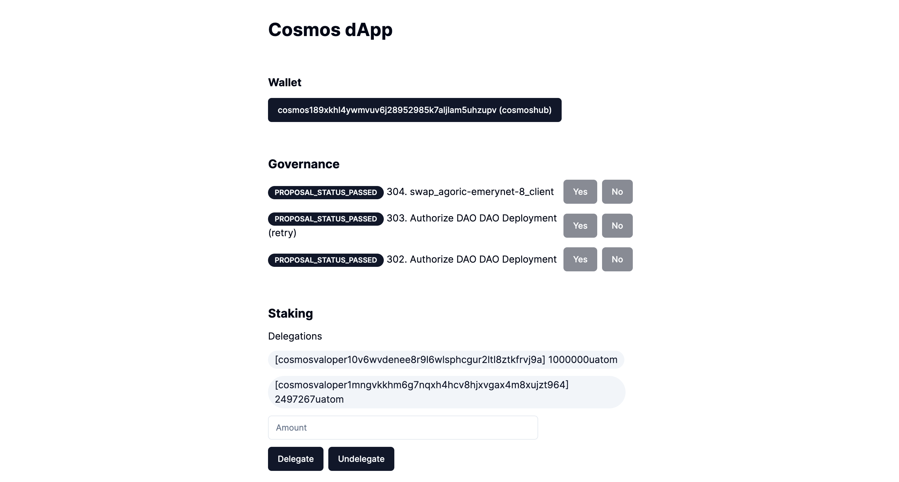

# Governance

Governance implements the creation and transmission of a list of currently ongoing proposals and Msg voting.

Currently, there is no progress proposal on cosmoshub testnet, so I only look into it through the example code.

## Implementation

### Proposal List Inquiry (REST API)

Check three recent proposals. Check conditions such as status can be selected through parameters (see swagger)
```ts
const { getRestEndpoint } = useChain("cosmoshubtestnet");
const res = await fetch(
  `${await getRestEndpoint()}/cosmos/gov/v1/proposals?pagination.limit=3&pagination.reverse=true`
);
const result = await res.json();
```

### Voting Functionality

```ts
const msg: MsgVoteEncodeObject = {
      typeUrl: "/cosmos.gov.v1beta1.MsgVote",
      value: {
        proposalId: BigInt(id),
        voter: address,
        option: yes ? VoteOption.VOTE_OPTION_YES : VoteOption.VOTE_OPTION_NO,
      },
    };
const client = await getSigningStargateClient();
const res = await client.signAndBroadcast(address, [msg], "auto");
```

#### **`components/gov.tsx`**

```ts
"use client";

import { useChain } from "@cosmos-kit/react";
import { useEffect, useState } from "react";
import { MsgVoteEncodeObject } from "@cosmjs/stargate";
import { VoteOption } from "cosmjs-types/cosmos/gov/v1beta1/gov";
import { Button } from "./ui/button";
import { Badge } from "./ui/badge";

export default function Gov() {
  const { address, getRestEndpoint, getSigningStargateClient } =
    useChain("cosmoshubtestnet");

  const [proposals, setProposals] = useState<any>();

  const vote = async (id: string, yes: boolean) => {
    if (!address) {
      return;
    }

    const msg: MsgVoteEncodeObject = {
      typeUrl: "/cosmos.gov.v1beta1.MsgVote",
      value: {
        proposalId: BigInt(id),
        voter: address,
        option: yes ? VoteOption.VOTE_OPTION_YES : VoteOption.VOTE_OPTION_NO,
      },
    };
    const client = await getSigningStargateClient();
    const res = await client.signAndBroadcast(address, [msg], "auto");
    console.log(res);
  };

  useEffect(() => {
    if (!address) {
      return;
    }
    const fetchProposals = async () => {
      const res = await fetch(
        `${await getRestEndpoint()}/cosmos/gov/v1/proposals?pagination.limit=3&pagination.reverse=true`
      );
      const result = await res.json();
      setProposals(result.proposals);
    };
    fetchProposals();
  }, [address]);

  return (
    <div className="space-y-3">
      <h3 className="text-xl font-bold">Governance</h3>
      {proposals &&
        proposals.map((proposal: any) => {
          return (
            <div className="flex space-x-2 items-center" key={proposal.id}>
              <div className="w-full">
                <Badge>{proposal.status}</Badge> {proposal.id}. {proposal.title}
              </div>
              <Button
                onClick={() => vote(proposal.id, true)}
                disabled={proposal.status !== "PROPOSAL_STATUS_VOTING_PERIOD"}
              >
                Yes
              </Button>
              <Button
                onClick={() => vote(proposal.id, false)}
                disabled={proposal.status !== "PROPOSAL_STATUS_VOTING_PERIOD"}
              >
                No
              </Button>
            </div>
          );
        })}
    </div>
  );
}
```

#### **`app/pages.tsx`**

```ts
import Balance from "@/components/balance";
import Gov from "@/components/gov";
import IbcSend from "@/components/ibc-send";
import Send from "@/components/send";
import Staking from "@/components/staking";
import Wallet from "@/components/wallet";

export default function Home() {
  return (
    <main>
      <div className="m-10 grid gap-14 w-2/5 mx-auto">
        <h1 className="text-3xl font-bold">Cosmos dApp</h1>
        <Wallet />
        <Gov />
        <Staking />
        <IbcSend />
        <Send />
        <Balance />
      </div>
    </main>
  );
}
```

## Result

Three most recent Proposal and voting functionality is applied to the project.

