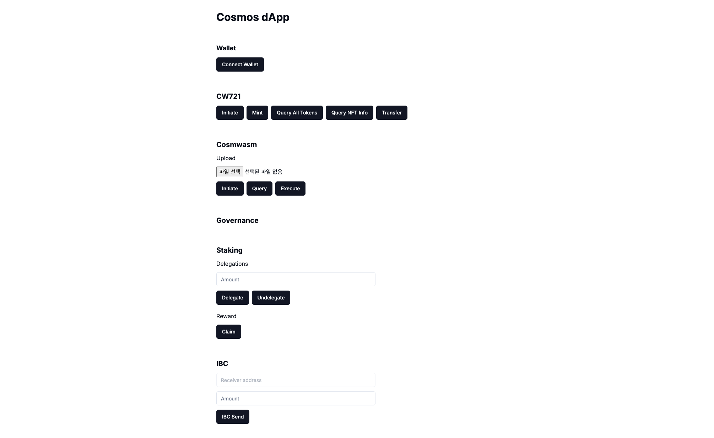
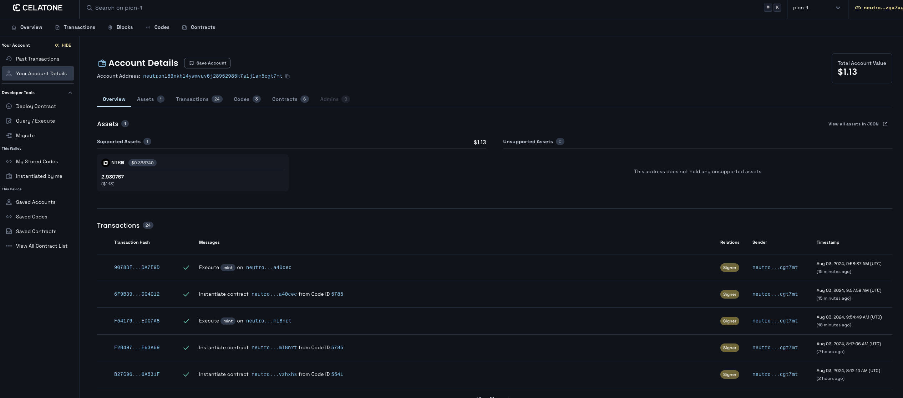

# NFT

It utilizes CW721, a Cosmwasm smart contract, to implement NFT minting and transfer.

## Prepare in Advance

Distribute the CW721 contract.
https://github.com/public-awesome/cw-nfts

### clone and build
```bash
git clone https://github.com/public-awesome/cw-nfts.git
cd cw-nfts
./build.sh
```

`Is the docker daemon running?` If a docker-related error occurs, run docker.

When compiling is complete, cw721_base.wasm will appear in the folder below.

```bash
cd artifacts
cw721_base.wasm
```

In order to check the schema, the schema is generated through the command below, and the files created in the schema directory are checked.
```sh
cd contracts
cd cw721-base
cargo schema

cd schema

cat instantiate_msg.json #struct to initiate
cat query_msg.json #struct query the state
cat execute_msg.json # truct to change the state
```

Deploy the contract on Neutron testnet. (See Mission#9)

### schema

#### **`initiage_msg.json`**

```json
{
  "$schema": "http://json-schema.org/draft-07/schema#",
  "title": "InstantiateMsg",
  "type": "object",
  "required": ["name", "symbol"],
  "properties": {
    "minter": {
      "description": "The minter is the only one who can create new NFTs. This is designed for a base NFT that is controlled by an external program or contract. You will likely replace this with custom logic in custom NFTs",
      "type": ["string", "null"]
    },
    "name": {
      "description": "Name of the NFT contract",
      "type": "string"
    },
    "symbol": {
      "description": "Symbol of the NFT contract",
      "type": "string"
    },
    "withdraw_address": {
      "type": ["string", "null"]
    }
  },
  "additionalProperties": false
}
```

## Implementation

On the Neutron Testnet, cw721 was placed with the code ID '5785'. It is recommended to post it directly and use the code written, but in the example, it proceeds to '5785'.

### Initiate

If you check the `initiate_msg.json` schema above, properties need `name(*)`, `symbol(*)`, `minter`, and `withdraw_address`. In the mission, the minter is used as the current wallet address to be minted.
```ts
const client = await getSigningCosmWasmClient();
const init = await client.instantiate(
  address,
  5785,
  {
    name: "MY NFT",
    symbol: "MYNFT",
    minter: address,
  },
  "MY NFT TEST",
  "auto"
);
console.log(init);
const contractAddress = init.contractAddress;
```

Through the above initiation, a collection of 'MY NFT' CW721 will be created, and you can mint through a connected wallet.

### Mint

Try to mint NFTs through the generated contactAddress information.

Check the schema information for mint, make a structure according to the specifications, call, and inquire.
#### **`execute_msg.json` in `mint`**

```json
{
  "description": "Mint a new NFT, can only be called by the contract minter",
  "type": "object",
  "required": ["mint"],
  "properties": {
    "mint": {
      "type": "object",
      "required": ["owner", "token_id"],
      "properties": {
        "extension": {
          "description": "Any custom extension used by this contract",
          "anyOf": [
            {
              "$ref": "#/definitions/Metadata"
            },
            {
              "type": "null"
            }
          ]
        },
        "owner": {
          "description": "The owner of the newly minter NFT",
          "type": "string"
        },
        "token_id": {
          "description": "Unique ID of the NFT",
          "type": "string"
        },
        "token_uri": {
          "description": "Universal resource identifier for this NFT Should point to a JSON file that conforms to the ERC721 Metadata JSON Schema",
          "type": ["string", "null"]
        }
      },
      "additionalProperties": false
    }
  }
}
```

Based on the above schema, msg to be transmitted during execution is generated and called.

```ts
const client = await getSigningCosmWasmClient();
const execute = await client.execute(
  address,
  contractAddress,
  { mint: { owner: address, token_id: "1", token_uri: "ipfs://" } },
  "auto"
);
console.log(execute);
```

### Look up NFT token information

Below is an example of calling a `{nft_info: { token_id: "1''}` smart query that queries NFT information with the token ID of CW721.

Based on the schema information below, smart msg is generated and called to obtain contact status information.
#### **`query_msg.json` in `nft_info`**

```json
{
  "description": "With MetaData Extension. Returns metadata about one particular token, based on *ERC721 Metadata JSON Schema* but directly from the contract",
  "type": "object",
  "required": [
    "nft_info"
  ],
  "properties": {
    "nft_info": {
      "type": "object",
      "required": [
        "token_id"
      ],
      "properties": {
        "token_id": {
          "type": "string"
        }
      },
      "additionalProperties": false
    }
  },
  "additionalProperties": false
},
```

```ts
const client = await getSigningCosmWasmClient();
const query = await client.queryContractSmart(contractAddress, {
  nft_info: { token_id: "1" },
});
console.log(query);
```

### Look up all NFT token information

Below is an example of calling the `{all_tokens:{}}` smart query that queries all token IDs of CW721. Schema attachment is omitted.
```ts
const client = await getSigningCosmWasmClient();
const query = await client.queryContractSmart(contractAddress, {
  all_tokens: {},
});
console.log(query);
```

### Send NFTs

Try sending NFTs.

Check the schema information for, create a structure according to the specifications, call, and inquire.
#### **`execute_msg.json` in `transfer_nft`**

```json
{
  "description": "Transfer is a base message to move a token to another account without triggering actions",
  "type": "object",
  "required": [
    "transfer_nft"
  ],
  "properties": {
    "transfer_nft": {
      "type": "object",
      "required": [
        "recipient",
        "token_id"
      ],
      "properties": {
        "recipient": {
          "type": "string"
        },
        "token_id": {
          "type": "string"
        }
      },
      "additionalProperties": false
    }
  },
  "additionalProperties": false
},
```

Based on the above schema, msg to be transmitted during execute is created and called. In this example, it is sent to the person, but it is improved to receive and transmit a different address.

```ts
const client = await getSigningCosmWasmClient();
const execute = await client.execute(
  address,
  contractAddress,
  { transfer_nft: { recipient: address, token_id: "1" } },
  "auto"
);
console.log(execute);
```

### Apply to Mission

Understand NFT minting and driving methods through examples implementing the above contents.
#### **`components/nft.tsx`**

```ts
"use client";

import { useChain } from "@cosmos-kit/react";
import { Button } from "./ui/button";
import { useState } from "react";

export default function NFT() {
  const { address, getSigningCosmWasmClient } = useChain("neutrontestnet");
  const [contractAddress, setContractAddress] = useState(
    "neutron1g52kvc0y5s98q2walfwjtlk07h7mx8wnc4hsq0zrzelm0xlqezaqa40cec"
  );

  const initiate = async () => {
    if (!address) {
      return;
    }

    const client = await getSigningCosmWasmClient();
    const init = await client.instantiate(
      address,
      5785,
      {
        name: "MY NFT",
        symbol: "MYNFT",
        minter: address,
      },
      "MY NFT TEST",
      "auto"
    );
    console.log(init);
    setContractAddress(init.contractAddress);
  };

  const mint = async () => {
    if (!address) {
      return;
    }

    const client = await getSigningCosmWasmClient();
    const execute = await client.execute(
      address,
      contractAddress,
      { mint: { owner: address, token_id: "1" } },
      "auto"
    );
    console.log(execute);
  };

  const allTokens = async () => {
    if (!address) {
      return;
    }

    const client = await getSigningCosmWasmClient();
    const query = await client.queryContractSmart(contractAddress, {
      all_tokens: {},
    });
    console.log(query);
  };

  const nftInfo = async () => {
    if (!address) {
      return;
    }

    const client = await getSigningCosmWasmClient();
    const query = await client.queryContractSmart(contractAddress, {
      nft_info: { token_id: "1" },
    });
    console.log(query);
  };

  const transfer = async () => {
    if (!address) {
      return;
    }

    const client = await getSigningCosmWasmClient();
    const execute = await client.execute(
      address,
      contractAddress,
      { transfer_nft: { recipient: address, token_id: "1" } },
      "auto"
    );
    console.log(execute);
  };

  return (
    <div className="space-y-3">
      <h3 className="text-xl font-bold">CW721</h3>
      <div className="space-x-2 flex">
        <Button onClick={initiate}>Initiate</Button>
        <Button onClick={mint}>Mint</Button>
        <Button onClick={allTokens}>Query All Tokens</Button>
        <Button onClick={nftInfo}>Query NFT Info</Button>
        <Button onClick={transfer}>Transfer</Button>
      </div>
    </div>
  );
}
```

#### **`app/pages.tsx`**

```ts
import Balance from "@/components/balance";
import Gov from "@/components/gov";
import IbcSend from "@/components/ibc-send";
import NFT from "@/components/nft";
import Send from "@/components/send";
import Staking from "@/components/staking";
import Wallet from "@/components/wallet";
import Wasm from "@/components/wasm";

export default function Home() {
  return (
    <main>
      <div className="m-10 grid gap-14 w-2/5 mx-auto">
        <h1 className="text-3xl font-bold">Cosmos dApp</h1>
        <Wallet />
        <NFT />
        <Wasm />
        <Gov />
        <Staking />
        <IbcSend />
        <Send />
        <Balance />
      </div>
    </main>
  );
}
```

## Result





Inquire transmitted and minted content on Celaton, an explorer dedicated to Netron testnet.
https://neutron.celat.one/pion-1/accounts/{address}
