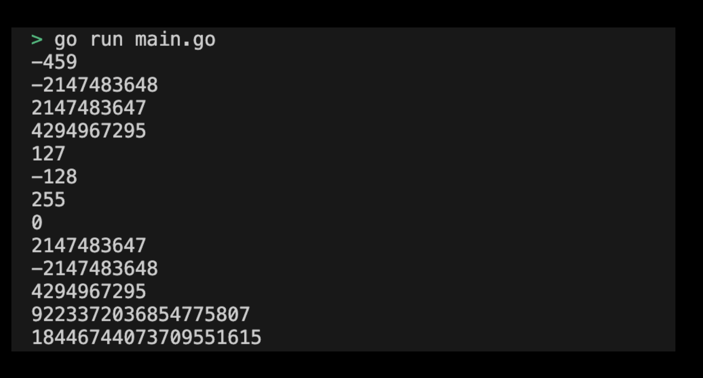

# 01-00. Integer 사용해보기

## 0. Try using Integrer
Let's use the Integer type as a practice. Future practice will be conducted by creating a direct directory and writing a program.

## 1. Setting Preferences
The default settings are as follows:
```sh
# Create integer directory
$ mkdir integer && cd integer

# Create integer go module
$ go mod init integer
```

## 2. Creating a main function
Now let's write the main function code that will use the Integer type. The code to execute in the main function is as follows:
```go
package main

import (
	"fmt"
)

func main() {
    var a int = -459
    var b int32 = -2147483648
    var c int32 = 2147483647
    var d uint32 = 4294967295

    fmt.Println(a) // -459
    fmt.Println(b) // -2147483648
    fmt.Println(c) // 2147483647
    fmt.Println(d) // 4294967295

    // Overflow examples
    var e int8 = 127
    fmt.Println(e)  // 127
    e++
    fmt.Println(e)  // -128 (overflow)

    var f uint8 = 255
    fmt.Println(f)  // 255
    f++
    fmt.Println(f)  // 0 (overflow)

    // Using math package for max values
    fmt.Println(math.MaxInt32) // 2147483647
    fmt.Println(math.MinInt32) // -2147483648
    fmt.Println(math.MaxUint32) // 4294967295
    fmt.Println(math.MaxInt64) // 9223372036854775807

    var maxUint64 uint64 = math.MaxUint64
    fmt.Println(maxUint64) // 18446744073709551615
}
```
> Check the practice code: [01_integrer](../code/01_integrer/)

## 3. Running the Integrer program
The `go run {go file name}.go` command allows you to run the go program where the main function is written. Try entering the command as follows:
```sh
$ go run main.go
```

## 4. Example of submission of execution results
The results output from the execution are as follows:
<div style="text-align: center;">
   
</div>


