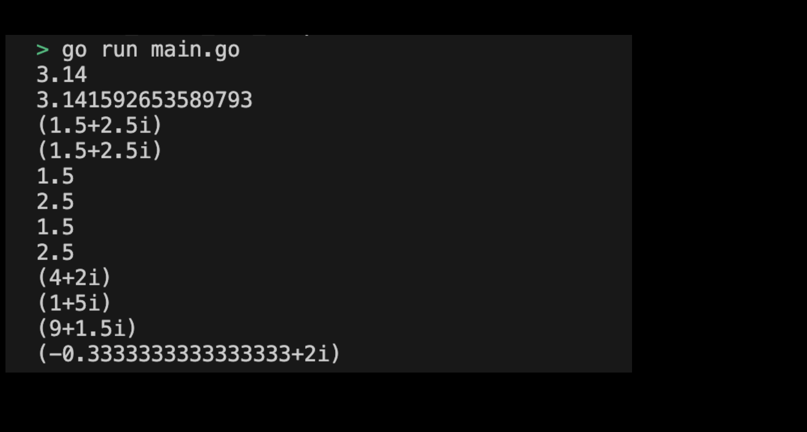

# 01-01. Try Float & Complex

## 0. Try Float & Complex
Let's try the Float & Complex type as a practice.

## 1. Setting Preferences
The default settings are as follows:
```sh
# Create float_and_complex directory
$ mkdir float_and_complex && cd float_and_complex

# Create float_and_complex go module
$ go mod init float_and_complex
```

## 2. Creating a main function
Now let's write the main function code that will use the Float & Complex type. The code to execute in the main function is as follows:
``` go
package main

import (
	"fmt"
)

func main() {
	// Float
	var f1 float32 = 3.14
	var f2 float64 = 3.141592653589793

	fmt.Println(f1) // 3.14
	fmt.Println(f2) // 3.141592653589793

	// Complex
	var c1 complex64 = complex(1.5, 2.5)
	var c2 complex128 = complex(1.5, 2.5)

	fmt.Println(c1) // (1.5+2.5i)
	fmt.Println(c2) // (1.5+2.5i)

	// 실수와 허수 출력하기
	fmt.Println(real(c1)) // 1.5
	fmt.Println(imag(c1)) // 2.5

	fmt.Println(real(c2)) // 1.5
	fmt.Println(imag(c2)) // 2.5

	// complex 타입의 수로 연산 수행하기 
	var c3 complex128 = complex(2.5, 3.5)
	var c4 complex128 = complex(1.5, -1.5)

	fmt.Println(c3 + c4) // (4+2i)
	fmt.Println(c3 - c4) // (1+5i)
	fmt.Println(c3 * c4) // (9+2i)
	fmt.Println(c3 / c4) // (0.5+2i)
}
```
> Check the practice code: [01_floor_and_complex](../code/01_floor_and_complex/)

## 3. Example of submitting Float & Complex program execution screen
The results printed by running the program are as follows:
<div style="text-align: center;">
   
</div>
