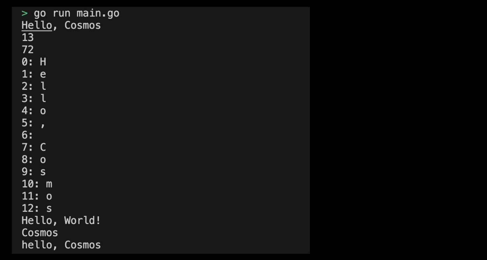

# 01-02. Try String

## 0. Try String
Let's use the String type as a practice.

## 1. Setting Preferences
The default settings are as follows:
```sh
# Create string directory
$ mkdir string && cd string

# Create string go module 
$ go mod init string
```

## 2. Creating a main function
Now let's write the main function code that will use the String type. The code to execute in the main function is as follows:
```go
package main

import (
	"fmt"
)

func main() {
	var str string = "Hello, Cosmos"
	fmt.Println(str) // Hello, Cosmos

	// len function returns the number of bytes of the string, not the number of characters. 
	fmt.Println(len(str)) // 13
	
    fmt.Println(str[0]) // 72 (ASCII value of 'H')

    // Repeat the string with range to get a Unicode code point and output it.
	for index, runeValue := range str { 
        // index: the starting byte position of the rune in the string.
        // runeValue: Unicode code point of the character in that location.
		fmt.Printf("%d: %c\n", index, runeValue)
	}
	// 0: H
	// 1: e
	// 2: l
	// 3: l
	// 4: o
	// 5: ,
	// 6:  
	// 7: C
    // 8: o
    // 9: s
    // 10: m
    // 11: o
    // 12: s

	// 문자열 concatenation
	str1 := "Hello, "
	str2 := "World!"
	combined := str1 + str2
	fmt.Println(combined) // Hello, World!

	// Substring (slicing 사용)
	substr := str[7:13]
	fmt.Println(substr) // Cosmos

	// 문자열을 byte 배열로 변환하기 
	byteSlice := []byte(str)
	byteSlice[0] = 'h'
	newStr := string(byteSlice)
	fmt.Println(newStr) // hello, Cosmos
}
```
> Check Practice Code: [01_string](../code/01_string/)

## 3. Example of submitting a string program execution screen
The results printed by running the program are as follows:
<div style="text-align: center;">
   
</div>

