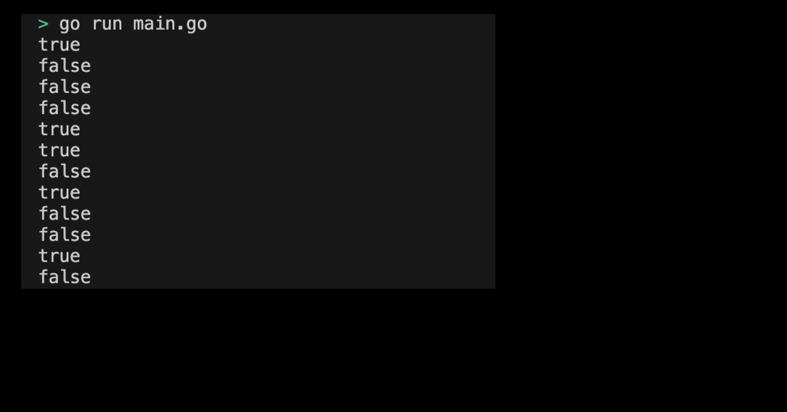

# 01-04. Try the Boolean

## 0. Try Boolean
Let's use the `bool` type function as a practice.

## 1. Setting Preferences
The default settings are as follows:
```sh
# Create boolean directory
$ mkdir boolean && cd boolean

# Create boolean go module
$ go mod init boolean
```

## 2. Creating a main function
Now let's write the main function code that will use the bol type. The code to execute in the main function is as follows:
```go
package main

import (
	"fmt"
)

func main() {
	var b1 bool = true
	var b2 bool = false

	fmt.Println(b1) // true
	fmt.Println(b2) // false

	// Basic value of bool type
	var b3 bool
	fmt.Println(b3) // false

	// Comparative operatro 
	a := 10
	b := 20
	fmt.Println(a == b) // false
	fmt.Println(a != b) // true
	fmt.Println(a < b)  // true
	fmt.Println(a > b)  // false
	fmt.Println(a <= b) // true
	fmt.Println(a >= b) // false

	// Logical Operatro
	c := true
	d := false
	fmt.Println(c && d) // false
	fmt.Println(c || d) // true
	fmt.Println(!c)     // false
}
```
> Check the practice code: [01_boolean](../code/01_boolean/)

## 3. Example of submitting Boolean program execution screen
The results printed by running the program are as follows:

<div style="text-align: center;">
   
</div>
