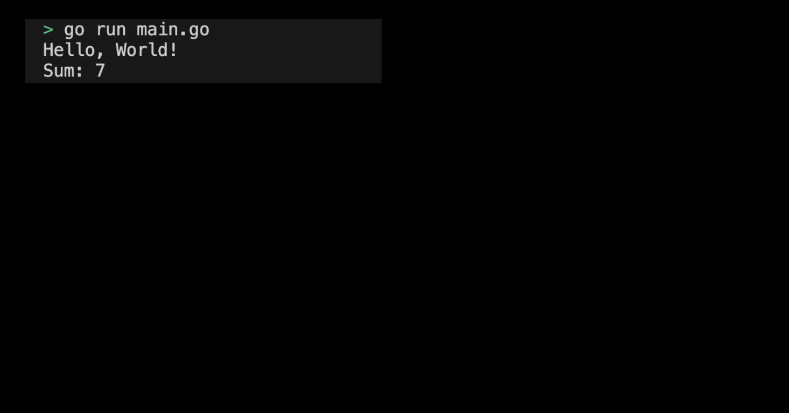

# 01-05. Try Fuction

## 0. Try Function
Let's directly define and use Function as a practice.

## 1. Setting Preferences
The default settings are as follows:
```sh
# Create function directory
$ mkdir function && cd function

# Create function go module 
$ go mod init function
```

## 2. Creating a main function
Now let's directly define the function and write the code to use. Implement a function `greet()` that has no parameters and no return value and a function `add(bint)` that takes two integers as parameters and returns the sum.

The full code is as follows:
```go
package main

import (
	"fmt"
)

// Functions without parameters and return values
func greet() {
	fmt.Println("Hello, World!")
}

// Functions with parameters and return values
func add(a int, b int) int {
	return a + b
}


func main() {
	// Call function 
	greet()

	result := add(3, 4)
	fmt.Println("Sum:", result) // 7
}
```
> Check the practice code: [01_function](../code/01_function/)

## 3. Submit Function program execution screen
The results printed by running the program are as follows:
<div style="text-align: center;">
   
</div>

