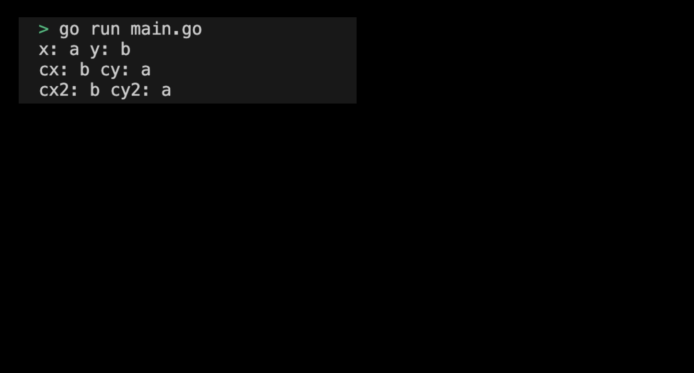

# 01m06. Function - Swap 함수 구현하기

## 목차
0. Function - Swap 함수 구현하기
1. 기본 설정하기
2. Swap 함수 작성하기
3. Swap 프로그램 실행화면 제출 예시

## 0. Function - Swap 함수 구현하기
x와 y의 값을 바꾸는 간단한 함수를 직접 구현해보도록 하자. 해당 실습을 통해 다음을 알아볼 수 있다. 
- 함수는 여러 값을 반환할 수 있으므로 추가 데이터 구조나 임시 변수가 없어도 값을 쉽게 교환할 수 있다.
- 함수 인수가 '값'으로 전달되므로 함수가 호출될 때 인수의 복사본이 만들어진다. 그러므로 함수 내에서 변수가 수정되어도 기존 변수는 영향을 받지 않는다. 

## 1. 기본 설정하기
기본 설정은 다음과 같다:
```sh
# function_swap 디렉토리 생성
$ mkdir function_swap && cd function_swap

# function_swap go module 생성 
$ go mod init function_swap
```

## 2. Swap 함수 작성하기
각 조건을 만족하는 `swap`과 `namedReturnSwap` 함수를 구현한다: 
1. `swap` 함수는 두 개의 문자열(x, y)을 매개변수로 받아, 두 값을 교환하여 반환한다.
2. `namedReturnSwap` 함수는 `swap` 함수와 마찬가지로 두 개의 문자열(x, y)을 매개변수를 받으며, 명명된 반환값(r1, r2)을 사용하여 두 값을 교환하여 반환한다.

구현한 swap 함수를 main 함수에서 다음과 같이 호출할 수 있다:
```go
func main() {
    x, y := "a", "b"
    cx, cy := swap(x, y)
    fmt.Println("x:", x, "y:", y) // x: a y: b
	fmt.Println("cx:", cx, "cy:", cy) // cx: b cy: a

	cx2, cy2 := namedReturnSwap(x,y)
	fmt.Println("cx2:", cx2, "cy2:", cy2) // cx2: b cy2: a
}
```
> 구현된 실습 코드 확인하기: [01_function_swap](../code/01_function_swap/)

## 3. Swap 프로그램 실행화면 제출 예시
프로그램을 실행하여 출력된 결과는 다음과 같다:
<div style="text-align: center;">
   
</div>

이렇게 작성된 Swap 함수는 두 개의 문자열 값을 간단히 교환하여 반환하는 기능을 수행한다. 이를 통해 Go에서 함수가 여러 값을 반환할 수 있다는 점과, 함수 호출 시 인수의 복사본이 만들어진다는 점을 이해할 수 있다.
