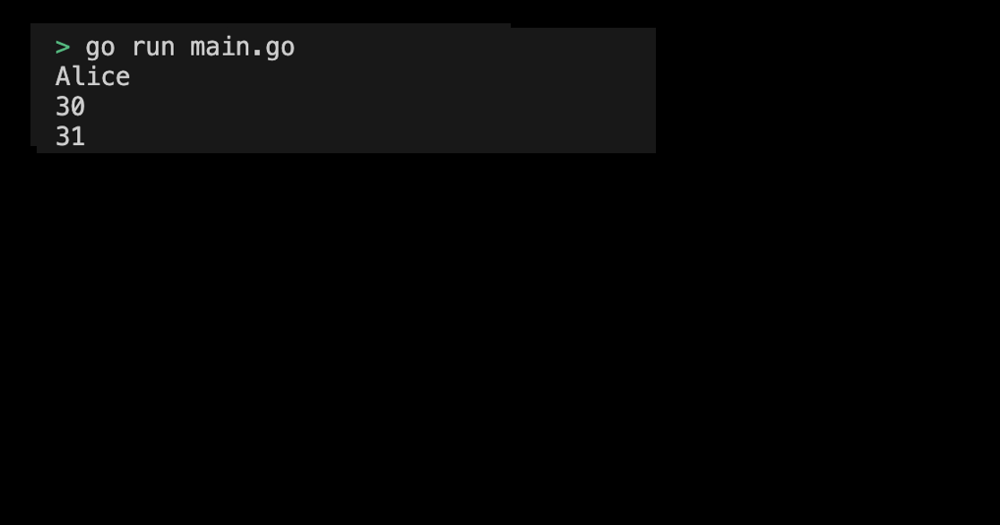

# 01-07. Try Structures

## 0. Try Structures
Let's directly define and use the structure as a practice.

## 1. Setting Preferences
The default settings are as follows:
```sh
# Create struct directory
$ mkdir struct && cd struct

# struct go module 생성 
$ go mod init struct
```

## 2. Creating code
Now let's directly define the structure and write the code to use in the following order.

### 1. Define Person Structures
- name: field of string type
- age: field of integer type
```go
type Person struct {
    name string
    age  int
}
```
### 2. Creating an instance of a Person structure 
```go
func main() {
    p := Person{name: "Alice", age: 30}
}
```

### 3. Inquire and modify Person instance field values created (in No. 2)
Let's approach the name, age of the object created by the instance and modify the age value ourselves.
```go
func main() {
    p := Person{name: "Alice", age: 30}
	// Search field value
    fmt.Println(p.name) // Alice
    fmt.Println(p.age)  // 30

    // Modify field
    p.age = 31
    fmt.Println(p.age)  // 31
}
```

The entire code looks as follows:
```go
package main

import (
	"fmt"
)

type Person struct {
    name string
    age  int
}

func main() {
    p := Person{name: "Alice", age: 30}
	// Search field value
    fmt.Println(p.name) // Alice
    fmt.Println(p.age)  // 30

    // Modify field value
    p.age = 31
    fmt.Println(p.age)  // 31
}
```
> Check Practice Code: [01_struct](../code/01_struct/)

## 3. Example of submitting a structure program execution screen
The results printed by running the program are as follows:
<div style="text-align: center;">
   
</div>


 