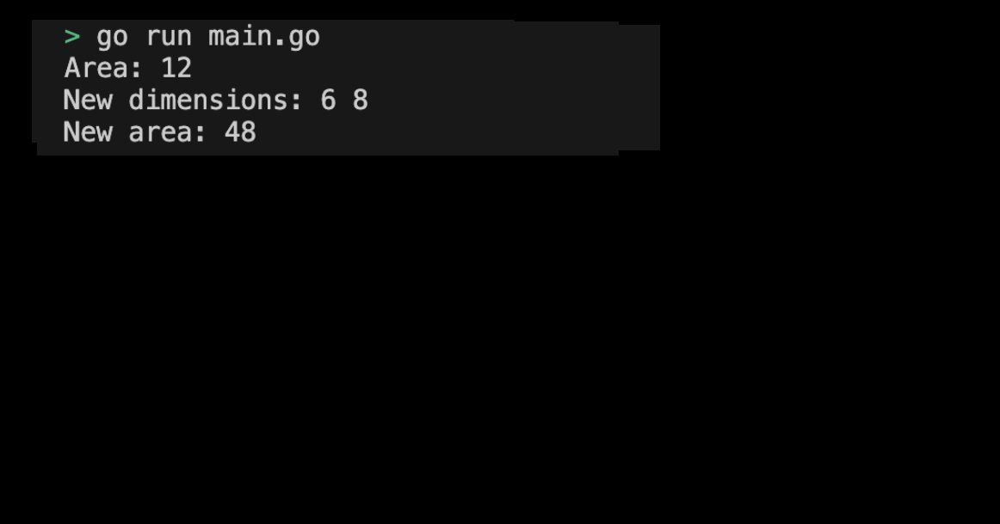

# 01m08. Method 사용해보기

## 목차
0. Method 사용해보기
1. 기본 설정하기
2. 코드 작성하기
   1. Rectangle 구조체 정의하기
   2. Rectangle 구조체에 area 메서드 추가하기 
   3. Rectangle 구조체에 scale 메서드 추가하기
   4. main 함수 작성하기
3. Method 프로그램 실행화면 제출 예시

## 0. Method 사용해보기
실습으로 메서드를 직접 정의하여 사용해보도록 하자. 

## 1. 기본 설정하기
기본 설정은 다음과 같다:
```sh
# method 디렉토리 생성
$ mkdir method && cd method

# method go module 생성 
$ go mod init method
```

## 2. 코드 작성하기
이제 구조체 직접 정의하고 이와 함께 사용되는 메서드를 사용해보도록 하자.

### 1. Rectangle 구조체 정의하기
- width: float64 타입의 필드
- height: float64 타입의 필드
```go
type Rectangle struct {
    width, height float64
}
```

### 2. Rectangle 구조체에 area 메서드 추가하기
area 메서드는 Rectangle의 넓이를 계산하여 반환한다.
```go
func (r Rectangle) area() float64 {
    return r.width * r.height
}
```

### 3. Rectangle 구조체에 scale 메서드 추가하기
scale 메서드는 Rectangle의 너비와 높이를 주어진 인수(factor)로 확대 또는 축소한다.
```go
func (r *Rectangle) scale(factor float64) {
    r.width *= factor
    r.height *= factor
}
```

### 4. main 함수 작성하기
main 함수에서 Rectangle 구조체의 인스턴스를 생성하고, area 및 scale 메서드를 호출해보자.
```go
func main() {
    rect := Rectangle{width: 3, height: 4}
    fmt.Println("Area:", rect.area()) // Area: 12

    rect.scale(2)
    fmt.Println("New dimensions:", rect.width, rect.height) // New dimensions: 6 8
    fmt.Println("New area:", rect.area()) // New area: 48
}
```

전체 코드는 다음과 같다:
```go
package main

import (
	"fmt"
)

type Rectangle struct {
    width, height float64
}

func (r Rectangle) area() float64 {
    return r.width * r.height
}

func (r *Rectangle) scale(factor float64) {
    r.width *= factor
    r.height *= factor
}

func main() {
    rect := Rectangle{width: 3, height: 4}
    fmt.Println("Area:", rect.area()) // Area: 12

    rect.scale(2)
    fmt.Println("New dimensions:", rect.width, rect.height) // New dimensions: 6 8
    fmt.Println("New area:", rect.area()) // New area: 48
}
```
> 실습 코드 확인하기: [01_method](../code/01_method/)

## 3. Method 프로그램 실행화면 제출 예시
프로그램을 실행하여 출력된 결과는 다음과 같다:
<div style="text-align: center;">
   
</div>


