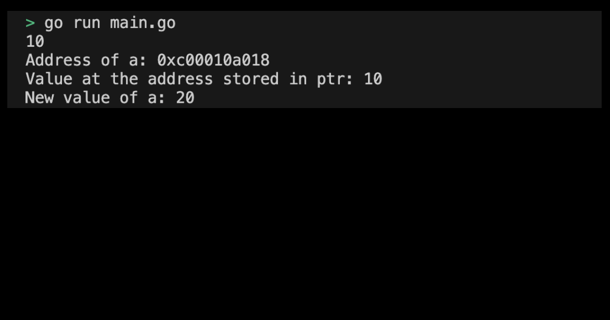

# 01m09. Pointer 사용해보기

## 목차
0. Pointer 사용해보기
1. 기본 설정하기
2. 코드 작성하기
   1. 포인터 변수 선언 및 초기화
   2. 포인터를 사용하여 값 조회 및 변경
3. Pointer 프로그램 실행화면 제출 예시

## 0. Pointer 사용해보기
포인터의 사용법을 실습해보도록 하자.

## 1. 기본 설정하기
기본 설정은 다음과 같다:
```sh
# pointer 디렉토리 생성
$ mkdir pointer && cd pointer

# pointer go module 생성 
$ go mod init pointer
```

## 2. 코드 작성하기
### 1. 포인터 변수 선언 및 초기화
int 타입의 변수 a와 포인터 변수 ptr을 선언하고, ptr 포인터 변수에 a의 주소값을 저장해보자.
```go
package main

import (
	"fmt"
)

func main() {
	// int 타입 변수 a 선언 
    var a int = 10
	// 포인터 변수 ptr 선언 
    var ptr *int

    ptr = &a // ptr 포인터 변수는 a의 주소값을 가지고 있다
}
```
### 2. 포인터를 사용하여 값 조회 및 변경
포인터를 사용하여 a 주소에 저장되어 있는 값을 조회하고, 해당 주소에 접근하여 저장된 a 변수의 값을 변경해본다.
```go
// a 변수 조회 
fmt.Println(a) // 10

// ptr 변수 조회 (= a 변수의 주소값)
fmt.Println("Address of a:", ptr) // Address of a: 0xc000012028

// 포인터를 사용하여 a 값 조회하기 
fmt.Println("Value at the address stored in ptr:", *ptr) // Value at the address stored in ptr: 10

// 포인터를 사용하여 해당 주소에 들어있는 값을 변경하기
*ptr = 20
fmt.Println("New value of a:", a) // New value of a: 20
```

전체 코드는 다음과 같다:
```go
package main

import (
	"fmt"
)

func main() {
    var a int = 10
    var ptr *int

    ptr = &a // ptr 포인터 변수는 a의 주소값을 가지고 있다

    fmt.Println(a) // 10
    fmt.Println("Address of a:", ptr) // Address of a: 0xc000012028
    fmt.Println("Value at the address stored in ptr:", *ptr) // Value at the address stored in ptr: 10

    // pointer를 사용하여 해당 주소에 들어있는 값을 변경한다
    *ptr = 20
    fmt.Println("New value of a:", a) // New value of a: 20
}
```
> 실습 코드 확인하기: [01_pointer](../code/01_pointer/)

## 3. Pointer 프로그램 실행화면 제출 예시
프로그램을 실행하여 출력된 결과는 다음과 같다:
<div style="text-align: center;">
   
</div>
