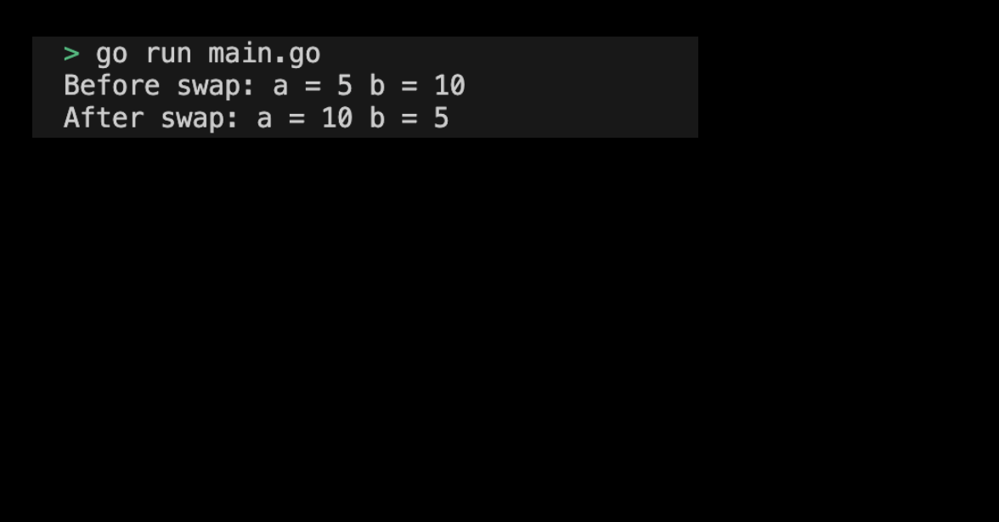

# 01-10. Using Pointer to Implement Swap Functions

## 0. Using Pointer to Implement Swap Functions
[`01m06_function_swap`](./01m06_function_swap.md) The swap example in the practice was simply a function of exchanging values. Here, let's create a function that changes the values of a and b by directly modifying the values at the memory address using a pointer. The operator '&' is used to transfer the addresses of a and b to the function.

## 1. Setting Preferences
The default settings are as follows:
```sh
# Create pointer_swap directory
$ mkdir pointer_swap && cd pointer_swap

# Create pointer_swap go module 
$ go mod init pointer_swap
```

## 2. Pointer를 활용한 Swap 함수 작성하기
포인터를 사용하여 두 정수의 값을 교환하는 `swap`함수를 작성한다: 
- `swap` 함수는 두 개의 int 타입의 포인터(x, y)을 매개변수로 받아, 두 값을 교환하고 반환하지 않는다.

pointer를 활용하여 구현한 swap 함수를 main 함수에서 다음과 같이 호출할 수 있다:
```go
func main() {
    a, b := 5, 10
    fmt.Println("Before swap: a =", a, "b =", b) // Before swap: a = 5 b = 10
    swap(&a, &b)
    fmt.Println("After swap: a =", a, "b =", b) // After swap: a = 10 b = 5
}
```
> 구현된 실습 코드 확인하기: [01_pointer_swap](../code/01_pointer_swap/)

## 3. Pointer를 활용한 Swap 함수 프로그램 실행화면 제출 예시
프로그램을 실행하여 출력된 결과는 다음과 같다:
<div style="text-align: center;">
   
</div>

이 실습을 통해 포인터를 사용하여 함수에서 값을 직접 수정하는 방법을 배웠다. 포인터를 사용하면 함수가 변수의 복사본이 아닌 실제 메모리 주소를 참조하므로, 함수 내에서 변수의 값을 직접 변경할 수 있다. 