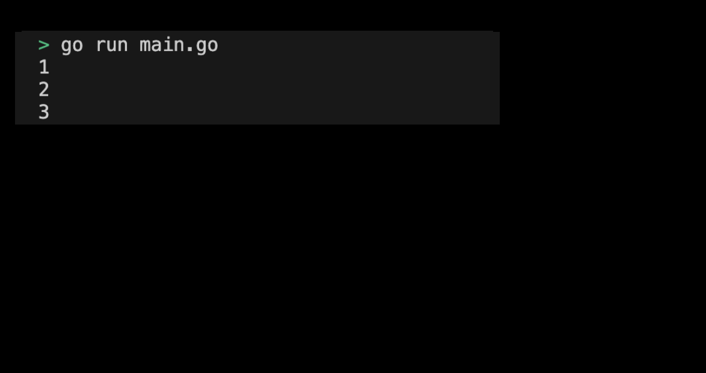

# 01-11. Try the Close feature

## 0. Try the Close feature
Let's use the closure function directly through practice.

## 1. Setting Preferences
The default settings are as follows:
```sh
# closure 디렉토리 생성
$ mkdir closure && cd closure

# closure go module 생성 
$ go mod init closure
```

## 2. Creating code
### 1. Define outer functions
The outer function has a count variable, and an anonymous function defined inside can access this count variable. When the outer function is assigned to the increase variable, the increase "remains" the count variable and returns an increased value each time it is called.
```go
func outer() func() int {
    count := 0
    return func() int {
        count++
        return count
    }
}
```

### 2. Creating a main function
Call the outer function from the main function and assign it to the increase variable. Then, each time you call the increase function, let's see if the count variable returns an increased value.
```go
func main() {
    increment := outer()

    fmt.Println(increment()) // 1
    fmt.Println(increment()) // 2
    fmt.Println(increment()) // 3
}
```
> Check the full practice code: [01_close](../code/01_close/)

## 3. Example of submitting a close program execution screen
The results printed by running the program are as follows:
<div style="text-align: center;">
   
</div>
