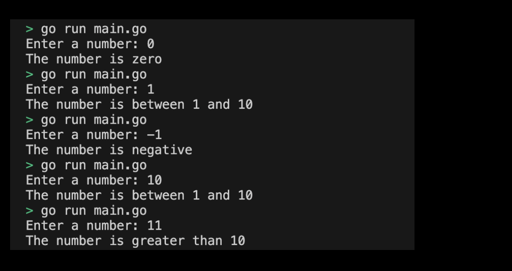

# 02-00. Practice Conditional Statement - Implementing a Number Discrimination Program

## 0. Implement a numerical discrimination program through a conditional statement
Let's implement a program that uses conditional statements to determine numbers.

## 1. Setting Preferences
The default settings are as follows:
```sh
# Create if_condition directory
$ mkdir if_condition && cd if_condition

# Create if_condition go module 
$ go mod init if_condition
```

## 2. Program Implementation Requirements
You should write a program code that determines the range of the number based on the number input by the user using the conditional statement.

Program implementation requirements are as follows:
1. If the number entered is negative, output "The number is negative".
2. If the number entered is 0, output "The number is zero".
3. If the number entered is greater than 0 and less than 10, "The number is between 1 and 10" is output.
4. If the input number is greater than 10, "The number is greater than 10" is output.
> Check the implemented practice code: [02_if_condition](../code/02_if_condition/)


## 3. Example of submitting a number determination program execution screen through a conditional statement
The results printed by running the program are as follows:
<div style="text-align: center;">
   
</div>
