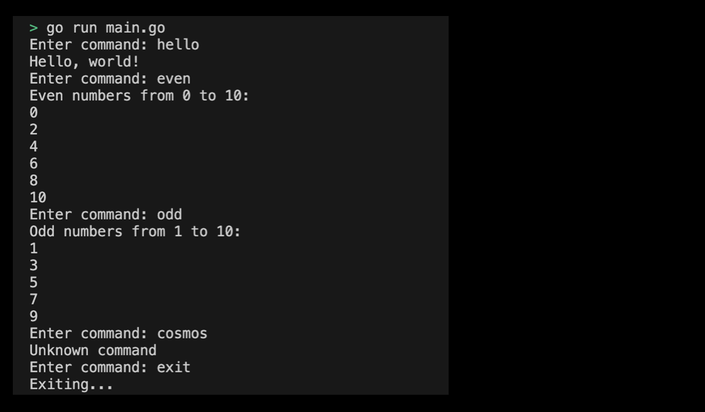

# 02m01. 반복문 & 조건문 실습 - CLI(Command Line Interface) 프로그램 구현하기

## 목차 
0. 반복문, 조건문을 활용하여 CLI(Command Line Interface) 프로그램 구현하기
1. 기본 설정하기
2. 프로그램 구현 요구사항
3. CLI 프로그램 실행화면 제출 예시

## 0. 반복문, 조건문을 활용하여 CLI(Command Line Interface) 프로그램 구현하기
조건문과 반복문을 모두 활용하여 간단한 CLI 프로그램을 만들어보도록 하자. [이전 조건문 실습](./02m00_condition_number_decision.md)은 반복문이 없어서 다른 입력 값을 입력하기 위해서 계속해서 프로그램을 다시 실행해야 하는 번거로움이 있었다. 이제 반복문을 사용하면 그러한 불편함을 해소할 수 있다. 

## 1. 기본 설정하기
기본 설정은 다음과 같다:
```sh
# simple_cli 디렉토리 생성
$ mkdir simple_cli && cd simple_cli

# simple_cli go module 생성 
$ go mod init simple_cli
```

## 2. 프로그램 구현 요구사항
이 프로그램은 사용자로부터 입력을 받아 그 입력에 따라 다른 동작을 수행한다. 이는 사용자가 "exit"를 입력할 때까지 무한 루프로 계속 실행된다. 

프로그램 구현 요구 사항은 다음과 같다:
1. 사용자가 입력한 명령어에 따라 다양한 동작을 수행한다.
2. 명령어는 다음과 같다:
   1. "exit": 프로그램을 종료한다.
   2. "hello": "Hello, world!"를 출력한다.
   3. "even": 0부터 10까지의 짝수를 출력한다.
   4. "odd": 1부터 10까지의 홀수를 출력한다.
   6. 그 외의 입력에 대해서는 "Unknown command"를 출력한다.
> 구현된 실습 코드 확인하기: [02_simple_cli](../code/02_simple_cli/)


## 3. 반복문, 조건문을 활용한 입출력 핸들러 프로그램 실행화면 제출 예시
프로그램을 실행하여 출력된 결과는 다음과 같다:
<div style="text-align: center;">
   
</div>
