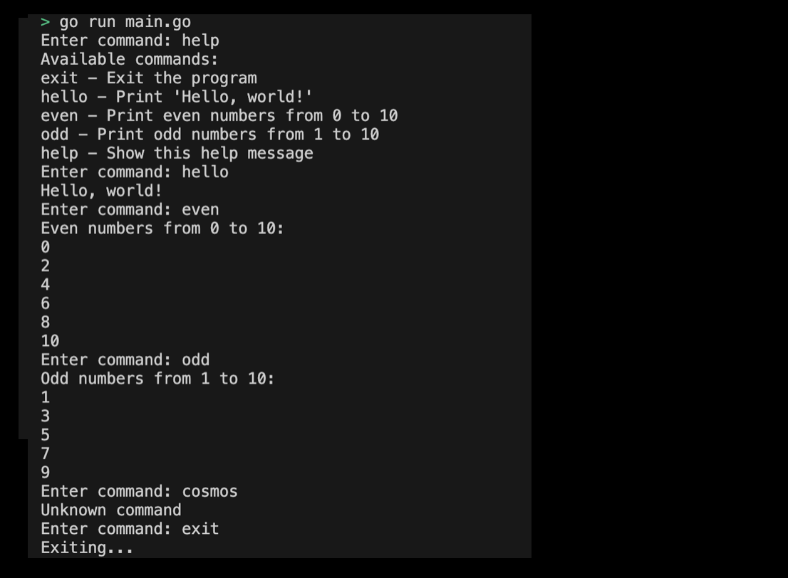

# 02-02. Switch Moon Practice - Implementing the Command Line Interface (CLI) Program

## 0. Implement a Command Line Interface (CLI) program using a switch statement
In this practice, let's write the [CLI program](./02m01_iteration_io_handler.md) using a switch statement. The switch statement can be used to write more readable codes.

## 1. Setting Preferences
The default settings are as follows:
```sh
# Create switch_simple_cli directory
$ mkdir switch_simple_cli && cd switch_simple_cli

# Create switch_simple_cli go module 
$ go mod init switch_simple_cli
```

## 2. Creating code
Program requirements are as follows:
1. Various operations are performed according to the command input by the user.
2. The commands are as follows:
1. "exit": Shut down the program.
2. "Hello": outputs "Hello, world!"
3. "even": outputs an even number from 0 to 10.
4. "odd": Outputs odd numbers from 1 to 10.
5. "Help": Prints a list of available commands.
6. For other inputs, "Unknown command" is output.
> Check the implemented practice code: [02_switch_simple_cli] (../code/02_switch_simple_cli/)

## 3. Example of submitting CLI program execution screen
The results printed by running the program are as follows:
<div style="text-align: center;">
   
</div>

