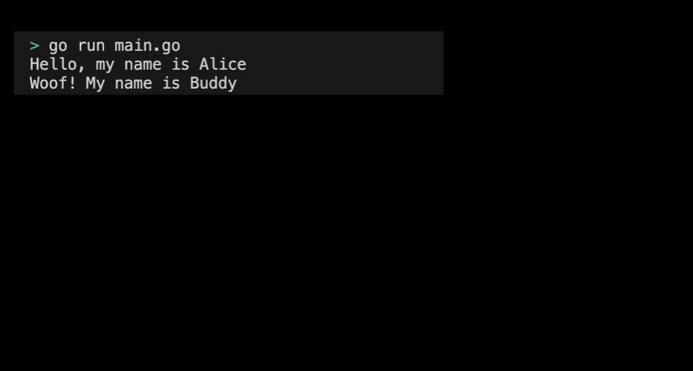

# 03-00. Implementing Polymorphism through Interface

## 0. Implementing polymorphism through Interface
In this practice, let's use the `Speaker` interface to implement the same method for various types of objects, and implement polymorphism through this.

## 1. Setting Preferences
The default settings are as follows:
```sh
# interface_polymorphism 디렉토리 생성
$ mkdir interface_polymorphism && cd interface_polymorphism

# interface_polymorphism go module 생성 
$ go mod init interface_polymorphism
```

## 2. Program Implementation Requirements
Here is the voilerpalte code for the practice.
```go
package main

type Speaker interface {
	Speak() string
}

func main() {
	
}
```

Program implementation requirements are as follows:
1. Define the Person type, and let this type implement the Speaker interface.
2. Define the Dog type, and let this type implement the Speaker interface.
3. Define the Greet function. This function takes the Speaker interface as an argument, calls the Speak method, and outputs the result.
4. It creates instances of Person and Dog types in the main function and passes them to the Greet function to output their respective greetings.
> Check the implemented practice code: [03_interface_polymorphism](../code/03_interface_polymorphism/)


## 3. Example of a program execution screen implementing polymorphism through the interface
The results of the example output from the program execution are as follows:
<div style="text-align: center;">
   
</div>

