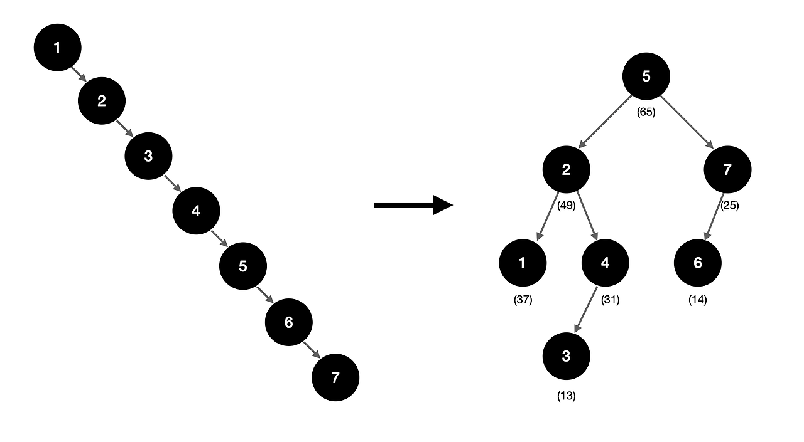

# 004. Go Data Structure
> This article deals with the main data structure of the Go language. It explains how to efficiently manage and use data through arrays, slices, maps, queues, stacks, trees, etc. In particular, understanding the tree structure helps to understand the IAVL tree used for state storage of Cosmos-SDK. It aims to further improve the understanding of data structure through practical tasks using this.

## 1. Array and Slice
Array and Slices are the most basic data structures, directly supported by Go.

### 1. Array
An array is a set of the same type elements of a fixed size. The size of the array is determined at the time of declaration and cannot be changed.

### 2. Slice
Slice is a dynamic arrangement, and unlike the arrangement, the size can be flexibly adjusted. Slice can refer to a subset of an array, and is used much more often than an array.

### 3. Difference between Array and Slice
- The array allocates size at a fixed rate, and Slice dynamically allocates size. Unlike the array, Slice does not have to size the declaration in advance.
- Slice can refer to a subset of an array.
- Slice provides more features and is used more often than Array.

## 2. Queue and Stack
A queue stack is a data structure that follows the principles of First-In-First-Out (FIFO) and Last-In-First-Out (LIFO), respectively.

## 3. Map
A map is a data structure that stores key-value pairs. The main characteristics of the map are as follows:
- Key should be unique.
- Key and Value types must be the same.
- The size is assigned dynamically.
- Through the Key, fast access of data stored in Map (O(1)) is possible.

## 4. Tree
A tree is a hierarchical data structure, consisting of nodes, and each node may have a child node. Rather than a linear structure such as Array and Slice, it is a data structure having a nonlinear structure with a parent-child concept. The most common tree forms are a binary tree and a variant thereof, a binary search tree. In Go, various tree structures can be implemented.

### 1. Binary Search Tree (BST)
In a binary search tree, each node has a maximum of two child nodes, the left child node is smaller than the parent node, and the right child node is larger than the parent node.
- Hierarchical structure: enables hierarchical representation of data.
- Efficient search: Binary search trees provide search time complexity of O(logn) on average.

The implemented code of the binary search tree is as follows:
```go
package main

import (
	"fmt"
)

type Node struct {
	value int
	left  *Node
	right *Node
}

// 새로운 노드를 추가하는 함수
func (n *Node) Insert(value int) {
	if value < n.value {
		if n.left == nil {
			n.left = &Node{value: value}
		} else {
			n.left.Insert(value)
		}
	} else {
		if n.right == nil {
			n.right = &Node{value: value}
		} else {
			n.right.Insert(value)
		}
	}
}

// Fundction to find the value in a tree 
func (n *Node) Search(value int) bool {
	if n == nil {
		return false
	}
	if value < n.value {
		return n.left.Search(value)
	} else if value > n.value {
		return n.right.Search(value)
	}
	return true
}

func main() {
	root := &Node{value: 10}
	root.Insert(5)
	root.Insert(15)
	root.Insert(3)
	root.Insert(7)

	fmt.Println(root.Search(7))  // true
    fmt.Println(root.Search(3))  // true
	fmt.Println(root.Search(12)) // false
}
```
> See the example code: [04_bst](../code/04_bst/)


#### Problems of Binary Search Tree
A binary search tree (BST) is a simple and intuitive tree structure, and data insertion, deletion, and search may be performed at O(log n) time complexity on average. However, there is a problem that the performance may be significantly degraded in a specific situation. This is because the tree is basically a structure in which the search, insertion, and deletion are all structures that depend on the height of the tree.

Since it cannot be balanced by itself, it may become a skewed tree according to the data order. In the deflection tree, the height of the tree approaches n, and in this case, the time complexity of search, insertion, and deletion increases to O(n). This becomes the same as the list structure, and the advantage of BST is lost. Therefore, it was devised as a balanced BST.

In the simplest example, if each node is randomly prioritized, a balanced tree can be created as follows:
<div style="text-align: center;">
   
</div>

### 2. AVL Tree 
The AVL tree is a type of balanced binary search tree (BST) implemented above, and maintains a balance so that the height difference between the left and right subtrees of each node is less than 1. This performs a rotation operation so that the tree automatically maintains balance during insertion and deletion so that the search, insertion, and deletion operations always have the time complexity of O(log n).
- It is designed to overcome the shortcomings of unbalanced structures such as bias trees in basic binary search trees.
- Balancing: Balance trees such as AVL trees ensure performance by balancing trees after insertion and deletion operations.


## 5. IAVL Tree in Cosmos-SDK
A blockchain is a database that stores states and a state machine replication (SMR) distributed system that changes states through consensus. The IAVL tree plays an important role in efficiently managing and verifying these blockchain states. For this, the Cosmos SDK uses an IAVL tree, which is a variation of the AVL tree.

The IAVL tree is a data structure that combines the characteristics of a binary search tree, an AVL tree, and a Merkle tree. It is mainly used to store and verify states on the blockchain. The IAVL tree has the following main characteristics:
- Binary search tree: Each node has a maximum of two child nodes, the left child node is smaller than the parent node, and the right child node is larger than the parent node.
- AVL tree: Keep the balance so that the height difference between the left and right subtrees of each node is less than or equal to 1. This automatically balances the tree during insertion and deletion so that the search, insertion, and deletion operations always have the time complexity of O(log n).
- Merkle tree: Each node has a hash value, which allows us to verify the data integrity of all sub-nodes in the tree. Merkle trees are essential for cryptographically securely managing the state of the blockchain.

These IAVL trees offer the following advantages:
- Efficient search, insertion, and deletion: maintain the balance of trees so that these operations always have the time complexity of O(logn).
- Cryptographic verification: The integrity of the data can be verified using the characteristics of the Merkle tree. This is essential to safely manage the state of the blockchain.
- Version management: The IAVL tree manages the version of the state, providing the ability to return to the state at a specific point in time. This is useful for rollback and verification of the state of the blockchain.

# Resources 
1. Go Docs, "The Go Programming Language Specification: Language version go1.22", Feb 6. 2024, https://go.dev/ref/spec
3. Cosmos IAVL Spec, https://github.com/cosmos/iavl/blob/master/docs/overview.md