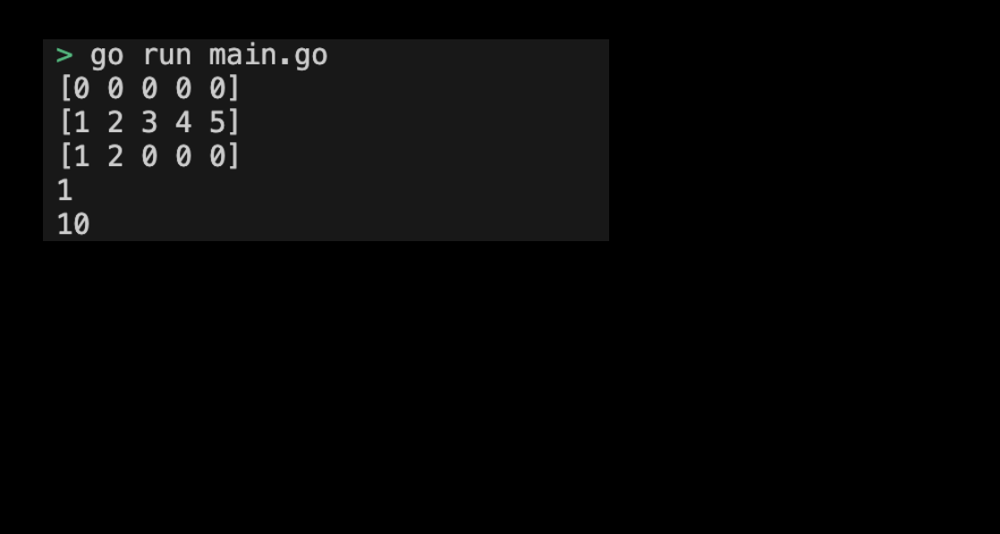

# 04-00. Try the Array

## 0. Try Array
In this practice, let's declare and reset the Array ourselves.

## 1. Setting Preferences
The default settings are as follows:
```sh
# Create array directory
$ mkdir array && cd array

# Create array go module
$ go mod init array
```

## 2. Creating code
The full code is as follows:
```go
package main

import (
	"fmt"
)

func main() {
	// Declare arry
	var arr1 [5]int
	fmt.Println(arr1) // [0 0 0 0 0]

	// Initialize array
	arr2 := [5]int{1, 2, 3, 4, 5}
	fmt.Println(arr2) // [1 2 3 4 5]

	// Partial initialization
	arr3 := [5]int{1, 2}
	fmt.Println(arr3) // [1 2 0 0 0]

	// Partial array access 
	fmt.Println(arr2[0]) // 1
	arr2[0] = 10
	fmt.Println(arr2[0]) // 10
}
```
> Check the practice code: [04_array](../code/04_array/)


## 3. Submit the Array execution screen
The results printed by running the program are as follows:
<div style="text-align: center;">
   
</div>

