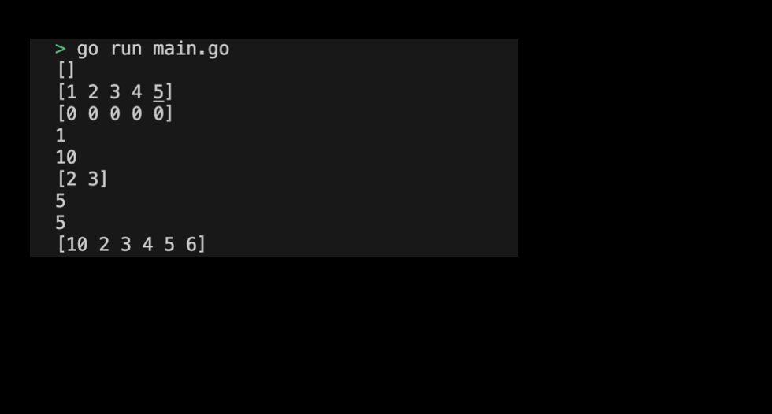

# 04m01. Slice 사용해보기

## 목차 
0. Slice 사용해보기
1. 기본 설정하기
2. 코드 작성하기
3. Slice 실행화면 제출 예시

## 0. Slice 사용해보기
이번 실습에서는 Slice를 직접 선언하고 초기화해보도록 하자. 

## 1. 기본 설정하기
기본 설정은 다음과 같다:
```sh
# slice 디렉토리 생성
$ mkdir slice && cd slice

# slice go module 생성 
$ go mod init slice
```

## 2. 코드 작성하기
전체 코드는 다음과 같다: 
```go
package main

import (
	"fmt"
)

func main() {
	// 슬라이스 선언
	var s1 []int
	fmt.Println(s1) // []

	// 슬라이스 초기화
	s2 := []int{1, 2, 3, 4, 5}
	fmt.Println(s2) // [1 2 3 4 5]

	// make 함수로 슬라이스 생성
	s3 := make([]int, 5)
	fmt.Println(s3) // [0 0 0 0 0]

	// 슬라이스의 요소 접근 및 수정
	fmt.Println(s2[0]) // 1
	s2[0] = 10
	fmt.Println(s2[0]) // 10

	// 슬라이스 부분 선택
	subSlice := s2[1:3]
	fmt.Println(subSlice) // [2 3]

	// 슬라이스의 길이와 용량
	fmt.Println(len(s2)) // 5
	fmt.Println(cap(s2)) // 5

	// append 함수로 요소 추가
	s2 = append(s2, 6)
	fmt.Println(s2) // [10 2 3 4 5 6]
}
```
> 실습 코드 확인하기: [04_slice](../code/04_slice/)

## 3. Slice 실행화면 제출 예시
프로그램을 실행하여 출력된 결과는 다음과 같다:
<div style="text-align: center;">
   
</div>
