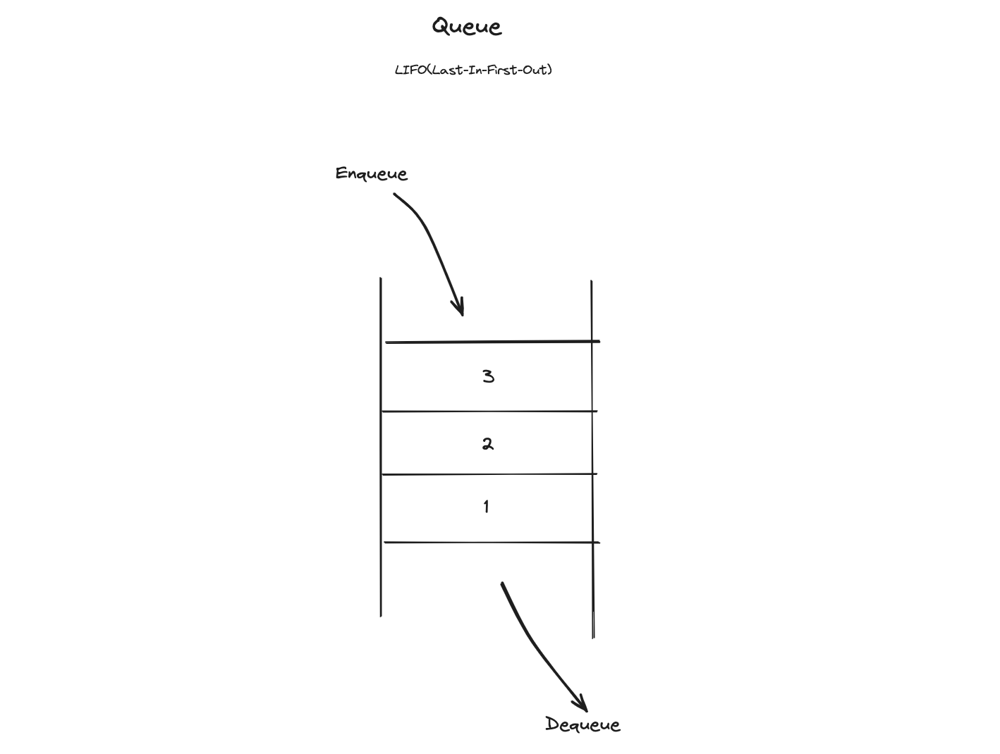
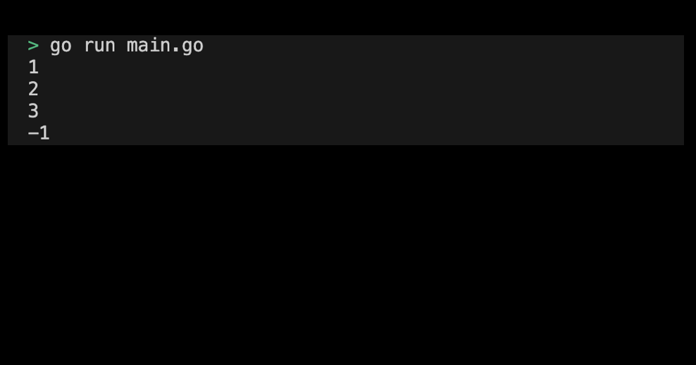

# 04-02. Implementing a queue with slice

## 0. Implementing a Queue with Slice
Let's try to implement a queue using Slice built-in in Go.

## 1. Setting Preferences
The default settings are as follows:
```sh
# Create queue directory
$ mkdir queue && cd queue

# Create queue go module
$ go mod init queue
```

## 2. Program Implementation Requirements
Program implementation requirements are as follows:
1. Implement a 'Enqueue' method that adds int-type data to the queue.
2. Implement a 'Dequeue' method that removes int-type data first stored in the queue. If the queue is empty, -1 is returned.
<div style="text-align: center;">
   
</div>

> Check the implemented practice code: [04_queue](../code/04_queue/)


## 3. Example of queue execution screen submission
The results printed by running the program are as follows:
<div style="text-align: center;">
   
</div>
