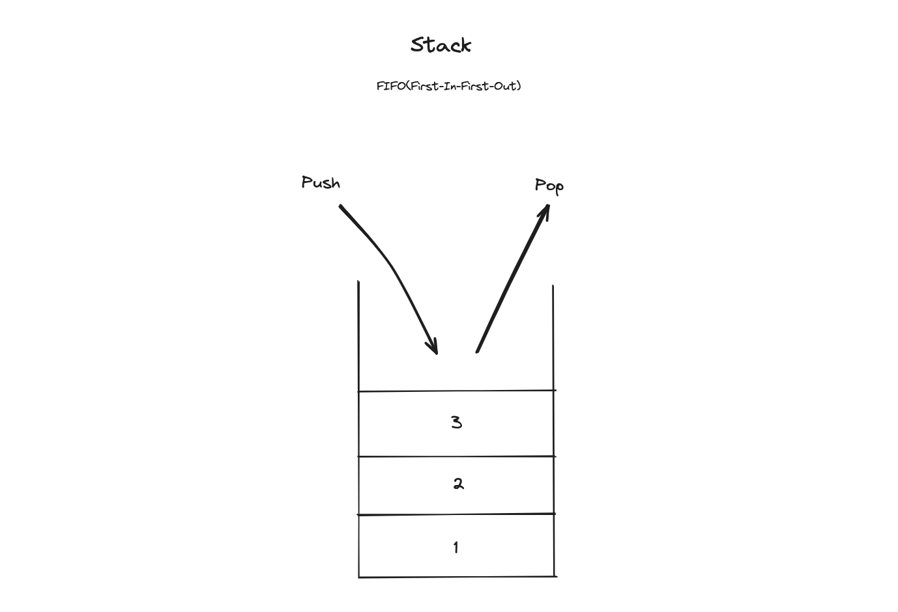
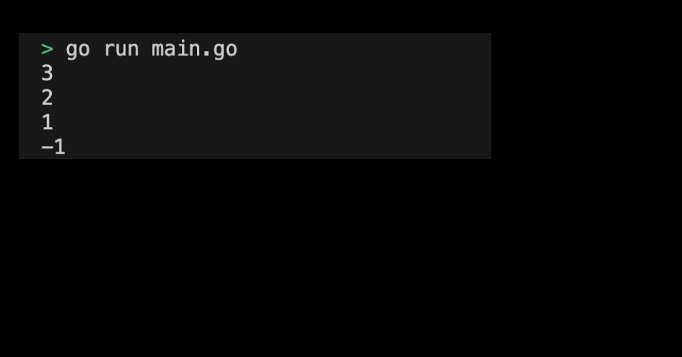

# 04m03. Slice로 Stack 구현하기

## 목차 
0. Slice로 Stack 구현하기
1. 기본 설정하기
2. 프로그램 구현 요구사항
3. Interface를 통해 다형성을 구현한 프로그램 실행화면 예시

## 0. Slice로 Stack 구현하기
Go에 built-in 되어있는 Slice를 사용하여 Stack을 구현해보도록 하자. 

## 1. 기본 설정하기
기본 설정은 다음과 같다:
```sh
# stack 디렉토리 생성
$ mkdir stack && cd stack

# stack go module 생성 
$ go mod init stack
```

## 2. 프로그램 구현 요구사항
프로그램 구현 요구 사항은 다음과 같다:
1. stack에 int 타입 데이터를 추가하는 `Push` 메서드를 구현한다. 
2. stack에 가장 나중에 저장된 int 타입 데이터를 제거하는 `Pop` 메서드를 구현한다. stack이 비었을 경우 -1을 반환한다.

<div style="text-align: center;">
   
</div>

> 구현된 실습 코드 확인하기: [04_stack](../code/04_stack/)


#### 3. Stack 실행화면 제출하기
프로그램을 실행하여 출력된 결과는 다음과 같다:
<div style="text-align: center;">
   
</div>
