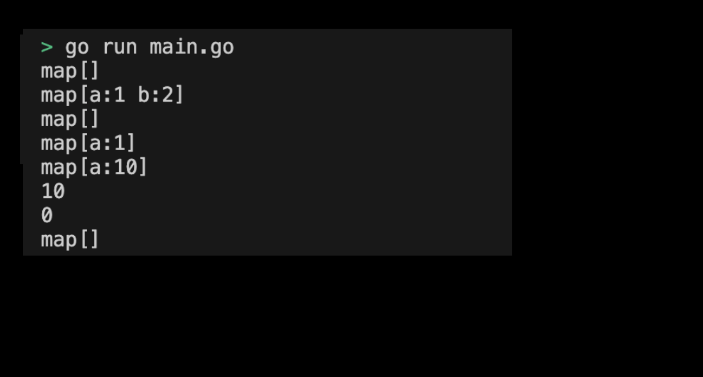

# 04-04. Try Map

## 0. Initialize and declare Map
In this practice, let's declare and reset the Map ourselves.

## 1. Setting Preferences
The default settings are as follows:
```sh
# Create map directory
$ mkdir map && cd map

# Create map go module 
$ go mod init map
```

#### 2. Creating code
The full code is as follows:
```go
package main

import (
	"fmt"
)

func main() {
	// Declare map
	var m1 map[string]int
	fmt.Println(m1) // map[]

	// Initialize map
	m2 := map[string]int{"a": 1, "b": 2}
	fmt.Println(m2) // map[a:1 b:2]

	// Create map with make function
	m3 := make(map[string]int)
	fmt.Println(m3) // map[]

	// Add or edit a value to map 
	m3["a"] = 1
	fmt.Println(m3) // map[a:1]
	m3["a"] = 10
	fmt.Println(m3) // map[a:10]

	// Access the value
	val := m3["a"]
	fmt.Println(val) // 10

	// Access the key that does not exist
	val2 := m3["b"]
	fmt.Println(val2) // 0

	// Delete the value
	delete(m3, "a")
	fmt.Println(m3) // map[]
}
```
> Check the practice code: [04_map](../code/04_map/)


#### 3. Examples of Map execution screen submission
The results printed by running the program are as follows:
<div style="text-align: center;">
   
</div>
