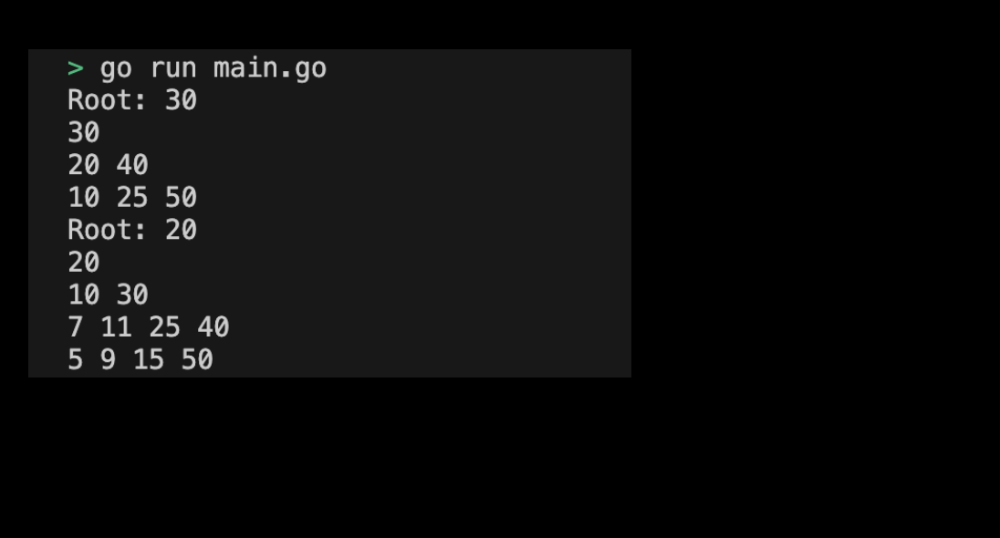

# 04-05. Try AVL Tree

## 0. Try AVL Tree
Balanced BST, such as AVL tree and RB tree, has a relatively long code because it has to be implemented by counting the number of various cases. Therefore, in this practice, understand some of the main functions of the AVL tree that have already been implemented and implement a function that simply outputs the tree structure.

## 1. Setting Preferences
The default settings are as follows:
```sh
# Cretea avl_tree directory
$ mkdir avl_tree && cd avl_tree

# Create avl_tree go module 
$ go mod init avl_tree
```

## 2. Understanding AVL Tree Functions
In the current code, only the 'Insert' function that inserts a value into the AVL tree is implemented. There are various functions to call in this function:
- `height`: Returns the node height of the AVL tree.
- `getBalance`: Calculate the height difference between the left tree and the right tree and return it. It is used as an important indicator for balancing because it becomes a skewed tree when one height is tilted.
- `rightRotate`: a function that rotates a node of an AVL tree to the right. This operates when the height of the overall node is skewed to the left.
- `leftRotate`: Rotates the node of the AVL tree to the left. This operates when the height of the overall node is skewed to the right.

These functions called in the 'Insert' function are essential for maintaining tree balance. To keep the AVL tree balanced, the tree's balance is calculated when a node is inserted and, if necessary, the rotation operation is performed. The following code shows the rotation conditions used in the Insert function:
```go
// Left Left Case
if balance > 1 && value < n.left.value {
	return rightRotate(n)
}

// Right Right Case
if balance < -1 && value > n.right.value {
	return leftRotate(n)
}

// Left Right Case
if balance > 1 && value > n.left.value {
	n.left = leftRotate(n.left)
	return rightRotate(n)
}

// Right Left Case
if balance < -1 && value < n.right.value {
	n.right = rightRotate(n.right)
	return leftRotate(n)
}
```
These conditions are necessary to balance the tree according to the inserted value. The AVL tree is balanced through this rotation operation because the height difference between the left subtree and the right subtree of each node is less than or equal to 1.


The codes given are as follows:
```go
package main

import (
	"fmt"
)

type AVLNode struct {
	value int
	left  *AVLNode
	right *AVLNode
	height int
}

func NewAVLNode(value int) *AVLNode {
	return &AVLNode{value: value, height: 1}
}

// Function to calculate the height of AVL tree
func height(n *AVLNode) int {
	if n == nil {
		return 0
	}
	return n.height
}

// Function to calcluate the equilibrium factor of AVL tree
func getBalance(n *AVLNode) int {
	if n == nil {
		return 0
	}
	return height(n.left) - height(n.right)
}

// Rotate to the righ
func rightRotate(y *AVLNode) *AVLNode {
	x := y.left
	T2 := x.right

	// Execute the rotation
	x.right = y
	y.left = T2

	// Update the height
	y.height = max(height(y.left), height(y.right)) + 1
	x.height = max(height(x.left), height(x.right)) + 1

	return x
}

// Rotate to the left
func leftRotate(x *AVLNode) *AVLNode {
	y := x.right
	T2 := y.left

	// Execute the rotation
	y.left = x
	x.right = T2

	// Update the height
	x.height = max(height(x.left), height(x.right)) + 1
	y.height = max(height(y.left), height(y.right)) + 1

	return y
}

// Function to calculate the maxiumum value 
func max(a, b int) int {
	if a > b {
		return a
	}
	return b
}

// Function to insert into the value of AVL tree 
func (n *AVLNode) Insert(value int) *AVLNode {
	if n == nil {
		return NewAVLNode(value)
	}

	if value < n.value {
		n.left = n.left.Insert(value)
	} else if value > n.value {
		n.right = n.right.Insert(value)
	} else {
		return n
	}

	n.height = 1 + max(height(n.left), height(n.right))

	balance := getBalance(n)

	// Left Left Case
	if balance > 1 && value < n.left.value {
		return rightRotate(n)
	}

	// Right Right Case
	if balance < -1 && value > n.right.value {
		return leftRotate(n)
	}

	// Left Right Case
	if balance > 1 && value > n.left.value {
		n.left = leftRotate(n.left)
		return rightRotate(n)
	}

	// Right Left Case
	if balance < -1 && value < n.right.value {
		n.right = rightRotate(n.right)
		return leftRotate(n)
	}

	return n
}

// todo: implementation
func printTree(root *AVLNode) {
	// fill out 
}

func main() {
	root := NewAVLNode(10)
	root = root.Insert(20)
    root = root.Insert(25)
	root = root.Insert(30)
	root = root.Insert(40)
	root = root.Insert(50)

	fmt.Println("Root:", root.value) // Root: 30
    // todo: printTree(root)

    root = root.Insert(5)
	root = root.Insert(7)
	root = root.Insert(9)
	root = root.Insert(11)
	root = root.Insert(15)
	fmt.Println("Root:", root.value) // Root: 20
    // todo: printTree(root)
   
}
```

## 3. Implementing a print function
Let's directly print out the AVL Tree that has already been implemented, understand it, and write the 'print Tree' function to make it easier to debug these tree structures.
> Check the practice code implemented with print function: [04_avl_tree](../code/04_avl_tree/)


## 4. Example of submitting an AVL tree to the execution screen
The results of the example output from the program execution are as follows:

<div style="text-align: center;">
   
</div>
